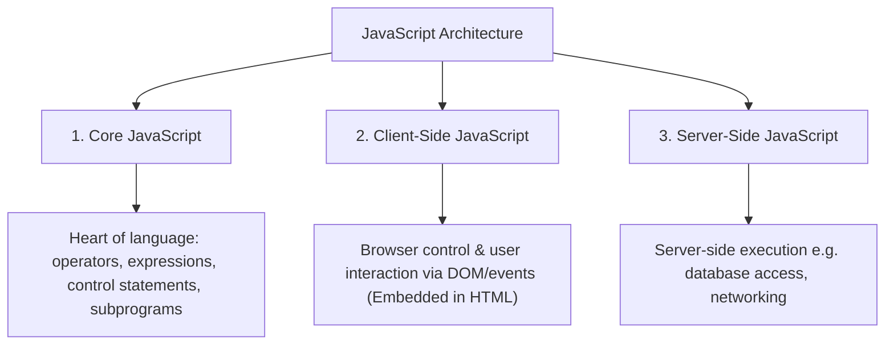
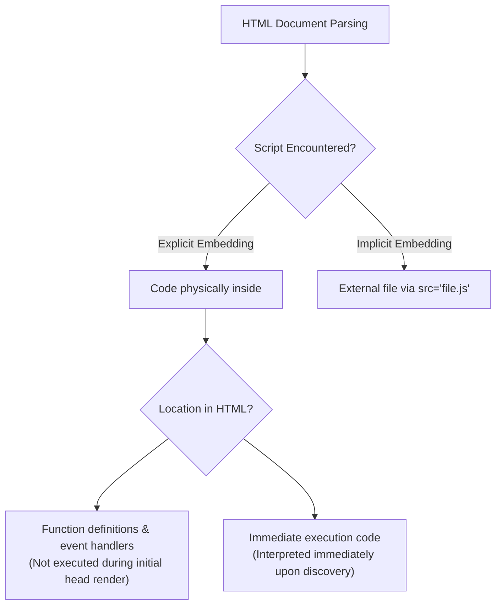
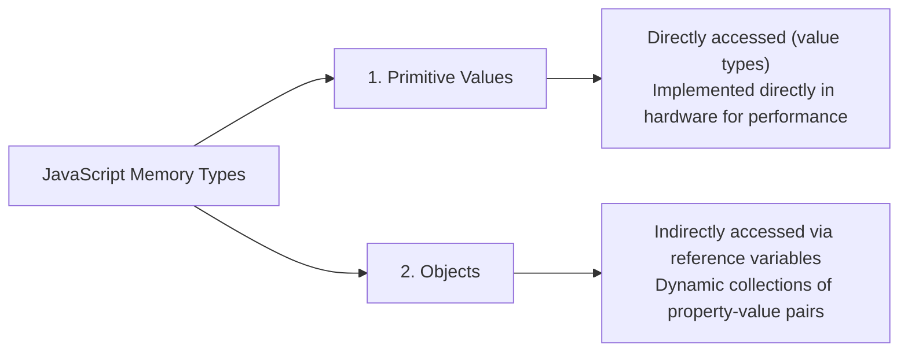

# Core JavaScript: Basics, Object Model & General Syntax

## 1. Overview of JavaScript

### 1.1 Origins & Standardization History
- **Creator**: Brendan Eich at Netscape in 1995.
- **Evolution of Names**: `Mocha` ➔ `LiveScript` ➔ `JavaScript` (joint venture between Netscape & Sun Microsystems).
- **Standards Specification**: 
  - Standardized under **ECMA-262** by the European Computer Manufacturers Association (ECMA).
  - Approved as **ISO-16262**.
  - **Official Language Standard Name**: `ECMAScript`.
  - Microsoft's implementation: `JScript` (and later `JScript .NET`).

#### Three Divisions of JavaScript


---

### 1.2 JavaScript vs. Java

| Feature / Dimension | Java | JavaScript | Academic & Technical Detail |
| :--- | :--- | :--- | :--- |
| **Paradigm** | Pure Class-Based Object-Oriented (OOP) | **Object-Based** (Prototype-based inheritance) | JavaScript does not support traditional class-based inheritance or dynamic binding via class hierarchies. |
| **Type System** | **Strongly Typed** (Static type checking at compile-time) | **Dynamically Typed** (Types bound to values at runtime) | Variables in JavaScript are not bound to types; compile-time type checking is impossible. |
| **Object Structure** | **Static** (Fixed data members and methods) | **Dynamic** (Properties/methods added or deleted at runtime) | JavaScript objects are dynamic property maps. |
| **Polymorphism** | Supported via class hierarchy & dynamic method resolution | Simulated via prototype lookup chain | No true class hierarchy polymorphism. |

---

### 1.3 Uses & Execution Environment

#### Client-Side vs. Server-Side
- **Client-Side JavaScript**:
  - Embedded logically or physically in HTML documents and interpreted by browser engines.
  - Offloads computational processing from servers to client machines.
  - **Security Restrictions**: Cannot read/write client file systems, access database engines directly, or perform arbitrary network operations.
- **Event-Driven Computation**:
  - Responds dynamically to user actions (mouse events, form inputs, keystrokes).
  - Uses the **Document Object Model (DOM)** to access and manipulate element contents and style properties.

---

### 1.4 Script Embedding Modes: Implicit vs. Explicit



#### Placement Rules in HTML Documents:
1. **`<head>` Element**:
   - Holds function definitions and code tied to form events.
   - **Behavior**: The interpreter notes their existence without executing them during initial `<head>` parsing.
2. **`<body>` Element**:
   - Holds script statements intended to execute immediately as the document is parsed.
   - **Behavior**: Interpreted sequentially upon discovery; output (`document.write`) is injected directly into HTML parsing.

---

## 2. Object Orientation in JavaScript

### 2.1 Object-Based Architecture
- JavaScript is an **Object-Based** language. Objects function both as direct data structures and models.

#### Primitives vs. Objects



- **Root Ancestor**: The `Object` prototype object is the ancestor of all objects.
- **Dynamic Property Manipulation**:
  ```javascript
  var myCar = new Object();
  myCar.make = "Ford";                         // Data Property added dynamically
  myCar.drive = function() { alert("Vroom"); }; // Method Property added dynamically
  delete myCar.make;                           // Data Property deleted dynamically
  ```

---

## 3. General Syntactic Characteristics

### 3.1 Identifiers & Keywords
- **Identifier Rules**: Must begin with a letter, underscore (`_`), or dollar sign (`$`). Subsequent characters may include digits (`0-9`).
- **Case Sensitivity**: Identifiers are strictly case-sensitive (`variable` $\neq$ `Variable`).
- **Reserved Words**: 25 reserved keywords (`var`, `function`, `with`, `delete`, `typeof`, `instanceof`, `void`, `in`, `this`, `switch`, `case`, `catch`, `try`, `finally`, `throw`, `new`, `return`, `break`, `continue`, `default`, `do`, `else`, `for`, `if`, `while`).

---

### 3.2 Embedding Rules & Legacy Hiding Techniques

For inline JavaScript, older browser compatibility or strict HTML validation when outputting HTML markup tags inside JavaScript requires escaping using HTML comment syntax:

```html
<script type="text/javascript">
  <!-- 
  document.write("Hello World!");
  // -->
</script>
```

- `<!--` opens the HTML comment block.
- `// -->` closes the HTML comment block while using `//` (JavaScript single-line comment) to prevent JavaScript engines from throwing a parse error on `-->`.

---

### 3.3 Automatic Semicolon Insertion (ASI) Mechanics & Traps

JavaScript engines automatically attempt to insert semicolons at statement ends under implicit rules.

#### ASI Execution Failure Case:
```javascript
function getItem() {
  return
    { name: "Laptop" };
}
console.log(getItem()); // Returns undefined
```

- Because `return` is a complete statement on its own, ASI inserts a semicolon immediately after `return`, converting it to `return;`.
- The object declaration on the next line becomes an unexecuted block.

#### Prevention Rule:
Statements should be explicitly terminated with semicolons, and multi-line statements must not break where the preceding line forms a complete valid expression.
