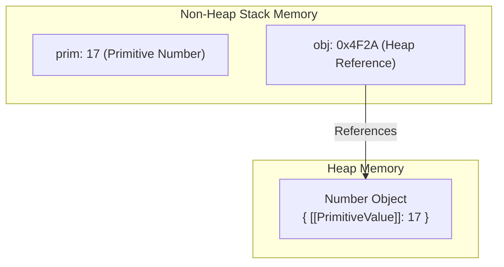
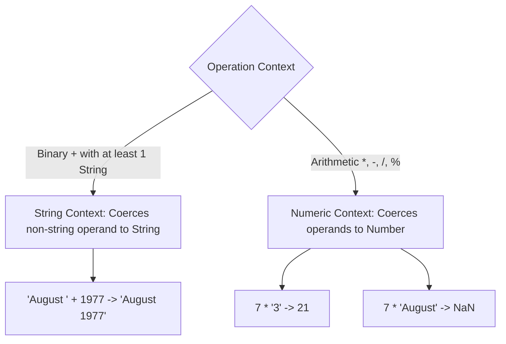
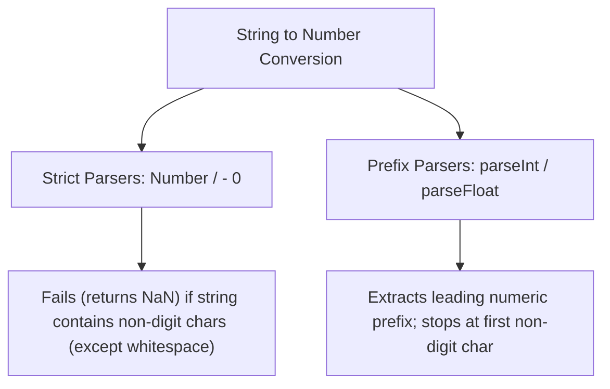

# Primitives, Operations, and Expressions

## 4. Primitive Types, Operations, and Expressions

### 4.1 Primitive Types & Wrapper Objects

JavaScript defines **5 primitive types**:
1. `Number`
2. `String`
3. `Boolean`
4. `Undefined`
5. `Null`

#### Primitive Values vs. Wrapper Objects
JavaScript maintains built-in wrapper objects for three primitives: `Number`, `String`, and `Boolean`.
- **Primitives**: Stored directly in non-heap memory (value types). Fast, low-overhead operations implemented directly in hardware.
- **Wrapper Objects**: Allocated in heap memory, containing internal properties that hold the primitive value.
- **Auto-Coercion / Auto-Boxing**: JavaScript automatically coerces primitive values to temporary wrapper objects when methods or properties are accessed on them, then discards the object immediately.



---

### 4.2 Numeric and String Literals

#### Numeric Literals
- All numbers in JavaScript belong to the `Number` type and are represented internally as **double-precision floating-point numbers** (IEEE 754 standard, 64-bit).
- There is no distinct `Integer` type at runtime.
- **Valid Floating-Point Forms**: `72`, `7.2`, `.72`, `72.`, `7E2`, `7e2`, `.7e2`, `7.e2`, `7.2E-2`.
- **Hexadecimal Integers**: Prefixed with `0x` or `0X` (e.g., `0xFF`).

#### String Literals
- Sequences of 0 or more characters enclosed in single (`'`) or double (`"`) quotes.
- No semantic difference exists between single-quoted and double-quoted strings.
- Empty string (null string): `''` or `""`.
- **Escape Sequences**: `\n` (newline), `\t` (tab), `\'` (single quote), `\"` (double quote), `\\` (backslash).

---

### 4.3 Other Primitive Types (`Null`, `Undefined`, `Boolean`)

#### `Null` Type
- Single value: `null` (reserved keyword).
- Represents the intentional absence of an object value or reference.

#### `Undefined` Type
- Single value: `undefined`.
- **Key Difference**: `undefined` is **not** a reserved word in ECMAScript specification.
- A variable that has been declared using `var` but not assigned an initial value automatically holds the value `undefined`.

#### `Boolean` Type
- Two values: `true` and `false`.
- Used as evaluation results of relational and logical expressions.

---

### 4.4 Variable Declarations & Dynamic Typing

JavaScript is **dynamically typed**: variables do not have fixed types; only values have types. A single variable can be rebound to values of different primitive types or object references throughout execution.

```javascript
var counter,
    index,
    pi = 3.14159265, 
    quarterback = "Elway",
    stop_flag = true;
```

- **Explicit Declaration**: Using `var`. Uninitialized variables evaluate to `undefined`.
- **Implicit Declaration**: Occurs when a value is assigned to an un-declared variable name.

---

### 4.5 Numeric Operators & Evaluation Rules

#### Operators Summary
- **Binary Arithmetic**: `+`, `-`, `*`, `/`, `%` (modulus).
- **Unary Arithmetic**: `+` (positive), `-` (negation), `++` (increment), `--` (decrement).

#### Prefix vs. Postfix Evaluation
- **Prefix (`++a`)**: Increments operand value first, then evaluates to the *new* value.
- **Postfix (`a++`)**: Evaluates to the *current* value first, then increments the operand value.

```javascript
var a = 7;
var val1 = (++a) * 3; // a becomes 8; val1 = 8 * 3 = 24
a = 7;
var val2 = (a++) * 3; // val2 = 7 * 3 = 21; a becomes 8
```

#### Precedence & Associativity Matrix

| Operator Group | Precedence | Associativity |
| :--- | :--- | :--- |
| `++`, `--`, unary `-`, unary `+` | Highest | Right-to-Left |
| `*`, `/`, `%` | Medium | Left-to-Right |
| binary `+`, binary `-` | Lowest | Left-to-Right |

---

### 4.6 The `Math` Object

The `Math` object is a standard built-in object containing static methods and properties for mathematical calculations:
- `Math.sin(x)`, `Math.cos(x)`: Trigonometric operations.
- `Math.floor(x)`: Truncates/rounds down to nearest integer.
- `Math.round(x)`: Rounds to nearest integer.
- `Math.max(a, b)`: Returns larger of two numbers.

---

### 4.7 The `Number` Object & `NaN` Mechanics

#### Static Properties of `Number`
- `Number.MAX_VALUE`: Largest representable double-precision number.
- `Number.MIN_VALUE`: Smallest positive representable double-precision number.
- `Number.NaN`: "Not a Number" error value.
- `Number.POSITIVE_INFINITY` / `Number.NEGATIVE_INFINITY`: Represent infinite values resulting from overflow or division by zero.
- `Number.PI`: Mathematical constant $\pi$.

#### Tricky `NaN` Behavior
- `NaN` is produced by illegal mathematical operations (e.g. `0 / 0`, `Math.sqrt(-1)` or failed string coercions).
- **Equality Trap**: `NaN` is **never equal to any value, including itself** (`NaN === NaN` evaluates to `false`).
- To test if a value is `NaN`, the global predicate `isNaN(val)` must be used.

```javascript
var result = 0 / 0;
console.log(result == NaN);   // false
console.log(result === NaN);  // false
console.log(isNaN(result));   // true
```

#### `toString()` Conversion
- `Number.prototype.toString([radix])` converts numbers to string representation. Accepts optional base radix (e.g., `num.toString(2)` for binary representation).

---

### 4.8 String Concatenation Operator

- JavaScript strings are scalar primitive values, not character arrays.
- Concatenation uses the binary `+` operator.
- If either operand of `+` is a string, JavaScript enforces **string context** and coerces the other operand to a string.

---

### 4.9 Implicit Type Conversions (Coercion Rules)



#### Primitive Coercion Rules:
- **`null` in numeric context**: Converts to numeric `0`.
- **`undefined` in numeric context**: Converts to `NaN`.

---

### 4.10 Explicit Type Conversions

#### Number to String
1. `String(value)` constructor.
2. `value.toString(radix)` method.
3. String concatenation with empty string: `value + ""`.

#### String to Number



| Method | Inputs & Examples | Output Result |
| :--- | :--- | :--- |
| `Number("42")` | Clean numeric string | `42` |
| `Number("42px")` | Contains non-digits | `NaN` |
| `"42px" - 0` | Arithmetic conversion | `NaN` |
| `parseInt("42px")` | Leading numeric prefix | `42` |
| `parseInt("abc42")` | Starts with non-digit | `NaN` |
| `parseFloat("3.14159text")` | Floating point prefix | `3.14159` |

---

### 4.11 String Properties and Methods

Primitive string variables automatically trigger wrapper object creation when methods or `.length` are accessed.

#### Core String Methods Summary

| Method | Arguments | Behavior |
| :--- | :--- | :--- |
| `.length` | Property | Returns number of characters in string. |
| `charAt(index)` | `(index: number)` | Returns single-character string at specified 0-based index. |
| `indexOf(substring)` | `(str: string)` | Returns 0-based start index of first match, or `-1` if not found. |
| `substring(from, to)` | `(start, end)` | Extracts substring from index `start` up to (excluding) index `end`. |
| `toLowerCase()` | None | Returns new string converted to lowercase. |
| `toUpperCase()` | None | Returns new string converted to uppercase. |

```javascript
var str = "George";
str.charAt(2);       // 'o'
str.indexOf('r');    // 3
str.substring(2, 4); // "or" (Extracts indices 2 and 3)
str.toLowerCase();   // "george"
```

---

### 4.12 The `typeof` Operator

The `typeof` operator returns a string indicating the type of the unevaluated operand.

#### Output Value Mapping Table

| Operand Value / Type | `typeof` Return String | Key Mechanics / Edge Cases |
| :--- | :--- | :--- |
| `Number` primitive | `"number"` | Includes `NaN`, `Infinity` |
| `String` primitive | `"string"` | |
| `Boolean` primitive | `"boolean"` | |
| `Undefined` variable | `"undefined"` | Declared but unassigned variables |
| `Object` instance | `"object"` | Any native object or wrapper |
| `null` | **`"object"`** | **Historical JS Engine Bug**: `null` is a primitive, but `typeof null` evaluates to `"object"`. |

---

### 4.13 Assignment Statements & Reference Allocation

- **Primitive Assignment**: Copies the raw scalar value directly. Modifying one variable does not affect another.
- **Object Assignment**: Copies the **heap memory address** (reference pointer). Both variables point to the identical object instance in memory.

---

### 4.14 The `Date` Object

Objects representing specific timestamps are constructed using `new Date()`.

#### Constructor
```javascript
var today = new Date(); // Instantializes with current client system local date and time
```

#### Core Getter Methods Matrix

| Method | Output Range | Description |
| :--- | :--- | :--- |
| `toLocaleString()` | String | Formatted date and time string based on local locale. |
| `getDate()` | `1` to `31` | Day of the month. |
| `getMonth()` | **`0` to `11`** | **0-Indexed Month**: `0` = January, `11` = December. |
| `getDay()` | **`0` to `6`** | **0-Indexed Day of Week**: `0` = Sunday, `6` = Saturday. |
| `getFullYear()` | 4-digit number | Full calendar year (e.g. `2026`). |
| `getTime()` | Integer | Epoch time in milliseconds since Jan 1, 1970 00:00:00 UTC. |
| `getHours()` | `0` to `23` | Hour in 24-hour format. |
| `getMinutes()` | `0` to `59` | Minute. |
| `getSeconds()` | `0` to `59` | Second. |
| `getMilliseconds()`| `0` to `999` | Millisecond. |
