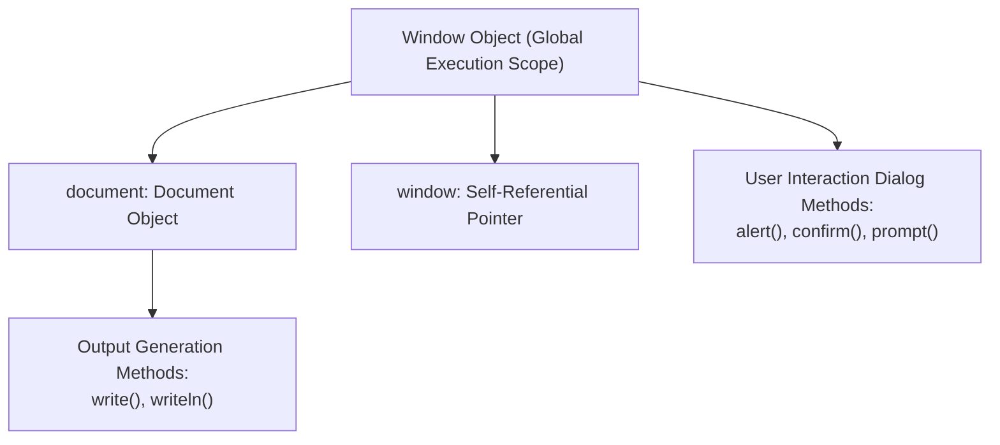
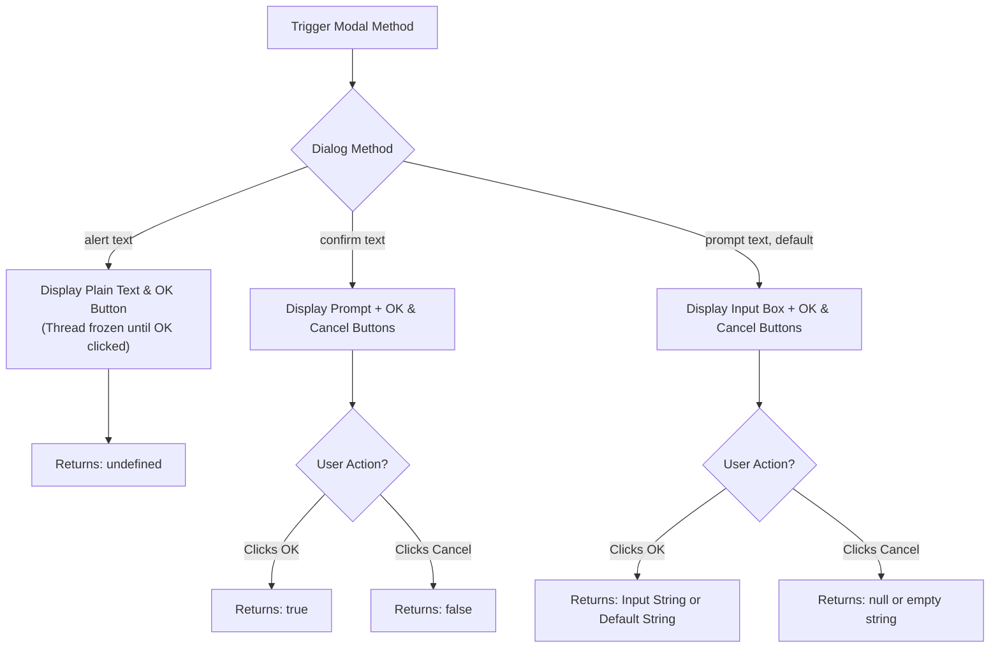
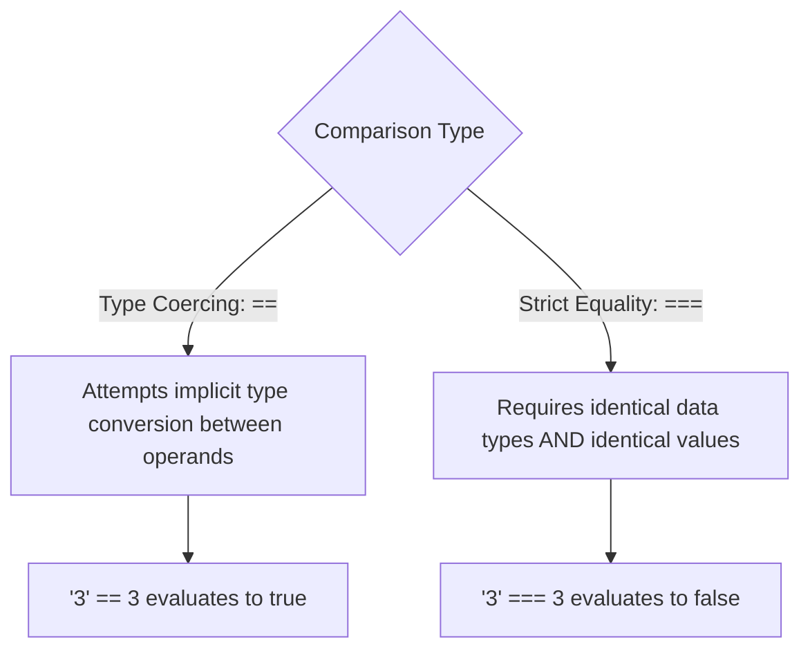

# Screen Output, Keyboard Input, and Control Flow

## 5. Screen Output and Keyboard Input

### 5.1 The Browser Model: `Window` and `Document` Objects

Client-side JavaScript interacts with the browser using object models of the environment:
- **`Window` Object**: Represents the browser window/tab frame. It serves as the **default implicit global object** context in client-side JavaScript. Calls to global methods do not require explicitly writing `window.` (e.g., `alert()` is equivalent to `window.alert()`).
  - **`window.document`**: Property referencing the `Document` object for the loaded HTML page.
  - **`window.window`**: Self-referential property pointing back to the `Window` instance.
- **`Document` Object**: Represents the parse tree and visual surface of the loaded HTML document.



---

### 5.2 Screen Output Generation (`document.write`)

`document.write()` creates dynamic HTML markup inline as the document is being parsed.

#### Mechanics of `document.write()`
- **Parameter Concatenation**: Accepts single or multiple comma-separated parameters. Multiple parameters are concatenated into a continuous string before output injection.
- **HTML Markup Interpretation**: Injected content is handed directly to the HTML parser. HTML tags inside parameters (such as `<br />`, `<table>`, `<b>`) are rendered visually by the browser.
- **Plain Text Newlines**: Plain text escape sequence `\n` is ignored by the HTML layout engine (renders as standard whitespace).
- **`document.writeln()`**: Appends an implicit `\n` newline character to its string argument. Has no visible effect in standard HTML rendering unless output is inside `<pre>` tags.

```javascript
var result = 42;
document.write("The result is: ", result, "<br />");
```

---

### 5.3 Modal User Interaction Dialogs

The `Window` object provides three built-in modal dialog methods. All three methods **block the execution thread** of the JavaScript interpreter until the user completes the required interaction.



#### Modal Dialog Comparison Matrix

| Method | Parameters | Return Type | Display Elements | Formatting Rule |
| :--- | :--- | :--- | :--- | :--- |
| `alert()` | `(messageText)` | `undefined` | Plain text prompt + **OK** button | Takes plain text. **`\n` creates newline**; HTML tags like `<br />` are NOT rendered. |
| `confirm()` | `(messageText)` | `Boolean` (`true` / `false`) | Plain text prompt + **OK** & **Cancel** buttons | Used for binary decision branches. |
| `prompt()` | `(promptText, defaultInput)` | `String` | Text box + **OK** & **Cancel** buttons | Collects user text input. Returns string input or default string. |

---

### 5.4 📜 Complete Program Code Listing: Quadratic Equation Solver

When calculating quadratic equation roots $x = \frac{-b \pm \sqrt{b^2 - 4ac}}{2a}$, negative discriminants ($b^2 - 4ac < 0$) produce non-real numbers. In JavaScript, `Math.sqrt()` executed on a negative number returns `NaN`.

#### 1. `roots.html`
```html
<!DOCTYPE html>
<!-- roots.html 
     A document for roots.js
     -->
<html lang = "en">
  <head>
    <title> roots.html </title>
    <meta charset = "utf-8" />
  </head>
  <body>
    <script type = "text/javascript" src = "roots.js">
    </script>
  </body>
</html>
```

#### 2. `roots.js`
```javascript
// roots.js 
//   Compute the real roots of a given quadratic
//   equation. If the roots are imaginary, this script
//   displays NaN, because that is what results from 
//   taking the square root of a negative number

// Get the coefficients of the equation from the user
var a = prompt("What is the value of 'a'? \n", "");
var b = prompt("What is the value of 'b'? \n", "");
var c = prompt("What is the value of 'c'? \n", "");

// Compute the square root and denominator of the result
var root_part = Math.sqrt(b * b - 4.0 * a * c);
var denom = 2.0 * a;

// Compute and display the two roots
var root1 = (-b + root_part) / denom;
var root2 = (-b - root_part) / denom;

document.write("The first root is: ", root1, "<br />");
document.write("The second root is: ", root2, "<br />"); 
```

---

## 6. Control Statements

### 6.1 Compound Statements & Variable Scope Trap

- **Compound Statement**: A sequence of statements enclosed within curly braces `{ ... }`.
- **Block Scope Trap**: In JavaScript, compound statement block wrappers `{ ... }` **do NOT create a local variable scope** for variables declared with `var`. 

```javascript
{
  var x = 10;
}
console.log(x); // Outputs 10 (x is accessible outside the block!)
```
*(Variables declared using `var` are visible throughout the entire document or enclosing function scope).*

---

### 6.2 Control Expressions & Truthy / Falsy Evaluation

Control statements evaluate expressions to determine truth values (`true` or `false`).

#### Implicit Boolean Conversion Rules

| Type | Falsy Values (`false`) | Truthy Values (`true`) |
| :--- | :--- | :--- |
| **Boolean** | `false` | `true` |
| **Number** | `0`, `-0`, `NaN` | Any non-zero numeric value |
| **String** | `""` (empty string) | Any non-empty string |
| **Objects / Null / Undefined**| `null`, `undefined` | Any Object reference (including empty `{}` and `[]`) |

#### Numeric Evaluation of Booleans
- In arithmetic contexts: `true` evaluates to `1`, `false` evaluates to `0`.

---

### 6.3 Relational and Equality Operators

#### Coercing (`==`, `!=`) vs. Strict (`===`, `!==`) Equality



#### Object Equality Rule
Relational equality checks (`==` or `===`) on object variables check **reference identity in memory**, not property equality.

```javascript
var objA = { id: 1 };
var objB = { id: 1 };
var objC = objA;

console.log(objA == objB);  // false (Different heap memory addresses)
console.log(objA === objB); // false (Different heap memory addresses)
console.log(objA == objC);  // true  (Both reference the exact same heap memory)
```

---

### 6.4 Complete Operator Precedence & Associativity Table

| Precedence Order | Operator Symbol(s) | Description | Associativity |
| :--- | :--- | :--- | :--- |
| **1 (Highest)** | `++`, `--`, unary `-`, unary `+`, `!` | Increment, Decrement, Negation, Logical NOT | Right-to-Left |
| **2** | `*`, `/`, `%` | Multiplication, Division, Modulus | Left-to-Right |
| **3** | binary `+`, binary `-` | Addition, Subtraction, Concatenation | Left-to-Right |
| **4** | `<`, `>`, `<=`, `>=` | Relational Comparisons | Left-to-Right |
| **5** | `==`, `!=` | Coercing Equality / Inequality | Left-to-Right |
| **6** | `===`, `!==` | Strict Equality / Inequality | Left-to-Right |
| **7** | `&&` | Logical Short-Circuit AND | Left-to-Right |
| **8** | `||` | Logical Short-Circuit OR | Left-to-Right |
| **9 (Lowest)** | `=`, `+=`, `-=`, `*=`, `/=`, `%=` | Assignment & Compound Assignment | Right-to-Left |

---

### 6.5 Selection Statements (`if-else` and `switch`)

#### `switch` Statement Mechanics
- Evaluates control expression once.
- Compares expression value against `case` values using **strict equality (`===`)**.
- **Fall-through Execution**: Without an explicit `break;` statement at the end of a `case` block, execution continues sequentially into subsequent `case` blocks.
- **Heterogeneous Cases**: `case` labels can evaluate to mixed types (numbers, strings, booleans).

---

### 6.6 📜 Complete Program Code Listing: Dynamic Table Generation (`borders2.js`)

```javascript
// borders2.js 
//   An example of a switch statement for table border
//   size selection
var bordersize;
var err = 0;

bordersize = prompt("Select a table border size: " +
                    "0 (no border), " +
                    "1 (1 pixel border), " +
                    "4 (4 pixel border), " +
                    "8 (8 pixel border), ");

switch (bordersize) {
  case "0": 
    document.write("<table>");
    break;
  case "1": 
    document.write("<table border = '1'>");
    break;
  case "4": 
    document.write("<table border = '4'>");
    break;
  case "8": 
    document.write("<table border = '8'>");
    break;
  default: {
    document.write("Error - invalid choice: ", bordersize, "<br />");
    err = 1;
  }
} 

if (err == 0) {
  document.write("<caption> 2010 NFL Divisional Winners </caption>");
  document.write("<tr>",
                 "<th />",
                 "<th> American Conference </th>",
                 "<th> National Conference </th>",
                 "</tr>",
                 "<tr>",
                 "<th> East </th>",
                 "<td> New England Patriots </td>",
                 "<td> Philadelphia Eagles </td>",
                 "</tr>",
                 "<tr>",
                 "<th> North </th>",
                 "<td> Pittsburgh Steelers </td>",
                 "<td> Chicago Bears </td>",
                 "</tr>",
                 "<tr>",
                 "<th> West </th>",
                 "<td> Kansas City Chiefs </td>",
                 "<td> Seattle Seahawks </td>",
                 "</tr>",
                 "<tr>",
                 "<th> South </th>",
                 "<td> Indianapolis Colts </td>",
                 "<td> Atlanta Falcons </td>",
                 "</tr>",
                 "</table>");
}
```

---

### 6.7 Loop Constructs (`while`, `for`, `do-while`)

#### 1. `while` Loop
Pre-test loop. Evaluates control condition before each iteration.

```javascript
while (control_expression)
  statement_or_compound_statement;
```

#### 2. `for` Loop
Pre-test loop with initialization, control condition, and increment expressions.

```javascript
for (initial_expression; control_expression; increment_expression)
  statement_or_compound_statement;
```

- **Comma Expression**: `initial_expression` and `increment_expression` can contain multiple comma-separated assignments.

#### 3. `do-while` Loop
Post-test loop. The control expression is evaluated at the end of the loop structure, ensuring the body executes **at least once**.

```javascript
do {
  count++;
  sum = sum + (sum * count);
} while (count <= 50);
```

---

### 6.8 📜 Complete Program Code Listing: Date Manipulation & Benchmarking (`date.js`)

```javascript
// date.js 
//   Illustrates the use of the Date object by 
//   displaying the parts of a current date and
//   using two Date objects to time a calculation

// Get the current date
var today = new Date();

// Fetch the various parts of the date
var dateString = today.toLocaleString();
var day = today.getDay();
var month = today.getMonth();
var year = today.getFullYear();
var timeMilliseconds = today.getTime();
var hour = today.getHours();
var minute = today.getMinutes();
var second = today.getSeconds();
var millisecond = today.getMilliseconds();

// Display the parts
document.write(
  "Date: " + dateString + "<br />",
  "Day: " + day + "<br />",
  "Month: " + month + "<br />",
  "Year: " + year + "<br />",
  "Time in milliseconds: " + timeMilliseconds + "<br />",
  "Hour: " + hour + "<br />",
  "Minute: " + minute + "<br />",
  "Second: " + second + "<br />",
  "Millisecond: " + millisecond + "<br />"
);

// Time a loop execution
var dum1 = 1.00149265, product = 1;
var start = new Date();

for (var count = 0; count < 10000; count++) {
  product = product + 1.000002 * dum1 / 1.00001;
}

var end = new Date();
var diff = end.getTime() - start.getTime();

document.write("<br />The loop took " + diff + " milliseconds <br />");
```
