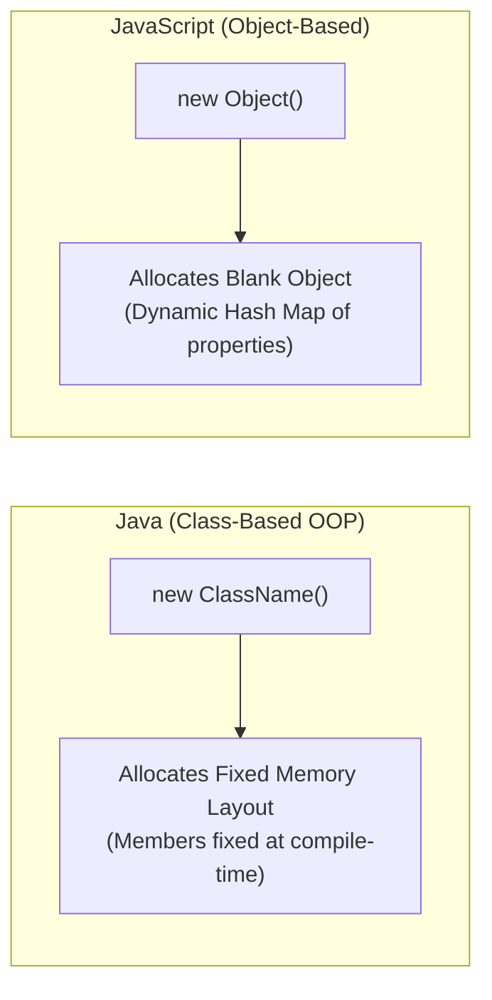

# Objects and Arrays in JavaScript

## 7. Object Creation and Modification

### 7.1 Object Instantiation Mechanics (Java vs. JavaScript)

In traditional class-based languages (such as Java), the `new` operator instantiates an object of a rigid, pre-compiled class structure where members are fixed. In JavaScript:
- The `new` operator creates a **blank object** with no initial properties.
- Objects have no rigid types or fixed member structures.
- Properties are created and initialized dynamically by constructors or by direct assignment.



---

### 7.2 Object Creation Techniques

#### 1. Constructor Invocation
```javascript
var my_object = new Object(); // Creates empty object instance
```
*(Parentheses are mandatory when calling constructors, even if no parameters are passed).*

#### 2. Object Literal Syntax
```javascript
var my_car = { make: "Ford", model: "Fusion" };
```
*(Creates an object and initializes properties inline without explicitly invoking `new Object()`)*.

---

### 7.3 Dynamic Property Mutation & Access Notation

Properties are named values bound to object references. Because properties are not variables, they are never declared with `var`.

#### Dynamic Property Creation and Deletion
```javascript
var my_car = new Object();

// Dynamic Property Addition
my_car.make = "Ford";
my_car.model = "Fusion";

// Nested Object Creation
my_car.engine = new Object();
my_car.engine.config = "V6";
my_car.engine.hp = 263;

// Property Deletion
delete my_car.model;
```

#### Property Access Notation Comparison

| Access Syntax | Example | Description |
| :--- | :--- | :--- |
| **Dot Notation** | `my_car.make` | Standard direct property access. Property name must be a valid identifier. |
| **Bracket Notation** | `my_car["make"]` | Subscript notation. Accesses property using a **string literal or variable**. |

```javascript
var prop1 = my_car.make;     // "Ford"
var prop2 = my_car["make"];   // "Ford"

var field = "engine";
console.log(my_car[field].config); // "V6"
```

- **Uninitialized Property Access Trap**: Attempting to access an object property that does not exist returns `undefined` (does not throw a ReferenceError).

---

### 7.4 Object Property Enumeration (`for-in` Loop)

The `for-in` loop iterates over all enumerable property keys of an object.

```javascript
for (var prop in my_car) {
  document.write("Name: ", prop, "; Value: ", my_car[prop], "<br />");
}
```
- In each iteration, `prop` is assigned the **string name** of a property key.
- Values are retrieved using bracket notation (`my_car[prop]`).

---

## 8. Arrays

### 8.1 Array Object Creation

Arrays in JavaScript are specialized `Object` instances with dynamic memory allocation and high-level array methods. Array elements can store mixed primitive types, object references, or other sub-arrays.

#### 1. Constructor Allocation (`new Array`)
```javascript
var my_list = new Array(1, 2, "three", "four"); // Length = 4
var your_list = new Array(100);                 // Length = 100 (Unallocated slots)
```

> [!IMPORTANT]
> **Single Parameter Constructor Trap**: Passing a single numeric argument to `new Array(N)` creates an array with `.length = N` containing $N$ empty unallocated element slots. It does **NOT** create a 1-element array containing the number $N$.

#### 2. Array Literal Syntax
```javascript
var my_list_2 = [1, 2, "three", "four"]; // Length = 4
```

---

### 8.2 Array Characteristics & Dynamic `.length` Mechanics

- **Zero-Indexed**: Element indexing starts strictly at `0`.
- **Dynamic Growth**: Assigning a value to an index beyond the current bounds automatically expands the array.
- **`.length` Formula**: `length = highest_assigned_index + 1`.

```javascript
var my_list = [1, 2, 3, 4]; // length = 4
my_list[47] = 2222;         // length automatically becomes 48!
```

#### Sparse Array Memory Allocation
Space in heap memory is allocated **only for assigned elements**. Unassigned index slots within the range do not consume element memory storage.

```javascript
var new_list = new Array();
new_list.length = 1002; // Sets .length property to 1002, but 0 element slots are allocated in memory
```

#### `.length` Mutation Behavior
- **Increasing `.length`**: Expands array boundary without allocating memory values.
- **Decreasing `.length`**: **Truncates array elements!** Elements indexed at or above the new length value are permanently deleted.

---

### 8.3 📜 Complete Program Code Listing: Array In-Place Insertion (`insert_names.js`)

This program maintains an alphabetically sorted array of names. When a user inputs a name via `prompt()`, it shifts existing elements down to insert the new string while preserving alphabetical order.

```javascript
// insert_names.js 
//   This script has an array of names, name_list,
//   whose values are in alphabetical order. New
//   names are input through a prompt. Each new
//   name is inserted into the name_list array,
//   after which the new list is displayed.

// The original list of names
var name_list = new Array("Al", "Betty", "Kasper",
                          "Michael", "Roberto", "Zimbo");
var new_name, index, last;

// Loop to get a new name and insert it
while (new_name = prompt("Please type a new name", "")) {
  last = name_list.length - 1;

  // Loop to find the place for the new name (shifting elements right)
  while (last >= 0 && name_list[last] > new_name) { 
    name_list[last + 1] = name_list[last];
    last--;
  }

  // Insert the new name into its spot in the array
  name_list[last + 1] = new_name;

  // Display the new array
  document.write("<p><strong>The new name list is:</strong> <br />");
  for (index = 0; index < name_list.length; index++) {
    document.write(name_list[index], "<br />");
  }
  document.write("</p>");
} // end of outer while loop
```

---

### 8.4 Built-in Array Methods Reference

```mermaid
graph TD
    ArrayMethods[Array Built-in Methods] --> Transform[String Conversion & Formatting]
    ArrayMethods --> StackQueue[Stack & Queue Operations]
    ArrayMethods --> SearchSort[Ordering & Subsets]

    Transform --> join["join(separator): Converts elements to single string"]
    Transform --> toString["toString(): Comma-separated element string"]

    StackQueue --> push["push(val): Append to HIGH end"]
    StackQueue --> pop["pop(): Remove from HIGH end"]
    StackQueue --> unshift["unshift(val): Prepend to LOW end"]
    StackQueue --> shift["shift(): Remove from LOW end"]

    SearchSort --> reverse["reverse(): Inverts element order in-place"]
    SearchSort --> sort["sort(): Coerces to strings & sorts alphabetically"]
    SearchSort --> concat["concat(...vals): Appends values/arrays returning new array"]
    SearchSort --> slice["slice(start, end): Shallow copy subset from start to end-1"]
```

#### Detailed Method Behaviors

| Method | Parameters | Return Value | Operational Mechanics |
| :--- | :--- | :--- | :--- |
| `join()` | `(separator?: string)` | `String` | Concatenates all elements into a string using `separator` (default `,`). |
| `reverse()` | None | `Array` | Reverses array element positions **in-place**. |
| `sort()` | None | `Array` | Coerces elements to strings and sorts alphabetically in-place. |
| `concat()` | `(val1, val2, ...)` | `Array` | Returns a **new array** containing original elements followed by appended values. |
| `slice()` | `(start, end?)` | `Array` | Returns subset array from `start` index up to (excluding) `end` index. |
| `toString()` | None | `String` | Converts elements to comma-delimited string (equivalent to `join()`). |
| `push()` | `(element)` | `Number` | Adds element to the end (high-index) of array; returns new length. |
| `pop()` | None | Any | Removes and returns element from the end (high-index) of array. |
| `unshift()` | `(element)` | `Number` | Inserts element at index `0` (low-index); shifts elements right. |
| `shift()` | None | Any | Removes and returns element at index `0`; shifts remaining elements left. |

```javascript
var list = ["Dasher", "Dancer", "Donner", "Blitzen"];

// Stack Operations (High End)
var deer = list.pop();   // deer = "Blitzen"; list = ["Dasher", "Dancer", "Donner"]
list.push("Blitzen");    // list = ["Dasher", "Dancer", "Donner", "Blitzen"]

// Queue Operations (Low End / Index 0)
var first = list.shift(); // first = "Dasher"; list = ["Dancer", "Donner", "Blitzen"]
list.unshift("Dasher");   // list = ["Dasher", "Dancer", "Donner", "Blitzen"]
```

---

### 8.5 Multi-Dimensional Arrays

Multi-dimensional arrays are represented in JavaScript as **arrays of arrays**.

#### 📜 Complete Program Code Listing: 2D Matrix Iteration (`nested_arrays.js`)

```javascript
// nested_arrays.js 
//   An example illustrating an array of arrays

// Create an array object with three arrays as its elements
var nested_array = [
  [2, 4, 6], 
  [1, 3, 5], 
  [10, 20, 30]
];

// Display the elements of nested_list using nested loops
for (var row = 0; row <= 2; row++) { 
  document.write("Row ", row, ": ");
  for (var col = 0; col <= 2; col++) {
    document.write(nested_array[row][col], " ");
  }
  document.write("<br />");
}
```
