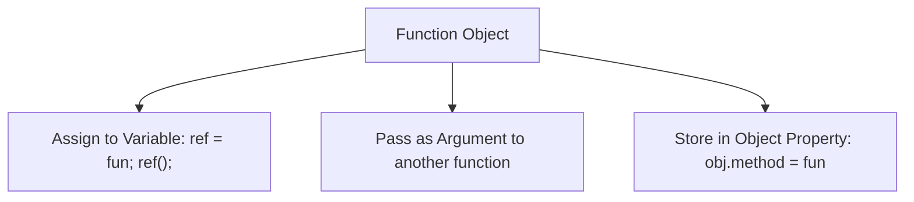
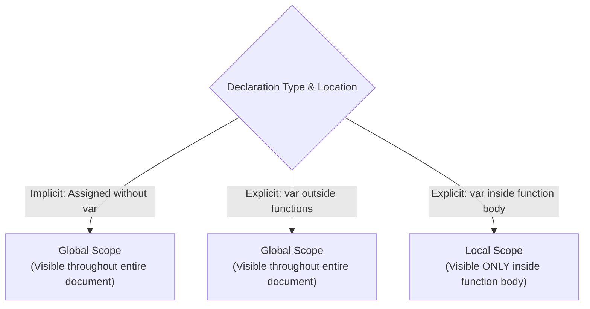

# Functions and Custom Object Constructors

## 9. Functions

### 9.1 Function Fundamentals & First-Class Object Status

A function definition consists of a header (`function` keyword, name, parameter list) and a body enclosed in a compound statement `{ ... }`.

```javascript
function name(parameter1, parameter2) {
  // Function Body
  return expression;
}
```

#### Key Functional Rules
- **Return Behavior**: A function returns control to its caller upon encountering `return`. If no `return` is executed or if `return` lacks an expression, the function evaluates to **`undefined`**.
- **First-Class Objects**: JavaScript functions are instances of `Object`. Function references can be:
  - Assigned to variables (`var ref = myFunc; ref();`)
  - Passed as arguments to other subprograms
  - Stored inside array slots or object properties (acting as methods)
- **HTML Placement Standard**: Function definitions must be placed in the `<head>` of the HTML document (explicitly or implicitly) so the interpreter parses the definition prior to executing body calls.



---

### 9.2 Variable Scope: Global vs. Local Variables

The scope of a variable determines its visibility across document lines.



> [!WARNING]
> **Implicit Global Trap**: Assigning a value to a variable *without* `var` inside a function body implicitly creates a **global variable** accessible outside the function. Always use `var` inside function bodies to scope variables locally.

#### Shadowing Rule
If a local variable inside a function shares the same identifier name as a global variable, the local variable takes precedence (shadows the global variable) within the function's execution context.

---

### 9.3 Parameters & Passing Mechanics

#### 1. Pass-By-Value Mechanics
JavaScript strictly uses **pass-by-value** parameter passing.
- **Primitives**: The raw value is copied into the formal parameter. Modifying the parameter inside the function has no effect on the caller's variable.
- **Objects & Arrays**: The **reference pointer value** is copied into the formal parameter.
  - Modifying object properties or array elements mutates the caller's object in heap memory.
  - Reassigning the formal parameter to a new object instance (`my_list = list2`) breaks the reference link and has **no effect** on the caller's variable.

```javascript
function fun1(my_list) {
  my_list[3] = 14;           // Mutates original array element in caller!
  my_list = new Array(1, 3); // Reassigns local parameter reference; does NOT alter caller!
}
```

---

#### 2. Dynamic Arity & The `arguments` Array

JavaScript does not enforce parameter count matching between caller arguments and formal definition parameters.
- **Excess Actual Parameters**: Extra arguments passed by caller are ignored by formal parameter bindings.
- **Missing Actual Parameters**: Unmatched formal parameters evaluate to `undefined`.
- **The `arguments` Array**: Every function execution context possesses an array-like object named `arguments`.
  - `arguments.length`: Number of actual parameters passed at call time.
  - `arguments[i]`: Accesses the $i$-th parameter.

#### 📜 Complete Program Code Listing: Variable Parameter Handling (`params.js`)

```javascript
// params.js 
//   The params function and a test driver for it.
//   This example illustrates a variable number of
//   function parameters

// Function params 
// Parameters: A variable number of parameters 
// Returns: nothing
// Displays its parameters
function params(a, b) {
  document.write("Function params was passed ",
      arguments.length, " parameter(s) <br />");
  document.write("Parameter values are: <br />");
  
  for (var arg = 0; arg < arguments.length; arg++) {
    document.write(arguments[arg], "<br />");
  }
  document.write("<br />");
}

// A test driver for function params
params("Mozart");
params("Mozart", "Beethoven");
params("Mozart", "Beethoven", "Tchaikowsky");
```

---

#### 3. Simulating Pass-By-Reference for Primitives
Because primitives are passed by value, functions cannot directly mutate primitive arguments in the caller scope.

```javascript
// Method 1: Array Wrapper Workaround
function by10(a) {
  a[0] *= 10;
}
var listx = [5];
by10(listx); // listx[0] is now 50

// Method 2: Return Value Re-assignment
function by10_2(a) {
  return 10 * a;
}
var x = 5;
x = by10_2(x); // x is now 50
```

---

### 9.4 Custom Array Sorting (`Array.prototype.sort`)

By default, `sort()` coerces elements to strings and orders them alphabetically. To sort non-strings or custom numeric orders, pass a **comparator function** `cmp(a, b)` returning:
- **Negative number**: If $a$ should precede $b$.
- **Zero**: If $a$ and $b$ are equivalent in order.
- **Positive number**: If $b$ should precede $a$ (swap required).

```javascript
// Numeric Ascending Comparator
function ascii_asc(a, b) { return a - b; }

// Numeric Descending Comparator
function ascii_desc(a, b) { return b - a; }

var num_list = [40, 100, 1, 5, 25];
num_list.sort(ascii_desc); // Output: [100, 40, 25, 5, 1]
```

---

## 10. An Example: Median Calculation

Calculating the median of an array of numbers requires sorting elements and taking the middle element (for odd lengths) or average of two middle elements (for even lengths).

#### 📜 Complete Program Code Listing: Array Median Calculation (`medians.js`)

```javascript
// medians.js 
//   A function and a function tester
//   Illustrates array operations

// Function median
//   Parameter: An array of numbers
//   Result: The median of the array
//   Return value: median number
function median(list) {
  // Sort array numerically using an anonymous inline comparator function
  list.sort(function (a, b) { return a - b; });
  
  var list_len = list.length;

  // Check if array length is odd or even
  if ((list_len % 2) == 1) {
    return list[Math.floor(list_len / 2)];
  } else {
    return Math.round((list[list_len / 2 - 1] + list[list_len / 2]) / 2);
  }
} // end of function median

// Test driver
var my_list_1 = [8, 3, 9, 1, 4, 7];
var my_list_2 = [10, -2, 0, 5, 3, 1, 7];

var med = median(my_list_1); 
document.write("Median of [", my_list_1, "] is: ", med, "<br />");

med = median(my_list_2);
document.write("Median of [", my_list_2, "] is: ", med, "<br />");
```

- **Side Effect Note**: `list.sort()` mutates the original caller array in-place. If preserving original array order is required, elements must be copied to a local array prior to sorting.

---

## 11. Custom Object Constructors & `this` Keyword

Constructors are specialized functions called with `new` to instantiate custom object structures.

### 11.1 The `this` Keyword Mechanics
When a function is called as a constructor using `new`:
1. JavaScript allocates a blank object in heap memory.
2. `this` inside the constructor is bound to that newly allocated blank object.
3. Properties and methods are attached directly to `this`.
4. The constructor implicitly returns `this`.

```javascript
// Custom Constructor Definition
function car(new_make, new_model, new_year) {
  // Data Properties
  this.make = new_make;
  this.model = new_model;
  this.year = new_year;
  
  // Method Property Binding
  this.display = display_car;
}

// External Method Function
function display_car() {
  document.write("Car make: ", this.make, "<br/>");
  document.write("Car model: ", this.model, "<br/>");
  document.write("Car year: ", this.year, "<br/>");
}

// Object Instantiation
var my_car = new car("Ford", "Fusion", "2012");
my_car.display(); // Invokes display_car with 'this' bound to my_car
```

### 11.2 Class Emulation & Instance Divergence
Objects constructed from the same constructor initially share the identical set of data properties and methods. However, because JavaScript objects are dynamic, individual instances can diverge post-instantiation by adding or deleting properties independently.
