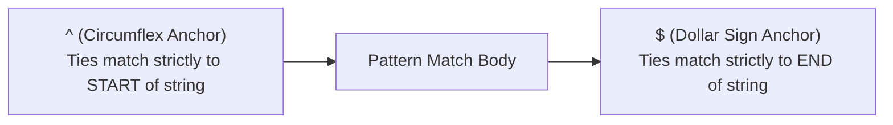
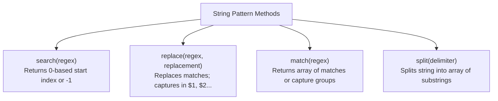
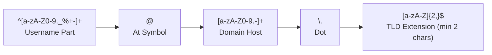

# Regular Expressions, Pattern Matching, and Script Debugging

## 12. Pattern Matching Using Regular Expressions

JavaScript regular expression pattern matching is based on Perl regular expression syntax. Regular expressions are delimited by slashes (`/pattern/`) and can be executed via `RegExp` object methods or `String` object pattern-matching methods.

---

### 12.1 Character and Character-Class Patterns

#### 1. Metacharacters & Escaping
- **Metacharacters**: Characters with special pattern syntax meanings:  
  `\` `|` `(` `)` `[` `]` `{` `}` `^` `$` `*` `+` `?` `.`
- **Escaping**: Precede metacharacter with backslash `\` to match literal character (e.g., `/3\.4/` matches `3.4`).
- **Wildcard Period (`.`)**: Matches **any single character except a newline (`\n`)**.

#### 2. Character Classes (`[...]`)
- **Explicit Character Sets**: `[abc]` matches `'a'`, `'b'`, or `'c'`.
- **Character Ranges**: `[a-h]` matches any lowercase letter from `'a'` to `'h'`.
- **Negated Character Classes (`[^...]`)**: A circumflex `^` as the **first character inside brackets** negates the set. E.g., `[^aeiou]` matches any character *except* lower-case vowels.

#### 3. Predefined Character Classes Reference Table

| Predefined Class | Equivalent Pattern | Matches |
| :--- | :--- | :--- |
| `\d` | `[0-9]` | Any single digit |
| `\D` | `[^0-9]` | Any non-digit character |
| `\w` | `[A-Za-z_0-9]` | Any word character (alphanumeric + underscore) |
| `\W` | `[^A-Za-z_0-9]` | Any non-word character |
| `\s` | `[ \r\t\n\f]` | Any whitespace character |
| `\S` | `[^ \r\t\n\f]` | Any non-whitespace character |

#### 4. Quantifiers

| Quantifier | Meaning | Example Pattern | Matching Sample |
| :--- | :--- | :--- | :--- |
| `{N}` | Exactly $N$ repetitions | `/xy{4}z/` | Matches `"xyyyyz"` |
| `*` | 0 or more repetitions | `/x*y+z?/` | Matches `"y"`, `"xy"`, `"xxxyz"` |
| `+` | 1 or more repetitions | `/\d+\.\d*/` | Matches `"3.14"`, `"42."` |
| `?` | 0 or 1 repetition (optional) | `/[A-Za-z]\w*/` | Identifier matching |

#### 5. Word Boundary Anchor (`\b`)
- `\b` matches a zero-width **position boundary** between a word character (`\w`) and a non-word character (`\W`).
- *Example*: `/\bis\b/` matches `"A tulip is a flower"` but does **not** match `"A frog isn't"` (because `s` in `isn't` is followed by word character `n`).

---

### 12.2 Anchors

Anchors match zero-width **positions** relative to the string boundaries.



- **`^` (Start Anchor)**: When placed at the start of a pattern outside brackets, matches string beginning. `/^pearl/` matches `"pearls"` but NOT `"My pearls"`.
- **`$` (End Anchor)**: When placed at the end of a pattern, matches string termination. `/gold$/` matches `"I like gold"` but NOT `"golden"`.

---

### 12.3 Pattern Modifiers

Modifiers are placed after the trailing slash delimiter (`/pattern/modifiers`).

| Modifier | Name | Operational Behavior |
| :--- | :--- | :--- |
| `i` | Case-Insensitive | Ignores letter case (`/Apple/i` matches `"apple"`, `"APPLE"`). |
| `g` | Global Match | Performs matching/replacing across the **entire string** instead of stopping after first match. |
| `x` | Extended Mode | Ignores unescaped whitespace and permits `#` comments inside pattern string. |

---

### 12.4 Pattern-Matching Methods of `String`



#### Method Details & Examples

1. **`String.prototype.search(regex)`**:
   ```javascript
   var str = "Rabbits are furry";
   var pos = str.search(/bits/); // Returns index 3
   ```

2. **`String.prototype.replace(regex, replacement)`**:
   - Replaces matched substring with replacement text.
   - When using capturing parentheses `(...)`, matched groups are assigned to `$1`, `$2`, `$3`.
   ```javascript
   var str = "Fred, Freddie, and Frederica were siblings";
   var result = str.replace(/Fre/g, "Boy");
   // result = "Boyd, Boyddie, and Boyderica were siblings"
   // $1 = "Fre", $2 = "Fre", $3 = "Fre"
   ```

3. **`String.prototype.match(regex)`**:
   - **With `g` modifier**: Returns array of all matching substrings.
     ```javascript
     var str = "Having 4 apples is better than having 3 oranges";
     var matches = str.match(/\d/g); // Returns ["4", "3"]
     ```
   - **Without `g` modifier**: Returns array where index `0` is full match, and index `1..N` hold parenthesized group matches `(...)`.
     ```javascript
     var str = "I have 428 dollars, but I need 500";
     var matches = str.match(/(\d+)([^\d]+)(\d+)/);
     // Returns: ["428 dollars, but I need 500", "428", " dollars, but I need ", "500"]
     ```

4. **`String.prototype.split(delimiter)`**:
   ```javascript
   var str = "grapes:apples:oranges";
   var fruit = str.split(":"); // Returns ["grapes", "apples", "oranges"]
   ```

---

### 12.5 📜 Practice Regex Problems & Solutions (Form Validation Suite)

#### Problem 1: Person Full Name Validation
- **Requirement**: Must start with a capital letter, allow letters, spaces, hyphens, and apostrophes (e.g. `"John Doe"`, `"Mary-Ann O'Connor"`).
- **Regex Pattern**: `/^[A-Z][a-z]+(['\s-][A-Z][a-z]+)+$/`

```javascript
function validateFullName(name) {
  var namePattern = /^[A-Z][a-z]+(['\s-][A-Z][a-z]+)+$/;
  return namePattern.test(name); // Returns true or false
}

console.log(validateFullName("John Doe"));          // true
console.log(validateFullName("Mary-Ann O'Connor")); // true
console.log(validateFullName("john doe"));          // false (Starts lowercase)
```

---

#### Problem 2: Email Address Validation
- **Requirement**: Standard email format `username@domain.extension` (e.g. `user.name123@sub.domain.edu`).
- **Regex Pattern**: `/^[a-zA-Z0-9._%+-]+@[a-zA-Z0-9.-]+\.[a-zA-Z]{2,}$/`



```javascript
function validateEmail(email) {
  var emailPattern = /^[a-zA-Z0-9._%+-]+@[a-zA-Z0-9.-]+\.[a-zA-Z]{2,}$/;
  return emailPattern.test(email);
}

console.log(validateEmail("varun.tech@college.edu")); // true
console.log(validateEmail("invalid-email@com"));      // false (Invalid TLD)
console.log(validateEmail("@missing-user.com"));       // false (Missing username)
```

---

#### Problem 3: Strong Password Validation
- **Requirement**: Minimum 8 characters long, containing at least:
  - 1 uppercase letter (`(?=.*[A-Z])`)
  - 1 lowercase letter (`(?=.*[a-z])`)
  - 1 digit (`(?=.*\d)`)
  - 1 special character (`(?=.*[@$!%*?&])`)
- **Regex Pattern**: `/^(?=.*[a-z])(?=.*[A-Z])(?=.*\d)(?=.*[@$!%*?&])[A-Za-z\d@$!%*?&]{8,}$/`

```javascript
function validatePassword(password) {
  var pwdPattern = /^(?=.*[a-z])(?=.*[A-Z])(?=.*\d)(?=.*[@$!%*?&])[A-Za-z\d@$!%*?&]{8,}$/;
  return pwdPattern.test(password);
}

console.log(validatePassword("SecureP@ss1")); // true
console.log(validatePassword("weakpass"));    // false (No uppercase/digits/specials)
console.log(validatePassword("Short1!"));     // false (Under 8 characters)
```

---

#### Problem 4: Indian PIN Code & US ZIP Code Validation
- **Indian 6-Digit PIN Code** (Cannot start with `0`): `/^[1-9]\d{5}$/`
- **US 5-Digit / 9-Digit ZIP Code** (`90210` or `90210-1234`): `/^\d{5}(-\d{4})?$/`

```javascript
function validateIndianPin(pin) {
  return /^[1-9]\d{5}$/.test(pin);
}

function validateUSZip(zip) {
  return /^\d{5}(-\d{4})?$/.test(zip);
}

console.log(validateIndianPin("560001"));   // true
console.log(validateIndianPin("012345"));   // false (Starts with 0)

console.log(validateUSZip("90210"));        // true
console.log(validateUSZip("90210-1234"));   // true
console.log(validateUSZip("9021"));         // false (Invalid length)
```

---

## 13. Form Input Validation Case Study

Pattern matching is widely used to validate form input format before submitting to servers.

### 📜 Complete Program Code Listing: Phone Number Validation (`forms_check.js`)

Validates 7-digit phone numbers formatted strictly as 3 digits, a hyphen, and 4 digits (`XXX-XXXX`).

```javascript
// forms_check.js 
//   A function tst_phone_num is defined and tested.
//   This function checks the validity of phone
//   number input from a form 

// Function tst_phone_num
//   Parameter: A string
//   Result: Returns true if the parameter has the form of a valid 
//           seven-digit phone number (3 digits, a dash, 4 digits)
function tst_phone_num(num) {
  // Use pattern anchored to beginning (^) and end ($) of string
  var ok = num.search(/^\d{3}-\d{4}$/);
  
  if (ok == 0) {
    return true;
  } else {
    return false;
  }
} // end of function tst_phone_num

// A script to test tst_phone_num 
var tst = tst_phone_num("444-5432");
if (tst) {
  document.write("444-5432 is a valid phone number <br />");
} else {
  document.write("Error in tst_phone_num <br />");
}

tst = tst_phone_num("444-r432");
if (tst) {
  document.write("Program error <br />");
} else {
  document.write("444-r432 is not a valid phone number <br />");
}

tst = tst_phone_num("44-1234");
if (tst) {
  document.write("Program error <br />");
} else {
  document.write("44-1234 is not a valid phone number <br />");
}
```

---

## 14. Errors in Scripts and Debugging

### 14.1 Classifications of Errors
1. **Syntax Errors**: Caught during initial browser parsing (e.g. mismatched parentheses, invalid keywords).
2. **Runtime / Interpretation Errors**: Occur during script execution (e.g. accessing properties of `undefined`).

### 14.2 Syntax Error Demonstration Script (`debugdemo.js`)

#### 📜 Complete Program Code Listing: Missing Parenthesis Syntax Bug (`debugdemo.js`)

```javascript
// debugdemo.js
//   An example to illustrate debugging help 

var row;
row = 0;

// SYNTAX ERROR TRAP: Missing right parenthesis in while condition control expression!
while(row != 4 {
  document.write("row is ", row, "<br />");
  row++;
}
```

### 14.3 Browser Debugging Tools & Consoles Overview

- **Internet Explorer (IE9)**: Developer Tools (`Tools -> Developer Tools`). Script error notifications enabled via `Internet Options -> Advanced -> Display notification about every script error`.
- **Mozilla Firefox**: Error Console (`Tools -> Web Developer -> Error Console`), legacy Venkman Debugger, and Firebug add-on.
- **Google Chrome**: JavaScript Developer Console (`Tools -> Developer tools -> Console`).
