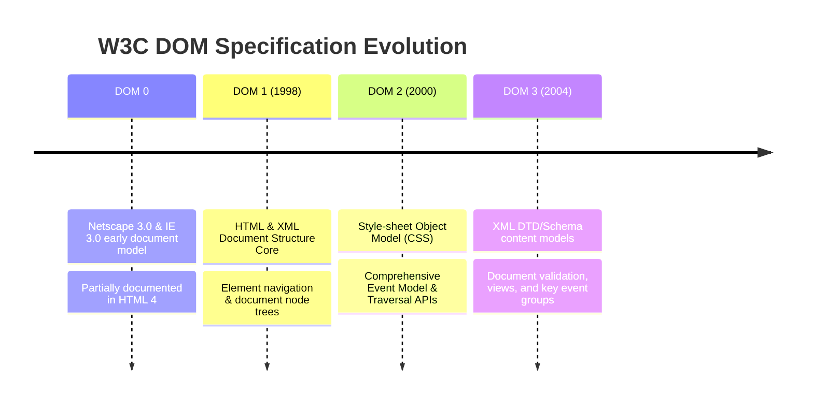
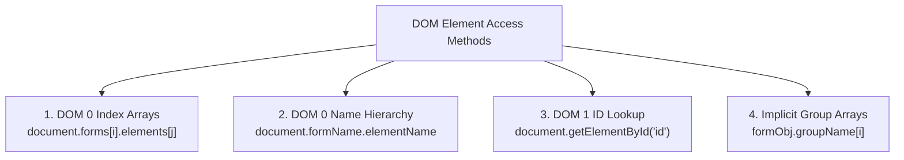

# JavaScript and HTML Documents: Execution Environment, DOM, and Element Access

## 1. The JavaScript Execution Environment

Client-side JavaScript operates within a browser window container. Its execution environment is defined by an object model tree hierarchy rooted at the top-level window.

```mermaid
graph TD
    Win["Window Object (Global Environment Host)"] --> GlobalVars["Global Variables (Properties of Window)"]
    Win --> Doc["Document Object (Displayed HTML Page)"]
    Doc --> Forms["forms[] Array (Collection of <form> elements)"]
    Forms --> FormElem["elements[] Array (Inputs, Buttons, Menus)"]
    Doc --> Anchors["anchors[] Array"]
    Doc --> Links["links[] Array"]
    Doc --> Images["images[] Array"]
```



### 1.1 The `Window` Object
- Represents the browser display window/tab frame.
- **Global Variable Scope Host**: All global variables created in client-side scripts implicitly become properties attached to the global `Window` object.
- Serves as the outer-most enclosing referencing environment.

### 1.2 The `Document` Object
- Represents the visual HTML document currently rendered in the window.
- Accessed via `window.document` or simply `document`.
- Contains built-in property arrays referencing collections of document elements:
  - `document.forms[]`: Collection of all HTML `<form>` elements.
  - `document.images[]`: Collection of all `` tags.
  - `document.links[]`: Collection of all hyperlinked `<a>` tags.
  - `document.anchors[]`: Collection of all named anchor tags.

---

## 2. The Document Object Model (DOM)

The Document Object Model (DOM) is an abstract Application Programming Interface (API) defined by the World Wide Web Consortium (W3C) that specifies an interface between HTML/XML documents and programming languages.

### 2.1 Evolution of DOM Specifications



- **DOM 0**: De facto standard implemented in legacy Netscape 3.0 / IE 3.0. Supported across all JS-enabled engines.
- **DOM 1**: Standardized basic node tree models for HTML/XML documents. Introduced `getElementById()`.
- **DOM 2**: Standardized CSS manipulation, event registration (`addEventListener`), and document traversal APIs.

### 2.2 DOM Abstract Architecture & Language Bindings
- **Tree Structure Representation**: Documents are structured as hierarchical node trees. Each element, attribute, and text snippet forms a node in the tree.
- **Language Binding**: Because the DOM is language-agnostic, each language (JavaScript, Java, C++) defines a binding mapping language constructs to DOM interfaces.
- **Object Properties vs HTML Attributes**: In the JavaScript binding, HTML elements become objects. HTML attributes correspond directly to object properties (e.g., `<input type="text" name="address">` maps to an object with `type = "text"` and `name = "address"`).

---

## 3. Element Access Techniques in JavaScript

JavaScript provides four distinct techniques for addressing HTML elements to attach event handlers or perform dynamic DOM updates.



---

### 3.1 Method 1: DOM 0 Positional Index Arrays (`forms[]` / `elements[]`)

Uses the document's sequential array trees.

```html
<form action="">
  <input type="button" name="turnItOn" />
</form>
```

```javascript
// Accesses 1st form's 1st input element
var dom = document.forms[0].elements[0];
```

> [!WARNING]
> **Fragility Flaw**: Positional addressing breaks completely if an HTML author inserts a new input element or form higher up in the document tree.

---

### 3.2 Method 2: DOM 0 Name Hierarchy (`document.formName.elementName`)

Requires `name` attributes on both the enclosing `<form>` element and target `<input>` elements.

```html
<form name="myForm" action="">
  <input type="button" name="turnItOn" />
</form>
```

```javascript
// Accesses element via document name properties
var dom = document.myForm.turnItOn;
```

---

### 3.3 Method 3: DOM 1 Unique Identifier Lookup (`document.getElementById`)

The standard modern approach. Uses the element's unique `id` attribute, regardless of depth or position in the DOM hierarchy.

```html
<form action="">
  <input type="button" id="turnItOn" name="turnItOn" />
</form>
```

```javascript
// Returns reference to object with matching id
var dom = document.getElementById("turnItOn");
```

- **Best Practice**: In form controls, assign matching values to both `id` (for JS DOM addressing) and `name` (for server form data processing).

---

### 3.4 Method 4: Implicit Group Arrays (Checkboxes and Radio Buttons)

Multiple checkbox buttons or radio buttons that share the same `name` attribute form an **implicit property array** on the parent `<form>` object.

#### 📜 Complete Code Snippet: Group Checkbox / Radio Enumeration

```html
<form id="vehicleGroup">
  <input type="checkbox" name="vehicles" value="car" /> Car
  <input type="checkbox" name="vehicles" value="truck" /> Truck
  <input type="checkbox" name="vehicles" value="bike" /> Bike
</form>
```

```javascript
// Count how many checkboxes in the 'vehicles' group are checked
var numChecked = 0;

// Step 1: Get DOM reference to the parent form
var formDom = document.getElementById("vehicleGroup");

// Step 2: Traverse the implicit array 'vehicles' on the form object
for (var index = 0; index < formDom.vehicles.length; index++) {
  if (formDom.vehicles[index].checked) {
    numChecked++;
  }
}

document.write("Total vehicles selected: ", numChecked);
```

- **`.checked` Property**: A boolean property (`true` if selected, `false` otherwise).
- **Radio Buttons**: Addressed and enumerated using identical implicit array iteration logic.
