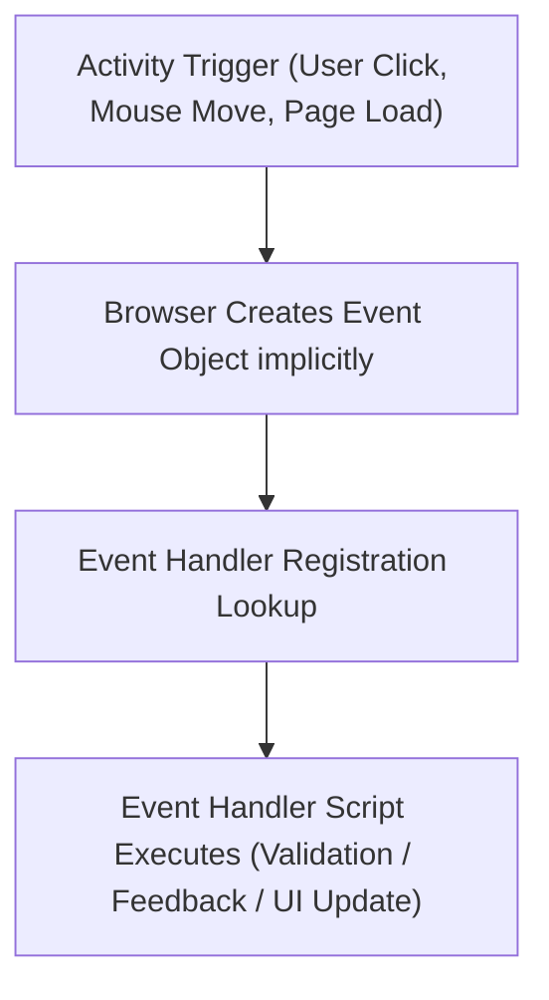
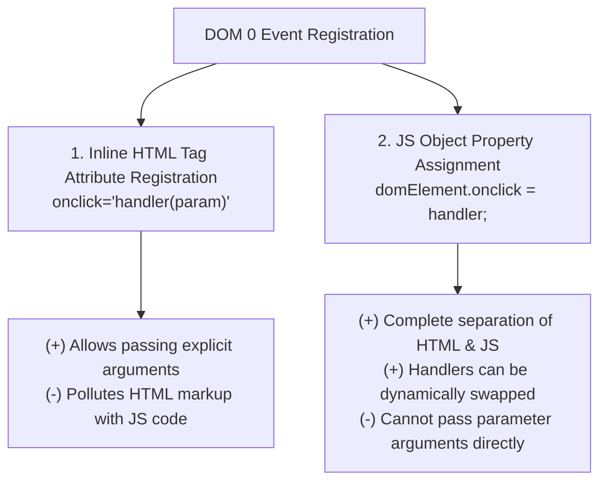

# DOM 0 Event Handling: Core Concepts, Event Registration, and Button Processing

## 4. Events and Event Handling (DOM 0 Model)

Event-driven programming executes code blocks in response to unpredictable user or browser activities.



### 4.1 Core Definitions & Rules
- **Event**: A notification object created implicitly by the browser when an action occurs (e.g., `click`, `load`, `blur`). Event names are **strictly lowercase**.
- **Event Handler**: A JavaScript function or script executed in response to an event occurrence.
- **Registration**: The mechanism connecting an event handler to a specific event on an HTML element.
- **`document.write()` Execution Rule in Event Handlers**:
  > [!CAUTION]
  > **Crucial Exam Rule**: Never call `document.write()` inside an event handler function! Because event handlers execute *after* the initial HTML page parsing has completed, calling `document.write()` will completely overwrite and replace the currently loaded document on screen.

---

### 4.2 Focus and Blur Mechanics
- **Focus (`focus` / `onfocus`)**: Triggered when an element becomes active via a mouse click or keyboard tabbing. Input focus dictates where keyboard keystrokes are directed. Only one element can hold focus at a time.
- **Blur (`blur` / `onblur`)**: Triggered when an element loses active focus (e.g., user tabs or clicks away to another element).

---

### 4.3 Standard Events, Attributes, and Tag Bindings

| Event Name | Tag Attribute | Compatible Tags | Trigger Circumstance |
| :--- | :--- | :--- | :--- |
| `blur` | `onblur` | `<a>`, `<button>`, `<input>`, `<textarea>`, `<select>` | Element loses input focus. |
| `change` | `onchange` | `<input>`, `<textarea>`, `<select>` | Value is modified AND element loses focus. |
| `click` | `onclick` | `<a>`, `<input>`, `<button>`, Most elements | Element is clicked with primary mouse button. |
| `dblclick` | `ondblclick` | Most elements | Element is double-clicked. |
| `focus` | `onfocus` | `<a>`, `<button>`, `<input>`, `<textarea>`, `<select>` | Element acquires focus. |
| `keydown` | `onkeydown` | `<body>`, Form elements | A key is depressed. |
| `keypress` | `onkeypress` | `<body>`, Form elements | A key is pressed and released. |
| `keyup` | `onkeyup` | `<body>`, Form elements | A key is released. |
| `load` | `onload` | `<body>` | The document completes loading in browser. |
| `mousedown` | `onmousedown` | Most elements | Mouse button is pressed down over element. |
| `mousemove` | `onmousemove` | Most elements | Mouse pointer moves within element bounds. |
| `mouseout` | `onmouseout` | Most elements | Mouse pointer exits element bounds. |
| `mouseover` | `onmouseover` | Most elements | Mouse pointer enters element bounds. |
| `mouseup` | `onmouseup` | Most elements | Mouse button is released over element. |
| `reset` | `onreset` | `<form>` | Form reset button is clicked. |
| `select` | `onselect` | `<input type="text">`, `<textarea>` | Text content is highlighted/selected. |
| `submit` | `onsubmit` | `<form>` | Form submit button is clicked. |
| `unload` | `onunload` | `<body>` | User navigates away from or closes document. |

---

### 4.4 Two Event Registration Approaches (DOM 0)



#### Approach 1: Inline Tag Attribute Registration
```html
<input type="button" id="myButton" onclick="planeChoice(152);" />
```

#### Approach 2: JS Object Property Registration

##### Option A: Addressing via `elements[]` Array
```javascript
var dom = document.getElementById("myForm");
dom.elements[0].onclick = planeChoice;
```

##### Option B: Addressing via Unique Element `id`
```html
<input type="radio" name="planeButton" value="152" id="152" />
```
```javascript
document.getElementById("152").onclick = planeChoice;
document.getElementById("172").onclick = planeChoice;
document.getElementById("182").onclick = planeChoice;
document.getElementById("210").onclick = planeChoice;
```

---

## 5. Body Element Event Handling

### 📜 Complete Program Code Listing: Page Load Notification (`load.html` & `load.js`)

#### 1. `load.html`
```html
<!DOCTYPE html>
<!-- load.html
     A document for load.js
     -->
<html lang = "en">
  <head>
    <title> load.html </title>
    <meta charset = "utf-8" />
    <script type = "text/javascript" src = "load.js">
    </script>
  </head>
  <body onload="load_greeting();">
    <p />
  </body>
</html>
```

#### 2. `load.js`
```javascript
// load.js
//   An example to illustrate the load event

// The onload event handler
function load_greeting() {
  alert("You are visiting the home page of \n" +
        "Pete's Pickled Peppers \n" + "WELCOME!!!");
}
```

---

## 6. Button Element Event Handling: Inline vs. Property Registration

### 📜 Complete Program Code Listing 1: Inline Parameterized Handler (`radio_click.html` & `radio_click.js`)

Registers `onclick` in HTML tag attributes, passing the model numeric code directly as a parameter.

#### 1. `radio_click.html`
```html
<!DOCTYPE html>
<!-- radio_click.html
     A document for radio_click.js
     Creates four radio buttons that call the planeChoice 
     event handler to display descriptions
     -->
<html lang = "en">
  <head>
    <title> radio_click.html </title>
    <meta charset = "utf-8" />
    <script type = "text/javascript" src = "radio_click.js">
    </script>
  </head>
  <body>
    <h4> Cessna single-engine airplane descriptions </h4>
    <form id = "myForm" action = "">
      <p>
        <label> 
          <input type = "radio" name = "planeButton" value = "152" 
                 onclick = "planeChoice(152)" />
          Model 152 
        </label>
        <br />
        <label> 
          <input type = "radio" name = "planeButton" value = "172"
                 onclick = "planeChoice(172)" />
          Model 172 (Skyhawk) 
        </label>
        <br />
        <label> 
          <input type = "radio" name = "planeButton" value = "182"
                 onclick = "planeChoice(182)" />      
          Model 182 (Skylane) 
        </label>
        <br />
        <label> 
          <input type = "radio" name = "planeButton" value = "210"
                 onclick = "planeChoice(210)" />
          Model 210 (Centurian) 
        </label>
      </p>
    </form>
  </body>
</html>
```

#### 2. `radio_click.js`
```javascript
// radio_click.js
//   An example of the use of the click event with radio buttons,
//   registering the event handler by assignment to the button
//   attributes

// The event handler for a radio button collection
function planeChoice(plane) {
  // Produce an alert message about the chosen airplane
  switch (plane) {
    case 152: 
      alert("A small two-place airplane for flight training");
      break;
    case 172: 
      alert("The smaller of two four-place airplanes");
      break; 
    case 182:
      alert("The larger of two four-place airplanes");
      break;    
    case 210:
      alert("A six-place high-performance airplane");
      break; 
    default:
      alert("Error in JavaScript function planeChoice");
      break;
  }
}
```

---

### 📜 Complete Program Code Listing 2: Un-parameterized Property Handler (`radio_click2.html`, `radio_click2.js`, & `radio_click2r.js`)

Registers handlers via JavaScript property assignment. Because property assignments cannot pass parameters directly, the handler function inspects the `.checked` state of the form button array.

#### 1. `radio_click2.html`
```html
<!DOCTYPE html>
<!-- radio_click2.html
     A document for radio_click2.js
     -->
<html lang = "en">
  <head>
    <title> radio_click2.html </title>
    <meta charset = "utf-8" />
    <script type = "text/javascript" src = "radio_click2.js">
    </script>
  </head>
  <body>
    <h4> Cessna single-engine airplane descriptions </h4>
    <form id = "myForm" action = "">
      <p>
        <label> 
          <input type = "radio" name = "planeButton" value = "152" /> 
          Model 152 
        </label>
        <br />
        <label> 
          <input type = "radio" name = "planeButton" value = "172" />
          Model 172 (Skyhawk) 
        </label>
        <br />
        <label> 
          <input type = "radio" name = "planeButton" value = "182" /> 
          Model 182 (Skylane) 
        </label>
        <br />
        <label> 
          <input type = "radio" name = "planeButton" value = "182" /> 
          Model 210 (Centurian) 
        </label>
      </p>
    </form>
    <!-- Script for registering the event handlers after DOM rendering -->
    <script type = "text/javascript" src = "radio_click2r.js">
    </script>
  </body>
</html>
```

#### 2. `radio_click2.js` (Handler Definition)
```javascript
// radio_click2.js
//   An example of the use of the click event with radio buttons,
//   registering the event handler by assigning an event property

// The event handler for a radio button collection
function planeChoice() {
  var plane;
  // Put the DOM address of the form in a local variable
  var dom = document.getElementById("myForm");

  // Determine which button was pressed by looping through implicit array
  for (var index = 0; index < dom.planeButton.length; index++) {
    if (dom.planeButton[index].checked) {
      plane = dom.planeButton[index].value;
      break;
    }
  }

  // Produce an alert message about the chosen airplane
  switch (plane) {
    case "152": 
      alert("A small two-place airplane for flight training");
      break;
    case "172": 
      alert("The smaller of two four-place airplanes");
      break; 
    case "182":
      alert("The larger of two four-place airplanes");
      break;    
    case "210":
      alert("A six-place high-performance airplane");
      break; 
    default:
      alert("Error in JavaScript function planeChoice");
      break;
  }
}
```

#### 3. `radio_click2r.js` (Registration Script)
```javascript
// radio_click2r.js
//   The event registering code for radio_click2

var dom = document.getElementById("myForm");

// Assign function reference to onclick property on elements array
dom.elements[0].onclick = planeChoice;
dom.elements[1].onclick = planeChoice;
dom.elements[2].onclick = planeChoice;
dom.elements[3].onclick = planeChoice;
```
