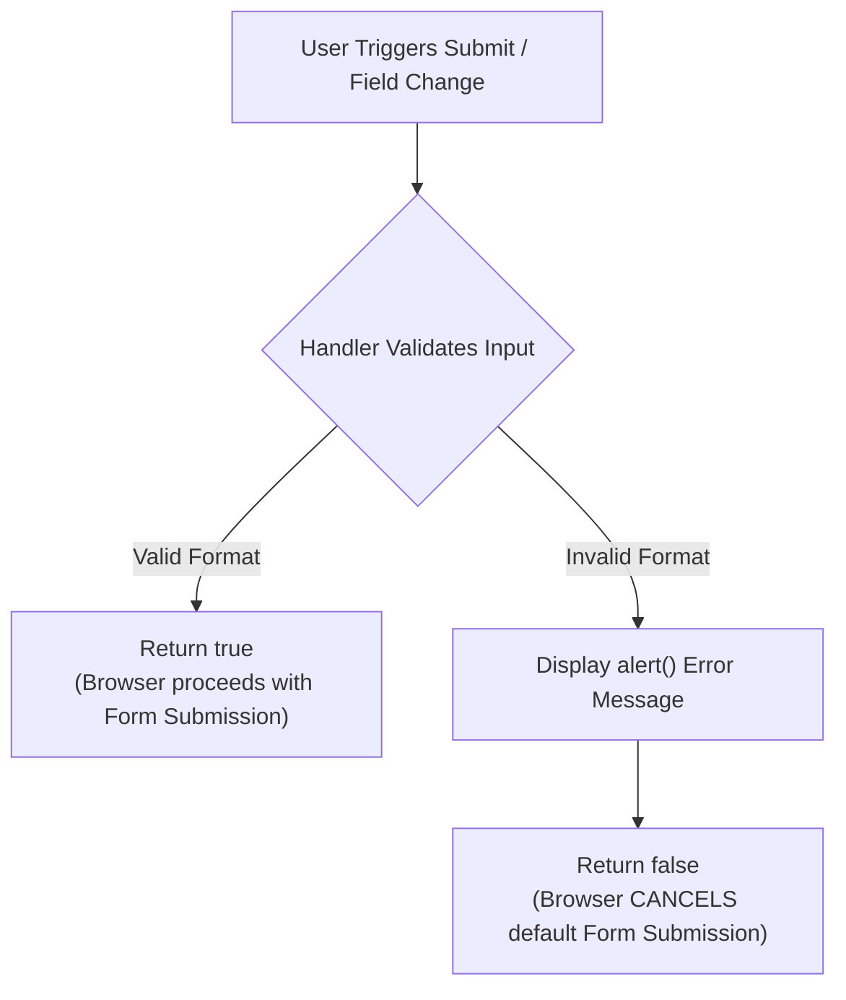

# Handling Events from Text Box and Password Elements

## 7. Form Field Event Handling & Input Validation

Text boxes (`<input type="text">`) and password fields (`<input type="password">`) emit four key events:
- `focus`: Element acquires active input cursor.
- `blur`: Element loses active focus.
- `change`: Value is modified **AND** element subsequently loses focus.
- `select`: User highlights text inside the element.

---

### 7.1 The Focus Event & Read-Only Blur Lock

To prevent users from modifying calculated fields (e.g. Total Cost in a shopping cart), an event handler attached to `onfocus` can immediately invoke `.blur()` to revoke focus.

#### 📜 Complete Program Code Listing: Read-Only Calculated Field (`nochange.html` & `nochange.js`)

#### 1. `nochange.html`
```html
<!DOCTYPE html>
<!-- nochange.html
     A document for nochange.js
     -->
<html lang = "en">
  <head> 
    <title> nochange.html </title>
    <meta charset = "utf-8" />
    <script type = "text/javascript" src = "nochange.js">
    </script>
    <style type = "text/css">
      td, th, table { border: thin solid black; }
    </style>
  </head>
  <body>
    <form action = "">
      <h3> Coffee Order Form </h3>
      <!-- A bordered table for item orders -->
      <table>
        <!-- Table Column Headings --> 
        <tr>
          <th> Product Name </th>
          <th> Price </th>
          <th> Quantity </th>
        </tr>
        <!-- Table Data Entries -->
        <tr>
          <th> French Vanilla (1 lb.) </th>
          <td> $3.49 </td>
          <td> <input type = "text" id = "french" size = "2" /> </td>
        </tr>
        <tr>
          <th> Hazlenut Cream (1 lb.) </th>
          <td> $3.95 </td>
          <td> <input type = "text" id = "hazlenut" size = "2" /> </td>
        </tr> 
        <tr>
          <th> Colombian (1 lb.) </th>
          <td> $4.59 </td>
          <td> <input type = "text" id = "colombian" size = "2" /></td>
        </tr>
      </table>

      <!-- Button for precomputation of total cost -->
      <p>
        <input type = "button" value = "Total Cost" onclick = "computeCost();" />
        <!-- Read-Only Cost Field: Forces blur upon focus -->
        <input type = "text" size = "5" id = "cost" onfocus = "this.blur();" />
      </p>

      <!-- Submit and Reset Buttons -->
      <p>
        <input type = "submit" value = "Submit Order" /> 
        <input type = "reset" value = "Clear Order Form" />
      </p>
    </form>
  </body>
</html>
```

#### 2. `nochange.js`
```javascript
// nochange.js
//   This script illustrates using the focus event
//   to prevent the user from changing a text field

// The event handler function to compute the cost
function computeCost() {
  var french = document.getElementById("french").value;
  var hazlenut = document.getElementById("hazlenut").value;
  var colombian = document.getElementById("colombian").value;

  // Compute the total cost and assign to the read-only input value
  document.getElementById("cost").value = 
    french * 3.49 + hazlenut * 3.95 + colombian * 4.59;
}
```

---

### 7.2 Form Input Validation Principles & The `return false` Pattern

Client-side input validation reduces server workload and saves network round-trips by verifying data before submission.



> [!IMPORTANT]
> **Canceling Default Actions**: Returning `false` from a validation event handler bound to `onsubmit` instructs the browser to **cancel the default form submission action**, keeping bad data from being sent across the network.

---

### 7.3 Password Verification Matching

When prompting users to set a password, double input fields are verified on `onblur` or `onsubmit`.

#### 📜 Complete Program Code Listing: Double Password Verification (`pswd_chk.html`, `pswd_chk.js`, & `pswd_chkr.js`)

#### 1. `pswd_chk.html`
```html
<!DOCTYPE html>
<!-- pswd_chk.html
     A document for pswd_chk.js
     Creates two text boxes for passwords
     -->
<html lang = "en">
  <head>
    <title> Illustrate password checking </title>
    <meta charset = "utf-8" />
    <script type = "text/javascript" src = "pswd_chk.js">
    </script>
  </head>
  <body>
    <h3> Password Input </h3>
    <form id = "myForm" action = "">
      <p>
        <label> Your password 
          <input type = "password" id = "initial" size = "10" />
        </label>
        <br /><br />
        <label> Verify password 
          <input type = "password" id = "second" size = "10" />
        </label>
        <br /><br />
        <input type = "reset" name = "reset" />
        <input type = "submit" name = "submit" />
      </p>
    </form>
    <!-- Script for registering the event handlers -->
    <script type = "text/javascript" src = "pswd_chkr.js">
    </script>
  </body>
</html>
```

#### 2. `pswd_chk.js`
```javascript
// pswd_chk.js
//   An example of input password checking using the submit event

// The event handler function for password checking
function chkPasswords() { 
  var init = document.getElementById("initial");
  var sec = document.getElementById("second");

  // Test 1: Check if initial password field is empty
  if (init.value == "") {
    alert("You did not enter a password \n" +
          "Please enter one now");
    return false;
  }

  // Test 2: Check if initial and secondary passwords match
  if (init.value != sec.value) {
    alert("The two passwords you entered are not the same \n" +
          "Please re-enter both now");
    return false;
  } else {
    return true;
  }
}
```

#### 3. `pswd_chkr.js`
```javascript
// pswd_chkr.js
//   Register the event handlers for pswd_chk.html

// Register handler on blur of 2nd field AND on submit of the form
document.getElementById("second").onblur = chkPasswords; 
document.getElementById("myForm").onsubmit = chkPasswords;
```

---

### 7.4 Form Field Format Validation (`onchange`)

Triggered via `onchange` when field text is edited and focus is lost.

#### Regex Patterns Used:
1. **Name Format** (`last-name, first-name, middle-initial`):  
   `/^[A-Z][a-z]+, ?[A-Z][a-z]+, ?[A-Z]\.?$/`
   - `^[A-Z][a-z]+, `: Last name starting uppercase, followed by comma.
   - `?[A-Z][a-z]+, `: Optional space, First name starting uppercase, followed by comma.
   - `?[A-Z]\.?$`: Optional space, uppercase middle initial, optional period, anchored to end (`$`).

2. **US 10-Digit Phone Format** (`ddd-ddd-dddd`):  
   `/^\d{3}-\d{3}-\d{4}$/`

#### 📜 Complete Program Code Listing: Customer Info Validator (`validator.html`, `validator.js`, & `validatorr.js`)

#### 1. `validator.html`
```html
<!DOCTYPE html>
<!-- validator.html
     A document for validator.js
     Creates text boxes for a name and a phone number
     -->
<html lang = "en">
  <head>
    <title> Illustrate form input validation </title>
    <meta charset = "utf-8" />
    <script type = "text/javascript" src = "validator.js">
    </script>
  </head>
  <body>
    <h3> Customer Information </h3>
    <form action = "">
      <p>
        <label>
          <input type = "text" id = "custName" />
          Name (last name, first name, middle initial)
        </label>
        <br /><br />
        <label>
          <input type = "text" id = "phone" />
          Phone number (ddd-ddd-dddd)
        </label>
        <br /><br />
        <input type = "reset" id = "reset" />
        <input type = "submit" id = "submit" />
      </p>
    </form>
    <script type = "text/javascript" src = "validatorr.js">
    </script>
  </body>
</html>
```

#### 2. `validator.js`
```javascript
// validator.js
//   An example of input validation using the change and submit events

// The event handler function for the name text box
function chkName() {
  var myName = document.getElementById("custName");

  // Test format: last-name, first-name, middle-initial
  var pos = myName.value.search(/^[A-Z][a-z]+, ?[A-Z][a-z]+, ?[A-Z]\.?$/);
  
  if (pos != 0) {
    alert("The name you entered (" + myName.value + 
          ") is not in the correct form. \n" +
          "The correct form is: last-name, first-name, middle-initial \n" +
          "Please go back and fix your name");
    return false;
  } else {
    return true;
  }
}

// The event handler function for the phone number text box
function chkPhone() {
  var myPhone = document.getElementById("phone");

  // Test format: ddd-ddd-dddd
  var pos = myPhone.value.search(/^\d{3}-\d{3}-\d{4}$/);
  
  if (pos != 0) {
    alert("The phone number you entered (" + myPhone.value +
          ") is not in the correct form. \n" +
          "The correct form is: ddd-ddd-dddd \n" +
          "Please go back and fix your phone number");
    return false;
  } else {
    return true;
  }
}
```

#### 3. `validatorr.js`
```javascript
// validatorr.js
//   Register the event handlers for validator.html

document.getElementById("custName").onchange = chkName;
document.getElementById("phone").onchange = chkPhone;
```
