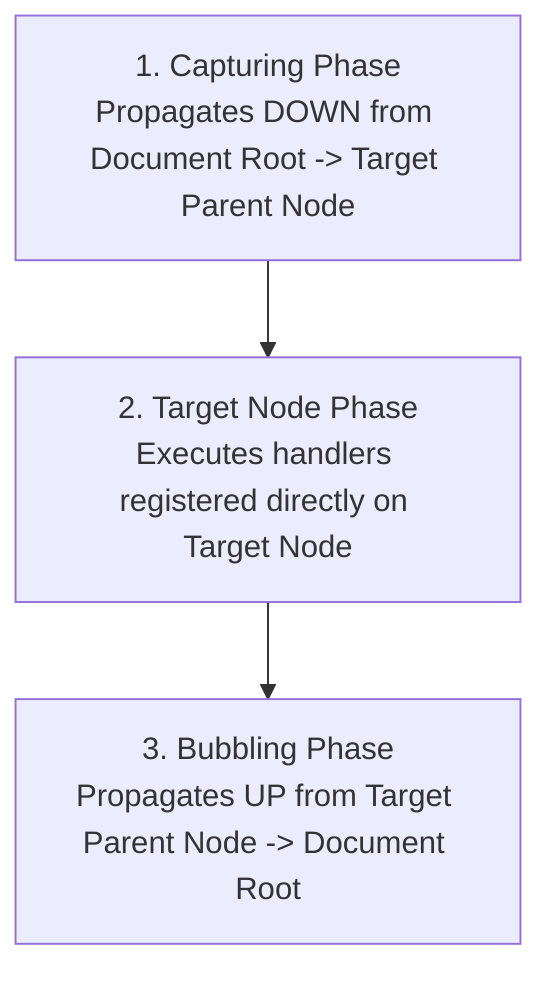
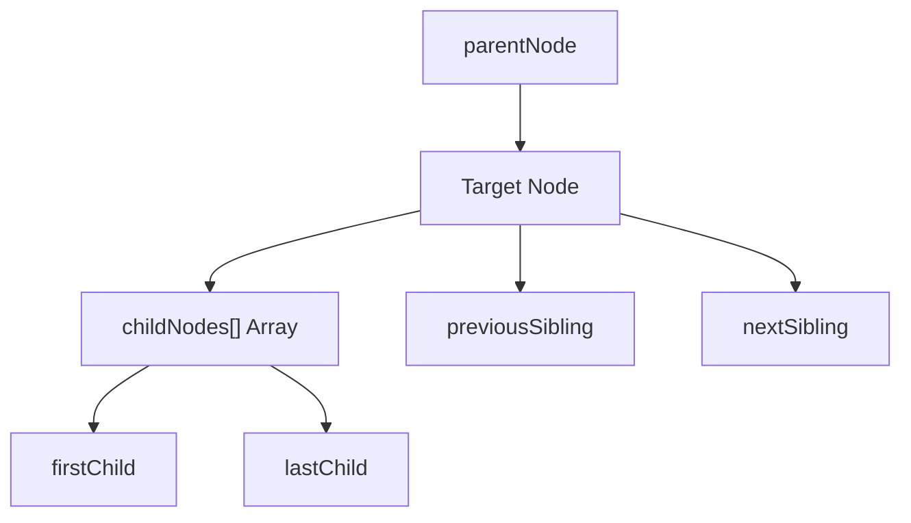

# Advanced DOM 2 Event Model, HTML5 Canvas, Navigator, and DOM Tree Traversal

## 8. The DOM 2 Event Model

The DOM 2 Event Model is a sophisticated, standardized event-handling specification defined in the W3C DOM Level 2 module.

### 8.1 DOM 2 Modules & Event Interfaces

| Module Name | Event Interface | Event Types Handled |
| :--- | :--- | :--- |
| **`HTMLEvents`** | `Event` | `abort`, `blur`, `change`, `error`, `focus`, `load`, `reset`, `resize`, `scroll`, `select`, `submit`, `unload` |
| **`MouseEvents`** | `MouseEvent` | `click`, `mousedown`, `mousemove`, `mouseout`, `mouseover`, `mouseup` |

---

### 8.2 Three-Phase Event Propagation Architecture

When an event occurs on an HTML element, the event object traverses the document tree in **three distinct phases**:



#### Detailed Phase Mechanics:
1. **Capturing Phase**:
   - The event propagates **downward** from the document root node toward the target node.
   - Handlers registered specifically with capturing enabled (`useCapture = true`) are triggered.
2. **Target Node Phase**:
   - The event reaches the actual target node that originated the event.
   - Handlers registered directly on the target node execute (regardless of capturing flag).
3. **Bubbling Phase**:
   - The event bubbles **upward** back toward the document root.
   - Handlers registered for bubbling (`useCapture = false`) execute along the ancestor path.
   - *Note*: Mouse events bubble; `load` and `unload` events do **not** bubble.

#### Propagation & Default Action Control Methods
- **`event.stopPropagation()`**: Halts further event propagation along the capture/bubble tree path.
- **`event.preventDefault()`**: Prevents the browser's default action associated with the event (equivalent to `return false` in DOM 0).

---

### 8.3 Event Listener Registration (`addEventListener`)

In DOM 2, handlers are attached using `addEventListener()` (defined in `EventTarget` interface).

```javascript
targetNode.addEventListener(eventTypeString, handlerFunction, useCaptureBoolean);
```

| Parameter | Type | Description |
| :--- | :--- | :--- |
| **`eventTypeString`** | `String` | Event name without `on` prefix (e.g. `"change"`, `"click"`, `"submit"`). |
| **`handlerFunction`** | `Function` | Function reference or unquoted function name to execute. |
| **`useCaptureBoolean`**| `Boolean` | `true` = Enable for **Capturing Phase**; `false` = Enable for **Target & Bubbling Phases**. |

#### Removal of Event Listeners
```javascript
targetNode.removeEventListener(eventTypeString, handlerFunction, useCaptureBoolean);
```

#### Event Object Properties (`Event` & `MouseEvent`)
When triggered, DOM 2 automatically passes the `event` object as the first parameter to the handler function:
- **`event.target`**: References the actual target node that generated the event.
- **`event.currentTarget`**: References the node currently executing the event handler.
- **`event.clientX` / `event.clientY`**: Cursor X and Y coordinates relative to the browser client area.

---

### 8.4 📜 Complete Program Code Listing: DOM 2 Validator (`validator2.html`, `validator2.js`, & `validator2r.js`)

#### 1. `validator2.html`
```html
<!DOCTYPE html>
<!-- validator2.html
     A document for validator2.js
     Creates text boxes for a name and a phone number
     Note: This document does not work with IE browsers before IE9
     -->
<html lang = "en">
  <head>
    <title> Illustrate form input validation with DOM 2 </title>
    <meta charset = "utf-8" />
    <script type = "text/javascript" src = "validator2.js">
    </script>
  </head>
  <body>
    <h3> Customer Information </h3>
    <form action = "">
      <p>
        <label>
          <input type = "text" id = "custName" />
          Name (last name, first name, middle initial)
        </label>
        <br /><br />
        <label>
          <input type = "text" id = "phone" />
          Phone number (ddd-ddd-dddd)
        </label>
        <br /><br />
        <input type = "reset" />
        <input type = "submit" id = "submitButton" />
      </p>
    </form>
    <!-- Script for registering event handlers -->
    <script type = "text/javascript" src = "validator2r.js">
    </script>
  </body>
</html>
```

#### 2. `validator2.js`
```javascript
// validator2.js
//   An example of input validation using the change and submit 
//   events using the DOM 2 event model

// The event handler function for the name text box
function chkName(event) {
  // Get the target node currently processing the event using event.currentTarget
  var myName = event.currentTarget;

  // Test name format
  var pos = myName.value.search(/^[A-Z][a-z]+, ?[A-Z][a-z]+, ?[A-Z]\.?$/);
  if (pos != 0) {
    alert("The name you entered (" + myName.value + 
          ") is not in the correct form. \n" +
          "The correct form is: last-name, first-name, middle-initial \n" +
          "Please go back and fix your name");
  } 
}

// The event handler function for the phone number text box
function chkPhone(event) {
  // Get the target node currently processing the event using event.currentTarget
  var myPhone = event.currentTarget;

  // Test phone number format
  var pos = myPhone.value.search(/^\d{3}-\d{3}-\d{4}$/);
  if (pos != 0) {
    alert("The phone number you entered (" + myPhone.value +
          ") is not in the correct form. \n" +
          "The correct form is: ddd-ddd-dddd \n" +
          "Please go back and fix your phone number");
  } 
}
```

#### 3. `validator2r.js`
```javascript
// validator2r.js
//   Registers the event handlers using DOM 2 addEventListener

var customerNode = document.getElementById("custName");
var phoneNode = document.getElementById("phone");

// Register using addEventListener (useCapture = false for bubbling/target phase)
customerNode.addEventListener("change", chkName, false);
phoneNode.addEventListener("change", chkPhone, false);
```

---

## 9. HTML5 `<canvas>` Element

The `<canvas>` element provides a resolution-dependent bitmap canvas surface for real-time rendering of graphs, games, or dynamic graphics via JavaScript.

```html
<canvas id="myCanvas" height="200" width="400">
  Your browser does not support the HTML5 canvas element.
</canvas>
```
- **Attributes**: `width` (default 300px), `height` (default 150px), `id` (for JS reference).
- Inner content displays as fallback markup for non-supporting legacy browsers.

---

## 10. The `navigator` Object

The `navigator` window property contains information describing the user's browser environment and engine version.

### 📜 Complete Program Code Listing: Browser Detection (`navigate.html` & `navigate.js`)

#### 1. `navigate.html`
```html
<!DOCTYPE html>
<!-- navigate.html
     A document for navigate.js
     Calls the event handler on load
     -->
<html lang = "en">
  <head>
    <title> navigate.html </title>
    <meta charset = "utf-8" />
    <script type = "text/javascript" src = "navigate.js">
    </script>
  </head>
  <body onload="navProperties()">
  </body>
</html>
```

#### 2. `navigate.js`
```javascript
// navigate.js
//  An example of using the navigator object

function navProperties() {
  alert("The browser is: " + navigator.appName + "\n" +
        "The version number is: " + navigator.appVersion + "\n");
}
```

---

## 11. DOM Tree Traversal and Modification (Node Interface)

All nodes in a DOM document implement the `Node` interface, which provides properties for traversing node relationships and methods for mutating tree structures dynamically.



### 11.1 DOM Tree Traversal Properties

| Property | Return Type | Description |
| :--- | :--- | :--- |
| `parentNode` | Node Reference | Addresses parent node of current node. |
| `childNodes` | Node Array | Array collection of immediate child nodes. |
| `firstChild` | Node Reference | Addresses 1st child node (`childNodes[0]`). |
| `lastChild` | Node Reference | Addresses last child node (`childNodes[length - 1]`). |
| `previousSibling` | Node Reference | Addresses preceding sibling node at same level. |
| `nextSibling` | Node Reference | Addresses subsequent sibling node at same level. |
| `nodeType` | Integer | Numeric node classification type (1=Element, 3=Text). |

```javascript
// Display total children under an element
var nod = document.getElementById("mylist");
var totalItems = nod.childNodes.length;
```

---

### 11.2 DOM Tree Modification Methods

| Method Signature | Action / Behavior |
| :--- | :--- |
| `appendChild(newChild)` | Appends `newChild` node to the end of child node list. |
| `insertBefore(newChild, refChild)` | Inserts `newChild` node immediately before `refChild`. |
| `replaceChild(newChild, oldChild)` | Replaces `oldChild` node with `newChild`. |
| `removeChild(oldChild)` | Removes `oldChild` node from tree structure. |
