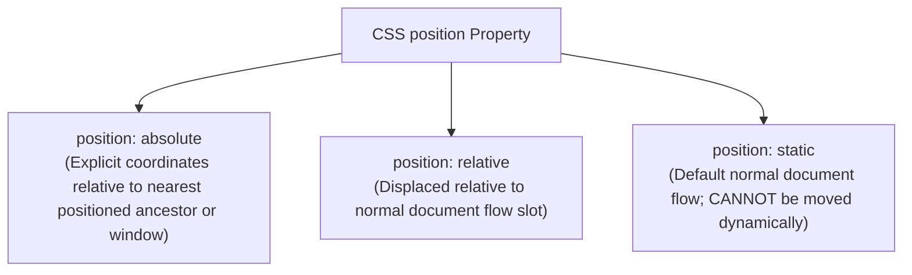
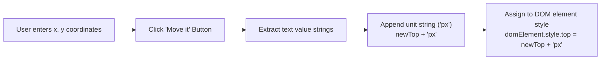

# Dynamic Documents & Element Positioning in JavaScript

## 1. Introduction to Dynamic HTML

Dynamic HTML (DHTML) is not a separate markup language; it is a combination of technologies (HTML, CSS, JavaScript, and the DOM API) that allows elements, attributes, styles, or contents of a rendered page to be modified dynamically while being displayed.

---

## 2. Positioning Elements (CSS-P)

Cascading Style Sheets - Positioning (CSS-P) defines how elements are placed on the browser display and enables JavaScript to dynamically relocate elements by modifying CSS style properties (`top`, `left`, and `position`).



---

### 2.1 Absolute Positioning (`position: absolute`)

An element with `position: absolute` is removed from normal document flow and placed at exact pixel/unit offsets specified by `top` and `left`.

#### Absolute Positioning Rules:
- **Reference Point**: Measured from the upper-left corner of the browser window display area.
- **Nested Reference Point**: If an absolutely positioned element is nested inside another **positioned ancestor element** (an element with `position` set to `absolute` or `relative`), the `top` and `left` values are measured from the **upper-left corner of the enclosing parent element**, not the window!

#### Watermark Superimposition Case Study (`absPos.html` & `absPos2.html`)
Absolute positioning allows superimposing text overlays (e.g., light-gray italicized text over normal text).

#### 📜 Complete Program Code Listing 1: Window Absolute Positioning (`absPos.html`)

```html
<!DOCTYPE html>
<!-- absPos.html
     Illustrates absolute positioning of elements
     -->
<html lang = "en">
  <head>
    <title> Absolute positioning </title>
    <meta charset = "utf-8" />
    <style type = "text/css">
      /* A style for a paragraph of text */
      .regtext { font-family: Times; font-size: 1.2em; width: 500px; } 

      /* A style for the text to be absolutely positioned */
      .abstext { 
        position: absolute; 
        top: 25px; 
        left: 25px; 
        font-family: Times; 
        font-size: 1.9em;
        font-style: italic; 
        letter-spacing: 1em; 
        color: rgb(160,160,160); 
        width: 450px; 
      }
    </style>
  </head>
  <body>
    <p class = "regtext">
      Apple is the common name for any tree of the genus Malus, 
      of the family Rosaceae. Apple trees grow in any of the 
      temperate areas of the world. Some apple blossoms are white,
      but most have stripes or tints of rose. Some apple blossoms
      are bright red. Apples have a firm and fleshy structure that
      grows from the blossom. The colors of apples range from 
      green to very dark red. The wood of apple trees is fine 
      grained and hard. It is, therefore, good for furniture
      construction. Apple trees have been grown for many
      centuries. They are propagated by grafting because they
      do not reproduce themeselves.
      <span class = "abstext">
        APPLES ARE GOOD FOR YOU
      </span>
    </p>
  </body>
</html>
```

#### 📜 Complete Program Code Listing 2: Nested Absolute Positioning (`absPos2.html`)

```html
<!DOCTYPE html>
<!-- absPos2.html
     Illustrates nested absolute positioning of elements
     -->
<html lang = "en">
  <head>
    <title> Nested absolute positioning </title>
    <meta charset = "utf-8" />
    <style type = "text/css">
      /* A style for a paragraph of text positioned 100px from top and left */
      .regtext { 
        font-family: Times; 
        font-size: 1.2em; 
        width: 500px;
        position: absolute; 
        top: 100px; 
        left: 100px; 
      }

      /* A style for nested text measured relative to parent paragraph upper-left */
      .abstext { 
        position: absolute; 
        top: 25px; 
        left: 25px; 
        font-family: Times; 
        font-size: 1.9em; 
        font-style: italic; 
        letter-spacing: 1em;
        color: rgb(160,160,160); 
        width: 450px; 
      }
    </style>
  </head>
  <body>
    <p class = "regtext">
      Apple is the common name for any tree of the genus Malus, 
      of the family Rosaceae. Apple trees grow in any of the  
      temperate areas of the world. Some apple blossoms are white,
      but most have stripes or tints of rose. Some apple blossoms 
      are bright red. Apples have a firm and fleshy structure that 
      grows from the blossom. The colors of apples range from
      green to very dark red. The wood of apple trees is fine
      grained and hard. It is, therefore, good for furniture
      construction. Apple trees have been grown for many
      centuries. They are propagated by grafting because they
      do not reproduce themeselves.
      <span class = "abstext">
        APPLES ARE GOOD FOR YOU
      </span>
    </p>
  </body>
</html>
```

---

### 2.2 Relative Positioning (`position: relative`)

An element with `position: relative` is initially rendered in normal document flow.
- Setting `top` and `left` displaces the element **relative to where it would normally have appeared**.
- Negative values move the element **upward** (negative `top`) and **leftward** (negative `left`).

#### 📜 Complete Program Code Listing: Relative Text Lowering (`relPos.html`)

```html
<!DOCTYPE html>
<!-- relPos.html
     Illustrates relative positioning of elements
     -->
<html lang = "en">
  <head>
    <title> Relative positioning </title>
    <meta charset = "utf-8" />
    <style type = "text/css">
      .regtext { font: 2em Times; }
      /* Displaces word 'GOOD' 15px downward relative to normal text baseline */
      .spectext { 
        font: 2em Times; 
        color: red; 
        position: relative;  
        top: 15px; 
      }
    </style>
  </head>
  <body>
    <p class = "regtext">
      Apples are
      <span class = "spectext"> GOOD </span> for you.
    </p>
  </body>
</html>
```

---

### 2.3 Static Positioning (`position: static`)

`static` is the default value of the `position` property.
- Elements are placed sequentially according to normal document flow.
- **Immovable Restriction**: A statically positioned element **cannot** have `top` or `left` set initially and **cannot be moved dynamically via JavaScript**.

---

## 3. Dynamic Element Movement via JavaScript

Moving an element on screen is achieved by updating the `top` and `left` style properties of an `absolute` or `relative` positioned element using JavaScript.

> [!IMPORTANT]
> **CSS Unit Requirement**: CSS `top` and `left` properties require unit strings (e.g. `"px"`). Numeric values extracted from form text boxes must be concatenated with `"px"` before being assigned to `.style.top` or `.style.left`.



### 📜 Complete Program Code Listing: Interactive Image Mover (`mover.html` & `mover.js`)

#### 1. `mover.html`
```html
<!DOCTYPE html>
<!-- mover.html
     Uses mover.js to move an image within a document
     -->
<html lang = "en">
  <head>
    <title> Moving elements </title>
    <meta charset = "utf-8" />
    <script type = "text/javascript" src = "mover.js">
    </script>
  </head>
  <body>
    <form action = "">
      <p>
        <label>
          x coordinate: 
          <input type = "text" id = "leftCoord" size = "3" />
        </label>
        <br />
        <label>
          y coordinate: 
          <input type = "text" id = "topCoord" size = "3" />
        </label>
        <br />
        <input type = "button" value = "Move it"
               onclick = "moveIt('saturn', 
                         document.getElementById('topCoord').value, 
                         document.getElementById('leftCoord').value)" />
      </p>
    </form>
    <div id = "saturn" style = "position: absolute; top: 115px; left: 0;">
       
    </div>
  </body>
</html>
```

#### 2. `mover.js`
```javascript
// mover.js
//   Illustrates moving an element within a document

// The event handler function to move an element
function moveIt(movee, newTop, newLeft) {
  // Get reference to style object of target element
  var dom = document.getElementById(movee).style; 

  // Change top and left properties with explicit 'px' pixel units
  dom.top = newTop + "px";
  dom.left = newLeft + "px";
}
```
