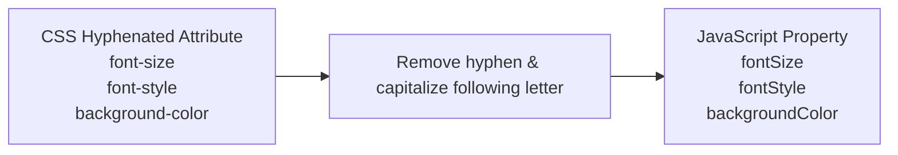

# Dynamic Styles, Visibility, Colors, Fonts, and Dynamic Content

## 4. Element Visibility Control (`visibility`)

The CSS `visibility` property controls whether an element is rendered visually on screen.
- **`visibility: visible`**: Element is visible.
- **`visibility: hidden`**: Element is invisible (hidden), but **retains its physical space** in the document layout structure.

### 📜 Complete Program Code Listing: Visibility Toggle (`showHide.html` & `showHide.js`)

#### 1. `showHide.html`
```html
<!DOCTYPE html>
<!-- showHide.html
     Uses showHide.js
     Illustrates visibility control of elements
     -->
<html lang = "en">
  <head>
    <title> Visibility control </title>
    <meta charset = "utf-8" />
    <script type = "text/javascript" src = "showHide.js">
    </script>
  </head>
  <body>
    <form action = "">
      <div id = "saturn" style = "position: relative; visibility: visible;">
        
      </div>
      <p>
        <br />
        <input type = "button" value = "Toggle Saturn" onclick = "flipImag()" />
      </p>
    </form>
  </body>
</html>
```

#### 2. `showHide.js`
```javascript
// showHide.js
//   Illustrates visibility control of elements

// The event handler function to toggle the visibility of the image of Saturn 
function flipImag() {
  var dom = document.getElementById("saturn").style;  

  // Flip the visibility state property
  if (dom.visibility == "visible") {
    dom.visibility = "hidden";
  } else {
    dom.visibility = "visible";
  }
}
```

---

## 5. Changing Colors and Fonts Dynamically

### 5.1 Dynamic Background and Foreground Colors

JavaScript can dynamically update document colors using `document.body.style.backgroundColor` (for page background) and `document.body.style.color` (for text foreground).

> [!IMPORTANT]
> **The `this.value` Parameter Pattern**: In inline event attributes (e.g. `onchange`), passing `this.value` sends the current element's string value directly to the event handler function.

#### 📜 Complete Program Code Listing: Dynamic Page Colors (`dynColors.html` & `dynColors.js`)

#### 1. `dynColors.html`
```html
<!DOCTYPE html>
<!-- dynColors.html
     Uses dynColors.js
     Illustrates dynamic foreground and background colors
     -->
<html lang = "en">
  <head>
    <title> Dynamic colors </title>
    <meta charset = "utf-8" />
    <script type = "text/javascript" src = "dynColors.js">
    </script>
  </head>
  <body>
    <p style = "font-family: Times; font-style: italic; font-size: 2em;"> 
      This small page illustrates dynamic setting of the
      foreground and background colors for a document
    </p>
    <form action = "">
      <p>
        <label>
          Background color: 
          <input type = "text" name = "background" size = "10"
                 onchange = "setColor('background', this.value)" />
        </label>
        <br />
        <label>
          Foreground color: 
          <input type = "text" name = "foreground" size = "10"
                 onchange = "setColor('foreground', this.value)" />
        </label>
        <br />
      </p>
    </form>
  </body>
</html>
```

#### 2. `dynColors.js`
```javascript
// dynColors.js
//   Illustrates dynamic foreground and background colors

// The event handler function to dynamically set background or foreground color
function setColor(where, newColor) {
  if (where == "background") {
    document.body.style.backgroundColor = newColor;
  } else {
    document.body.style.color = newColor;
  }
}
```

---

### 5.2 Dynamic Font Properties & CSS Hyphenation Conversion Rules

When changing CSS properties via JavaScript, CSS property names containing hyphens are converted to **camelCase**:



- `font-size` $\rightarrow$ `style.fontSize`
- `font-style` $\rightarrow$ `style.fontStyle`
- `font-family` $\rightarrow$ `style.fontFamily`

#### 📜 Complete Program Code Listing: Hover Font Effects (`dynFont.html`)

Using `onmouseover` and `onmouseout` to dynamically change text color, font style, and size when hovered over.

```html
<!DOCTYPE html>
<!-- dynFont.html
     Illustrates dynamic font styles and colors
     -->
<html lang = "en">
  <head>
    <title> Dynamic fonts </title>
    <meta charset = "utf-8" />
    <style type = "text/css">
      .regText { font: 1.1em 'Times New Roman'; }
      .wordText { color: blue; }
    </style>
  </head>
  <body>
    <p class = "regText"> 
      The state of 
      <span class = "wordText"
         onmouseover = "this.style.color = 'red'; 
                        this.style.fontStyle = 'italic';
                        this.style.fontSize = '2em';"
         onmouseout = "this.style.color = 'blue';
                       this.style.fontStyle = 'normal';
                       this.style.fontSize = '1.1em';">
         Washington
      </span>
      produces many of our nation's apples. 
    </p>
  </body>
</html>
```

---

## 6. Dynamic Content Manipulation (Context Help Box)

Modifying element content dynamically is accomplished by assigning text to the `.value` property of form input/textarea elements or `.innerHTML` for container elements.

### Multiline String Literal Syntax in JavaScript
In traditional JavaScript string literals, splitting a string across multiple physical lines requires a **trailing backslash (`\`)** at the end of each continued line.

### 📜 Complete Program Code Listing: Interactive Form Help Box (`dynValue.html` & `dynValue.js`)

Changes advice messages inside a `<textarea>` as the user hovers the mouse cursor over different form input fields.

#### 1. `dynValue.html`
```html
<!DOCTYPE html>
<!-- dynValue.html
     Illustrates dynamic values
     -->
<html lang = "en">
  <head>
    <title> Dynamic values </title>
    <meta charset = "utf-8" />
    <script type = "text/javascript" src = "dynValue.js">
    </script>
    <style type = "text/css">
      textarea { position: absolute; left: 250px; top: 0px; }
      span { font-style: italic; }
      p { font-weight: bold; }
    </style>
  </head>
  <body>
    <form action = "">
      <p>
        <span> Customer information </span>
        <br /><br />
        <label>
          Name: 
          <input type = "text" onmouseover = "messages(0)" onmouseout = "messages(4)" />
        </label>
        <br />
        <label>
          Email: 
          <input type = "text" onmouseover = "messages(1)" onmouseout = "messages(4)" />
        </label>
        <br /><br />
        <span> To create an account, provide the following: </span>
        <br /><br />
        <label>
          User ID: 
          <input type = "text" onmouseover = "messages(2)" onmouseout = "messages(4)" />
        </label>
        <br />
        <label>
          Password: 
          <input type = "password" onmouseover = "messages(3)" onmouseout = "messages(4)" />
        </label>
        <br />
      </p>
      <textarea id = "adviceBox" rows = "3" cols = "50">
This box provides advice on filling out the form on this page. Put the mouse cursor over any input field to get advice.
      </textarea>
      <br /><br />
      <input type = "submit" value = "Submit" />
      <input type = "reset" value = "Reset" />
    </form>
  </body>
</html>
```

#### 2. `dynValue.js`
```javascript
// dynValue.js
//   Illustrates dynamic values

// Array of advice messages with multiline string continuation backslashes (\)
var helpers = [
  "Your name must be in the form: \n \
   first name, middle initial., last name",
  "Your email address must have the form: \
   user@domain",
  "Your user ID must have at least six characters",
  "Your password must have at least six \
   characters and it must include one digit",
  "This box provides advice on filling out \
   the form on this page. Put the mouse cursor over any \
   input field to get advice"
];

// Event handler function to dynamically update textarea content
function messages(adviceNumber) {
  document.getElementById("adviceBox").value = helpers[adviceNumber];
}
```
