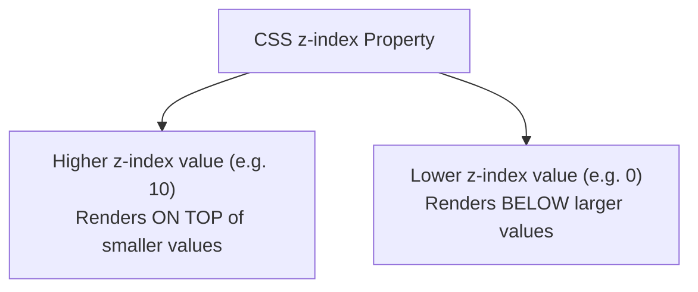
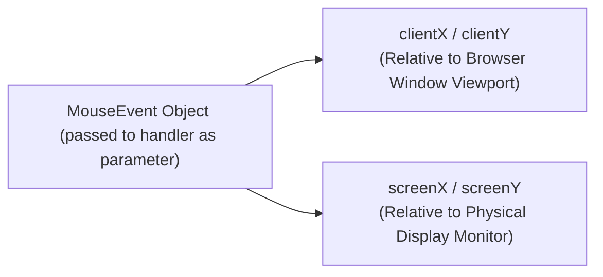

# Stacking Elements (z-index), Mouse Coordinates, and Contextual Mouse Reaction

## 7. Stacking Elements (`z-index` & `zIndex`)

Overlapping elements in a 2D document display can be stacked in a 3D visual order using the CSS `z-index` property (accessed in JS via `.style.zIndex`).



> [!CAUTION]
> **JavaScript Reserved Name Trap**:
> When tracking the element currently on top in a global variable, **NEVER name the variable `top`**! `window.top` is a reserved JavaScript/browser property referencing the topmost frame. Naming your variable `top` breaks execution in Chrome browsers. Use `topp` or `currentTop` instead.

### 📜 Complete Program Code Listing: Dynamic Card Stacking (`stacking.html` & `stacking.js`)

#### 1. `stacking.html`
```html
<!DOCTYPE html>
<!-- stacking.html
     Uses stacking.js
     Illustrates dynamic stacking of images.
     -->
<html lang = "en">
  <head>
    <title> Dynamic stacking of images </title>
    <meta charset = "utf-8" />
    <script type = "text/javascript" src = "stacking.js">
    </script>
    <style type = "text/css">
      .plane1 { position: absolute; top: 0; left: 0; z-index: 0; }
      .plane2 { position: absolute; top: 50px; left: 110px; z-index: 0; }
      .plane3 { position: absolute; top: 100px; left: 220px; z-index: 0; }
    </style>
  </head>
  <body>
    <p>
      
      
      
    </p>
  </body>
</html>
```

#### 2. `stacking.js`
```javascript
// stacking.js
//   Illustrates dynamic stacking of images

// Global variable tracking top element id (avoided reserved keyword 'top')
var topp = "airplane1";

// The event handler function to move the given element to top of stack
function toTop(newTop) {
  // Set DOM address references for old top and new top elements
  var domTop = document.getElementById(topp).style;
  var domNew = document.getElementById(newTop).style;

  // Reset old top to 0 and promote new top to 10
  domTop.zIndex = "0";
  domNew.zIndex = "10";
  topp = newTop;
}
```

---

## 8. Locating Mouse Cursor Coordinates (`clientX`/`clientY` vs `screenX`/`screenY`)

MouseEvent objects contain two key coordinate pairs:
- **`clientX` / `clientY`**: Geometric pixel coordinates relative to the upper-left corner of the **browser client display window**.
- **`screenX` / `screenY`**: Pixel coordinates relative to the user's physical **computer screen display monitor**.



> [!NOTE]
> **Cross-Browser Event Parameter Handling**: Firefox passes the implicitly created `event` object as a parameter to handlers. IE and Chrome expose it as a global window object. Passing `event` explicitly in inline HTML calls (`onclick="findIt(event)"`) works universally across all browsers.

### 📜 Complete Program Code Listing: Mouse Coordinate Tracker (`where.html` & `where.js`)

#### 1. `where.html`
```html
<!DOCTYPE html>
<!-- where.html
     Uses where.js
     Illustrates x- and y-coordinates of the mouse cursor
     -->
<html lang = "en">
  <head>
    <title> Where is the cursor? </title>
    <meta charset = "utf-8" />
    <script type = "text/javascript" src = "where.js">
    </script>
  </head>
  <body onclick = "findIt(event)">
    <form action = "">
      <p> 
        Within the client area: <br />
        x:
        <input type = "text" id = "xcoor1" size = "4" />
        y:
        <input type = "text" id = "ycoor1" size = "4" />
        <br /><br />
        Relative to the origin of the screen coordinate system:
        <br />
        x:
        <input type = "text" id = "xcoor2" size = "4" />
        y:
        <input type = "text" id = "ycoor2" size = "4" />
      </p>
    </form>
    <p>
      
    </p>
  </body>
</html>
```

#### 2. `where.js`
```javascript
// where.js
//   Show the coordinates of the mouse cursor position 
//   in an element and on the screen when the mouse is clicked

function findIt(evt) {
  document.getElementById("xcoor1").value = evt.clientX;
  document.getElementById("ycoor1").value = evt.clientY;
  document.getElementById("xcoor2").value = evt.screenX;
  document.getElementById("ycoor2").value = evt.screenY;
}
```

---

## 9. Reacting to Mouse Clicks & Dynamic Element Positioning at Cursor

Using `onmousedown` and `onmouseup` on the document body allows dynamic popups to be centered directly over the cursor location by subtracting pixel coordinate offsets from `evt.clientX` and `evt.clientY`.

### 📜 Complete Program Code Listing: Cursor Popup Message (`anywhere.html` & `anywhere.js`)

#### 1. `anywhere.html`
```html
<!DOCTYPE html>
<!-- anywhere.html
     Uses anywhere.js
     Display a message when the mouse button is pressed,
     no matter where it is on the screen 
     -->
<html lang = "en">
  <head>
    <title> Sense events anywhere </title>
    <meta charset = "utf-8" />
    <script type = "text/javascript" src = "anywhere.js">
    </script>
  </head>
  <body onmousedown = "displayIt(event);" onmouseup = "hideIt();">
    <p>
      <span id = "message"  
            style = "color: red; visibility: hidden;
                     position: relative;
                     font-size: 1.7em; font-style: italic;
                     font-weight: bold;">
         Please don't click here! 
      </span>
      <br /><br /><br /><br /><br /><br /><br /><br />
      <br /><br /><br /><br /><br /><br /><br /><br />
    </p>
  </body>
</html>
```

#### 2. `anywhere.js`
```javascript
// anywhere.js
//   Display a message when the mouse button is pressed,
//   no matter where it is on the screen 

// The event handler function to display the message centered at cursor
function displayIt(evt) {
  var dom = document.getElementById("message");
  
  // Apply pixel offsets (-130px left, -25px top) to center popup over cursor
  dom.style.left = (evt.clientX - 130) + "px";
  dom.style.top = (evt.clientY - 25) + "px";
  dom.style.visibility = "visible";
}

// The event handler function to hide the message on mouse release
function hideIt() {
  document.getElementById("message").style.visibility = "hidden";
}
```
