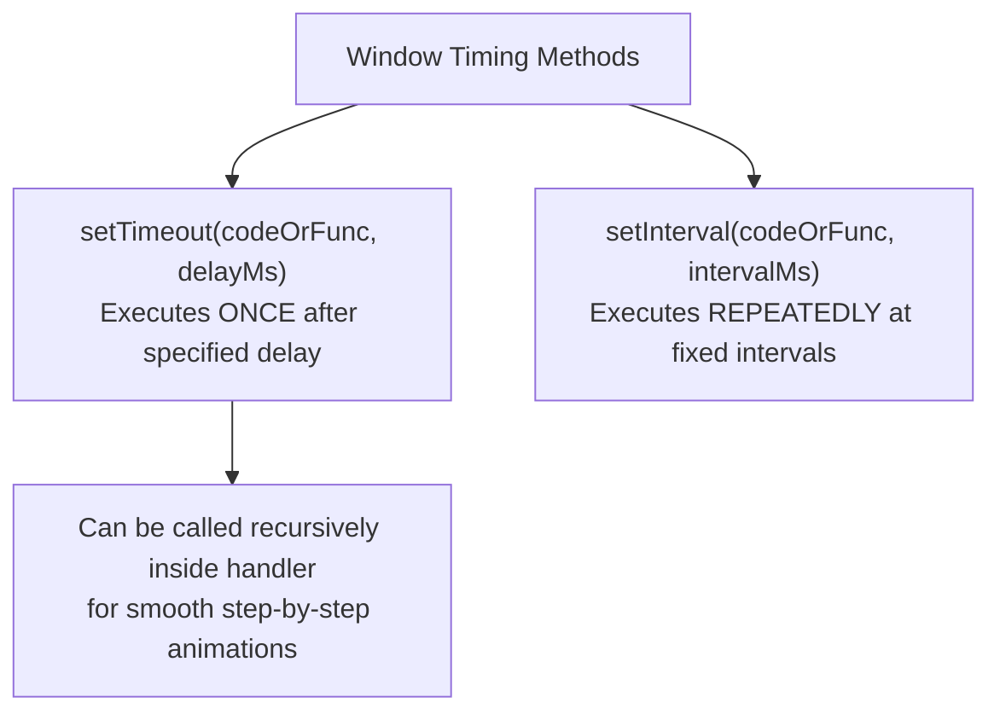
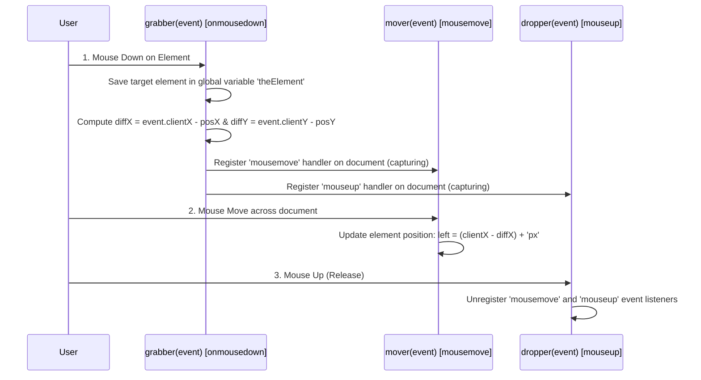

# Slow Element Movement (Timers) and Drag-and-Drop Implementation

> [!IMPORTANT]
> **High-Frequency Exam Topic**: Drag and drop mechanics and timer-driven animation (`setTimeout`/`setInterval`) are frequently asked core long-answer questions in university examinations.

---

## 10. Slow Movement of Elements (Timers & Animation)

Moving an element smoothly across the screen requires incremental positional updates separated by small time intervals.

### 10.1 Timers: `setTimeout` vs `setInterval`



- **`setTimeout(codeString, delayMs)`**: Delays execution of `codeString` (or function reference) by `delayMs` milliseconds **once**.
- **`setInterval(codeString, intervalMs)`**: Executes `codeString` **repeatedly** every `intervalMs` milliseconds until cleared.

---

### 10.2 Unit Stripping & Re-concatenation Rule

CSS position properties (`style.left`, `style.top`) are returned as strings with unit suffixes (e.g., `"100px"`).
1. **Extraction/Stripping**: Extract numeric values using `.match(/\d+/)` or `parseInt()` so arithmetic operations (`x++`, `x--`) can be evaluated.
2. **Re-concatenation**: Append `"px"` back to coordinates (`x + "px"`) before assigning to `style.left` or `style.top`.

---

### 10.3 📜 Complete Program Code Listing: Timer Text Animation (`moveText.html` & `moveText.js`)

#### 1. `moveText.html`
```html
<!DOCTYPE html>
<!-- moveText.html
     Uses moveText.js 
     Illustrates a moving text element
     -->
<html lang = "en">
  <head>
    <title> Moving text </title>
    <meta charset = "utf-8" />
    <script type = "text/javascript" src = "moveText.js">
    </script>
  </head>
  <!-- Call the initializing function on load, giving destination coordinates -->
  <body onload = "initText()">
    <!-- The text to be moved, including its initial position -->
    <p>
      <span id = 'theText' style = "position: absolute; left: 100px; top: 100px; 
                 font: bold 1.7em 'Times Roman'; 
                 color: blue;"> Jump in the lake!
      </span>
    </p>
  </body>
</html>
```

#### 2. `moveText.js`
```javascript
// moveText.js - used with moveText.html 

var dom, x, y, finalx = 300, finaly = 300;

// Initialize initial coordinates and start mover loop
function initText() {
  dom = document.getElementById('theText').style;

  /* Get the current position string */
  var x = dom.left;
  var y = dom.top;

  /* Convert string values of left and top to numbers by stripping units */
  x = x.match(/\d+/);
  y = y.match(/\d+/);

  /* Call mover function */
  moveText(x, y);
}

// Move text incrementally toward (finalx, finaly)
function moveText(x, y) {
  /* Move x coordinate 1px toward finalx */
  if (x != finalx) {
    if (x > finalx) x--;
    else if (x < finalx) x++;
  }

  /* Move y coordinate 1px toward finaly */
  if (y != finaly) {
    if (y > finaly) y--;
    else if (y < finaly) y++;
  }

  /* As long as text has not reached destination, update styles and reschedule */
  if ((x != finalx) || (y != finaly)) { 
    /* Append 'px' unit back before assigning */
    dom.left = x + "px";
    dom.top = y + "px";

    /* Recursive call after a 1-millisecond delay using setTimeout */
    setTimeout("moveText(" + x + "," + y + ")", 1);  
  } 
}
```

---

## 11. Dragging and Dropping Elements (DOM 2 Event Model)

Drag-and-drop interaction allows users to grab an HTML element with a mouse click, drag it across the screen, and drop it at a new coordinate position.



---

### 11.1 Drag-and-Drop Implementation Breakdown

1. **`grabber(event)` [Attached to `onmousedown`]**:
   - Captures element target reference via `event.currentTarget`.
   - Parses initial `left` and `top` coordinates using `parseInt()`.
   - Computes coordinate offset differences:  
     $$\text{diffX} = \text{event.clientX} - \text{posX}$$  
     $$\text{diffY} = \text{event.clientY} - \text{posY}$$
   - Dynamically registers `mousemove` (`mover`) and `mouseup` (`dropper`) listeners on the `document` object using `addEventListener(..., true)`.
   - Calls `event.stopPropagation()` and `event.preventDefault()`.

2. **`mover(event)` [Attached to `mousemove` during drag]**:
   - Calculates updated position relative to cursor offsets:  
     $$\text{style.left} = (\text{event.clientX} - \text{diffX}) + \text{"px"}$$  
     $$\text{style.top} = (\text{event.clientY} - \text{diffY}) + \text{"px"}$$
   - Calls `event.stopPropagation()`.

3. **`dropper(event)` [Attached to `mouseup` upon drop]**:
   - Detaches drag movement listeners by calling `document.removeEventListener("mousemove", mover, true)` and `document.removeEventListener("mouseup", dropper, true)`.
   - Calls `event.stopPropagation()`.

---

### 11.2 📜 Complete Program Code Listing: Magnetic Poetry Drag and Drop (`dragNDrop.html` & `dragNDrop.js`)

#### 1. `dragNDrop.html`
```html
<!DOCTYPE html>
<!-- dragNDrop.html
     An example to illustrate the DOM 2 Event model
     Allows the user to drag and drop words to complete a short poem.
     Does not work with IE browsers before IE9
     -->
<html lang = "en">
  <head>
    <title> Drag and drop </title>
    <meta charset = "utf-8" />
    <script type = "text/javascript" src = "dragNDrop.js">
    </script>
  </head>
  <body style = "font-size: 20;">
    <p>
      Roses are red <br />
      Violets are blue <br />
      <span style = "position: absolute; top: 200px; left: 0px; background-color: lightgrey;"
            onmousedown = "grabber(event);"> candy </span>
      <span style = "position: absolute; top: 200px; left: 75px; background-color: lightgrey;"
            onmousedown = "grabber(event);"> cats </span>
      <span style = "position: absolute; top: 200px; left: 150px; background-color: lightgrey;"
            onmousedown = "grabber(event);"> cows </span>
      <span style = "position: absolute; top: 200px; left: 225px; background-color: lightgrey;"
            onmousedown = "grabber(event);"> glue </span>
      <span style = "position: absolute; top: 200px; left: 300px; background-color: lightgrey;"
            onmousedown = "grabber(event);"> is </span>
      <span style = "position: absolute; top: 200px; left: 375px; background-color: lightgrey;"
            onmousedown = "grabber(event);"> is </span>
      <span style = "position: absolute; top: 200px; left: 450px; background-color: lightgrey;"
            onmousedown = "grabber(event);"> meow </span>
      <span style = "position: absolute; top: 250px; left: 0px; background-color: lightgrey;"
            onmousedown = "grabber(event);"> mine </span>
      <span style = "position: absolute; top: 250px; left: 75px; background-color: lightgrey;"
            onmousedown = "grabber(event);"> moo </span>
      <span style = "position: absolute; top: 250px; left: 150px; background-color: lightgrey;"
            onmousedown = "grabber(event);"> new </span>
      <span style = "position: absolute; top: 250px; left: 225px; background-color: lightgrey;"
            onmousedown = "grabber(event);"> old </span>
      <span style = "position: absolute; top: 250px; left: 300px; background-color: lightgrey;"
            onmousedown = "grabber(event);"> say </span>
      <span style = "position: absolute; top: 250px; left: 375px; background-color: lightgrey;"
            onmousedown = "grabber(event);"> say </span>
      <span style = "position: absolute; top: 250px; left: 450px; background-color: lightgrey;"
            onmousedown = "grabber(event);"> so </span>
      <span style = "position: absolute; top: 300px; left: 0px; background-color: lightgrey;"
            onmousedown = "grabber(event);"> sticky </span>
      <span style = "position: absolute; top: 300px; left: 75px; background-color: lightgrey;"
            onmousedown = "grabber(event);"> sweet </span>
      <span style = "position: absolute; top: 300px; left: 150px; background-color: lightgrey;"
            onmousedown = "grabber(event);"> syrup </span>
      <span style = "position: absolute; top: 300px; left: 225px; background-color: lightgrey;"
            onmousedown = "grabber(event);"> too </span>
      <span style = "position: absolute; top: 300px; left: 300px; background-color: lightgrey;"
            onmousedown = "grabber(event);"> yours </span>
    </p>
  </body>
</html>
```

#### 2. `dragNDrop.js`
```javascript
// dragNDrop.js
//   An example to illustrate the DOM 2 Event model
//   Allows the user to drag and drop words to complete a short poem.

// Global variables to pass state between grabber, mover, and dropper handlers
var diffX, diffY, theElement;

// 1. Grabber Event Handler (triggered on mousedown)
function grabber(event) {
  // Set global reference to grabbed element
  theElement = event.currentTarget;

  // Determine current position by parsing integers from style strings
  var posX = parseInt(theElement.style.left);
  var posY = parseInt(theElement.style.top);

  // Compute offset difference between element position and mouse click
  diffX = event.clientX - posX;
  diffY = event.clientY - posY;

  // Dynamically register move and drop handlers on document using DOM 2 capturing
  document.addEventListener("mousemove", mover, true);
  document.addEventListener("mouseup", dropper, true);

  // Prevent event propagation and browser default actions
  event.stopPropagation();
  event.preventDefault();
}

// 2. Mover Event Handler (triggered during mousemove)
function mover(event) {
  // Recompute position using cursor location and saved offsets
  theElement.style.left = (event.clientX - diffX) + "px";
  theElement.style.top = (event.clientY - diffY) + "px";

  // Prevent event propagation
  event.stopPropagation();
}

// 3. Dropper Event Handler (triggered on mouseup)
function dropper(event) {
  // Unregister move and drop event listeners from document
  document.removeEventListener("mouseup", dropper, true);
  document.removeEventListener("mousemove", mover, true);

  // Prevent event propagation
  event.stopPropagation();
}
```
