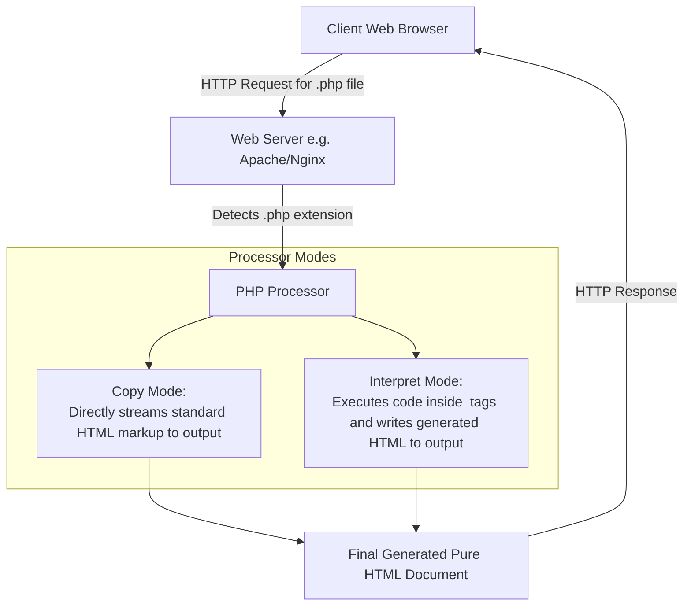

# Introduction to PHP: Origins, Syntax, Variables, Primitives, and Conversions

## 1. Origins and Uses of PHP

### 1.1 Historical Origins
- **Created by**: Rasmus Lerdorf (member of the Apache Group) in 1994 to track visitors to his personal website.
- **First Public Release (1995)**: Released as **Personal Home Page Tools** (PHP Tools).
- **Evolution of Acronym**: As usage exploded, the community adopted the recursive acronym **PHP: Hypertext Preprocessor**.
- **Current Status**: Maintained as an open-source product supported on almost all Web servers.

### 1.2 Core Uses & Capabilities
- **Server-Side Scripting**: Dynamic HTML content generation, form processing, and session management.
- **Database Integration**: Native driver support for 15 database systems (e.g., MySQL, PostgreSQL, SQLite, Oracle).
- **Protocol Support**: Supports POP3, IMAP, and HTTP protocols.
- **Component Architectures**: Interfaces with COM and CORBA architectures.

---

## 2. Overview of PHP Architecture

PHP is a **server-side, HTML-embedded scripting language**.



### 2.1 File Extensions & Server Processing
- Web servers recognize documents containing PHP scripts via extensions: `.php`, `.php3`, or `.phtml`.
- **Modes of Operation**:
  1. **Copy Mode**: Markup and client-side JavaScript outside PHP tags are copied directly to the output stream.
  2. **Interpret Mode**: Code inside PHP tags is executed, sending produced output to the output stream.
- **Security & Client Invisibility**: The client **never sees the raw PHP script**. Selecting *View Source* in the browser displays only the generated HTML output.

---

## 3. General Syntactic Characteristics

### 3.1 Tag Embedding
PHP code blocks are enclosed within `<?php` and `?>` tags:
```php
<?php
  echo "Hello, World!";
?>
```

### 3.2 File Inclusion (`include`)
External files can be pulled into a script using `include("filename");`:
```php
include("table2.inc");
```
- The included file can contain markup or script.
- The PHP interpreter automatically switches to **Copy Mode** upon entering an included file. Any PHP code inside the included file must be wrapped in `<?php ... ?>` tags.

---

### 3.3 Variable Naming & Case Sensitivity Rules
> [!IMPORTANT]
> **Variable Prefix Rule**: Every PHP variable name **MUST begin with a dollar sign (`$`)** (e.g., `$sum`, `$userName`).

| Identifier Type | Case Sensitivity Rule | Example |
| :--- | :--- | :--- |
| **Variable Names** | **Strictly Case Sensitive** | `$count` and `$COUNT` are different variables. |
| **Keywords / Reserved Words** | **Case Insensitive** | `while`, `WHILE`, and `wHiLe` are identical. |
| **Function Names** | **Case Insensitive** | `strlen()` and `STRLEN()` call the same function. |

---

### 3.4 Reserved Words Table

| | Reserved Words of PHP | | |
| :--- | :--- | :--- | :--- |
| `and` | `break` | `case` | `class` |
| `continue` | `default` | `do` | `else` |
| `elseif` | `extends` | `false` | `for` |
| `foreach` | `function` | `global` | `if` |
| `include` | `list` | `new` | `not` |
| `or` | `require` | `return` | `static` |
| `switch` | `this` | `true` | `var` |
| `virtual` | `while` | `xor` | |

---

### 3.5 Comments and Statements
- **Single-line Comments**: `#` or `//`
- **Multi-line Comments**: `/* ... */`
- **Statement Termination**: Statements **must end with semicolons (`;`)**.

---

## 4. Primitives, Operations, and Expressions

PHP has **8 Data Types**:
- **4 Scalar Types**: `integer`, `double`, `string`, `boolean`
- **2 Compound Types**: `array`, `object`
- **2 Special Types**: `resource`, `NULL`

---

### 4.1 Variables & `NULL` State
- **Dynamic Typing**: Variables are not type-declared. The type is assigned dynamically based on the value assigned.
- **Unbound Variables**: Variables used prior to assignment hold the default value `NULL`.
- **Coercion of `NULL`**:
  - In a numeric context $\rightarrow$ `NULL` coerces to `0`.
  - In a string context $\rightarrow$ `NULL` coerces to empty string `""`.
- **State Helper Functions**:
  - `IsSet($var)`: Returns `TRUE` if `$var` exists and is non-`NULL`.
  - `unset($var)`: Unsets `$var`, returning it to the unassigned `NULL` state.
  - `error_reporting(15)`: Configures interpreter to flag unbound variable references as notices (default level is 7).

---

### 4.2 Scalar Data Types

#### 1. Integer (`integer`)
Matches the `long` type of C (typically 32-bit signed integer on 32-bit systems).

#### 2. Double (`double`)
Floating-point numbers matching C `double` (e.g., `3.14159`, `.345`, `345.`, `2.5e3`).

#### 3. String (`string`)
Single-byte character sequence (no Unicode support). String literals use single quotes (`'`) or double quotes (`"`).

> [!IMPORTANT]
> **Single vs. Double Quote Interpolation**:
> - **Single Quotes (`'...'`)**: No variable interpolation or escape sequence processing (except `\'` and `\\`). Printed strictly literal.
> - **Double Quotes (`"..."`)**: **Variables are interpolated** (replaced by their current value) and escape sequences (`\n`, `\t`) are expanded.

```php
$sum = 10.2;
echo 'The sum is: $sum'; // Outputs: The sum is: $sum
echo "The sum is: $sum"; // Outputs: The sum is: 10.2
```

#### 4. Boolean (`boolean`)
Boolean values are `TRUE` and `FALSE` (case-insensitive).
- **Boolean Coercion to `FALSE`**:
  - Numeric `0` or `0.0`.
  - Empty string `""` or string `"0"`.
  - `NULL` or empty arrays.
- *Note*: String `"0.0"` coerces to **`TRUE`**.

---

### 4.3 Operators & Predefined Math Functions

#### Arithmetic Operators
Standard operators (`+`, `-`, `*`, `/`, `%`, `++`, `--`).
- Integer division that yields a non-integral quotient returns a `double`.
- Integer overflow automatically promotes the result type to `double`.

| Function | Parameter | Return Value |
| :--- | :--- | :--- |
| `floor($x)` | Double | Largest integer $\le x$. |
| `ceil($x)` | Double | Smallest integer $\ge x$. |
| `round($x)` | Double | Nearest rounded integer. |
| `srand($seed)`| Integer | Initializes random-number generator. |
| `rand($min, $max)`| Integers | Pseudo-random integer between `$min` and `$max`. |
| `abs($x)` | Number | Absolute value. |
| `min($a, $b, ...)`| Numbers | Minimum value. |
| `max($a, $b, ...)`| Numbers | Maximum value. |

---

### 4.4 String Concatenation & String Functions

- **Concatenation Operator**: The **period (`.`)** (Not `+`).
- **Character Index Access**: `$str{3}` or `$str[3]`.

```php
$str = "Apples are good";
$sub = substr($str, 7, 1); // $sub becomes 'a'
```

| Function | Parameters | Description |
| :--- | :--- | :--- |
| `strlen($str)` | String | Returns total length of string. |
| `strcmp($s1, $s2)` | 2 Strings | Returns `0` if identical, `<0` if `$s1 < $s2`, `>0` if `$s1 > $s2`. |
| `strpos($s1, $s2)` | 2 Strings | Zero-based index of 1st match of `$s2` in `$s1` (returns `FALSE` if absent).<br/>*Exam Note*: Use `===` to distinguish index `0` match from `FALSE`. |
| `substr($str, $pos, $len)`| String, Int, [Int] | Extracts substring starting at `$pos` of length `$len`. |
| `chop($str)` | String | Removes trailing whitespace. |
| `trim($str)` | String | Strips whitespace from both ends. |
| `ltrim($str)` | String | Strips whitespace from beginning. |
| `strtolower($str)` | String | Converts to lowercase. |
| `strtoupper($str)` | String | Converts to uppercase. |

---

### 4.5 Type Conversions (Implicit & Explicit)

#### 1. Implicit Coercions
- Numeric in string context $\rightarrow$ coerced to string.
- String in numeric context $\rightarrow$ coerced to integer/double.
  - If string contains `.`, `e`, or `E`, converts to `double`.
  - Non-numeric characters following numbers are ignored (e.g. `"45.5 apples"` $\rightarrow$ `45.5`).
  - If string doesn't begin with a digit/sign, conversion fails and yields `0`.
- Double to Integer: Fractional part is truncated; rounding is **not** performed.

#### 2. Three Explicit Conversion Syntax Options
1. **C-Style Cast**: `(int)$sum`
2. **Conversion Functions**: `intval($sum)`, `doubleval($sum)`, `strval($sum)`
3. **`settype()` Function**: `settype($sum, "integer");` (Mutates variable type directly)

#### 3. Type Inspection Functions
- `gettype($var)`: Returns string type name (e.g., `"integer"`, `"double"`, `"string"`, `"boolean"`, `"unknown"`).
- **Type Test Predicates**:
  - Integer tests: `is_int()`, `is_integer()`, `is_long()`
  - Double tests: `is_double()`, `is_float()`, `is_real()`
  - Boolean test: `is_bool()`
  - String test: `is_string()`

---

### 4.6 Assignment Operators
PHP inherits C assignment operators:
- Simple assignment: `=`
- Compound assignment: `+=`, `-=`, `*=`, `/=`, `%=`, `.=`
