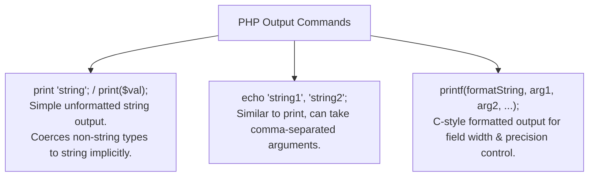

# PHP Output Formatting, Control Structures, and Mathematical Tables

## 5. Output Functions in PHP

Any output produced by a PHP script is streamed into the document built by the PHP processor and returned to the browser. Output MUST be valid HTML/XHTML or client-side JavaScript markup.



---

### 5.1 `print` and `echo`
- **`print`**: Outputs a string. Parentheses are optional: `print "Hello";` or `print("Hello");`. Non-string values are automatically coerced (e.g. `print(47)` outputs `"47"`).
- **`echo`**: Similar to `print`, but accepts multiple comma-separated parameters.

---

### 5.2 Formatted Output with `printf`
PHP borrows the C `printf` function to control alignment, field width, and decimal precision.

```php
printf(literal_format_string, param1, param2, ...);
```

#### Common Format Specifiers:
- `%s`: Character String
- `%d`: Signed Decimal Integer
- `%f`: Floating-point Double

#### Field Width & Precision Specifiers:
- `%10s`: String right-aligned in a 10-character wide field.
- `%6d`: Integer right-aligned in a 6-digit wide field.
- `%5.2f`: Float/double with 2 decimal places to the right and 5 digits to the left of the decimal point.

```php
$day = "Tuesday";
$high = 79;
printf("The high on %7s was %3d", $day, $high);
```

---

### 5.3 📜 Complete Program Code Listing: Welcome Date Script (`today.php`)

Uses `date("l, F jS")` to display the formatted current server day of the week, month, and day of the month with ordinal suffix (`st`, `nd`, `rd`, `th`).

```html
<!DOCTYPE html>
<!-- today.php - A trivial example to illustrate a php document -->
<html lang = "en">
  <head> 
    <title> today.php </title>
    <meta charset = "utf-8" />
  </head>
  <body>
      <p>
      <?php
        print "<b>Welcome to my home page <br /> <br />";
        print "Today is:</b> ";
        print date("l, F jS");
        print "<br />";
      ?>
      </p>
  </body>
</html>
```

#### `date()` Format Codes Used:
- `l` (lowercase L): Full day of the week (e.g. `Monday`).
- `F`: Full month name (e.g. `January`).
- `j`: Day of the month without leading zeros (1 to 31).
- `S`: English ordinal suffix for the day of the month (e.g. `st`, `nd`, `rd`, `th`).

---

## 6. Control Statements in PHP

### 6.1 Relational & Strict Equality Operators

| Operator | Name | Description | Coercion Behavior |
| :--- | :--- | :--- | :--- |
| `==` | Loose Equality | Equal value after coercion. | String `"42"` == `42` $\rightarrow$ `TRUE` |
| `!=` | Loose Inequality | Not equal value after coercion. | |
| `===` | **Strict Equality** | `TRUE` **only if both operands have the same type AND same value**. | String `"42"` === `42` $\rightarrow$ **`FALSE`** |
| `!==` | **Strict Inequality**| `TRUE` if operands differ in type OR value. | |
| `>`, `<`, `>=`, `<=` | Comparison | Standard numeric/lexicographical checks. | Converts numeric strings to numbers before comparison. |

> [!WARNING]
> **String vs Numeric Comparison Warning**: Comparing numeric strings (e.g. `"42"` vs `"100"`) using `==` coerces both to numbers. To force pure string comparison, **always use `strcmp($s1, $s2)`**.

---

### 6.2 Boolean Operators & Precedence

PHP provides two sets of Boolean operators:
1. **High Precedence**: `!`, `&&`, `||`
2. **Low Precedence**: `not`, `and`, `or`, `xor`

- `and` vs `&&`: Perform identical logical AND operations, but `and` has lower operator precedence than `&&`.
- `or` vs `||`: Perform identical logical OR operations, but `or` has lower operator precedence than `||`.
- `xor`: Evaluates to `TRUE` if **either operand is true, but NOT both**.
- All binary Boolean operators use **short-circuit evaluation**.

---

### 6.3 Selection Statements (`if`, `elseif`, `switch`)

#### `if` / `elseif` / `else`
```php
if ($num > 0) {
  $pos_count++;
} elseif ($num < 0) {
  $neg_count++;
} else {
  $zero_count++;
  print "Another zero! <br />";
}
```
*Note*: `elseif` can be written as a single keyword in PHP.

#### `switch` Statement
Control and case expressions accept `integer`, `double`, or `string`. Each case segment must terminate with a `break` statement to prevent fall-through execution.

```php
switch ($bordersize) {
  case "0": 
    print "<table>";
    break;
  case "1": 
    print "<table border = '1'>";
    break;
  case "4": 
    print "<table border = '4'>";
    break;
  case "8": 
    print "<table border = '8'>";
    break;
  default: 
    print "Error-invalid value: $bordersize <br />";
} 
```

---

### 6.4 Loop Statements (`while`, `do-while`, `for`)

#### 1. `while` Loop
```php
$fact = 1;
$count = 1;
while ($count < $n) {
  $count++;
  $fact *= $count;
}
```

#### 2. `do-while` Loop
```php
$count = 1;
$sum = 0;
do {
  $sum += $count;
  $count++;
} while ($count <= 100);
```

#### 3. `for` Loop
```php
for ($count = 1, $fact = 1; $count < $n;) {
  $count++;
  $fact *= $count;
}
```

- **`break`**: Immediately terminates execution of a `for`, `foreach`, `while`, or `do-while` loop.
- **`continue`**: Skips the remaining statements in the current iteration and advances to the next loop evaluation.

---

### 6.5 📜 Complete Program Code Listing: Mathematical Powers Table (`powers.php`)

Combines HTML table markup with a PHP `for` loop to compute square roots (`sqrt`), squares (`pow($n, 2)`), cubes (`pow($n, 3)`), and fourth powers (`pow($n, 4)`).

```html
<!DOCTYPE html>
<!-- powers.php
     An example to illustrate loops and arithmetic
     -->
<html lang = "en">
  <head> 
    <title> powers.php </title>
    <meta charset = "utf-8" />
    <style type = "text/css">
      td, th, table { border: thin solid black; }
    </style>
  </head>
  <body>
    <table>
      <caption> Powers table </caption>
      <tr>
        <th> Number </th>
        <th> Square Root </th>
        <th> Square </th>
        <th> Cube </th>
        <th> Quad </th>
      </tr>
      <?php
        for ($number = 1; $number <= 10; $number++) {
          $root = sqrt($number);
          $square = pow($number, 2);
          $cube = pow($number, 3);
          $quad = pow($number, 4);

          print("<tr align = 'center'> <td> $number </td>");
          print("<td> $root </td> <td> $square </td>");
          print("<td> $cube </td> <td> $quad </td> </tr>");
        }
      ?>
    </table>
  </body>
</html>
```
