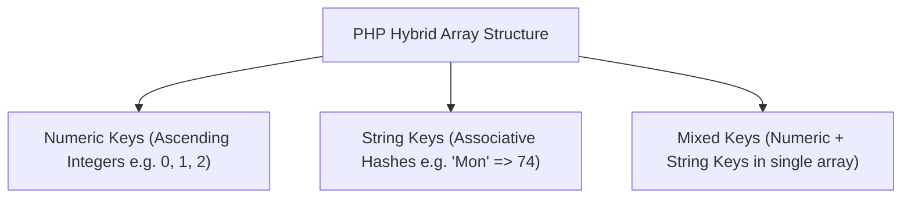
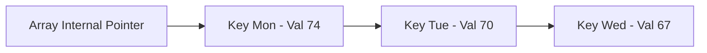

# PHP Arrays, Sequential Traversal, Sorting, Functions, Scope, and Lifetime

## 7. PHP Arrays

PHP arrays are a hybrid data structure combining traditional indexed arrays and associative arrays (hashes).



---

### 7.1 Array Creation Techniques

#### 1. Implicit Assignment Creation
```php
$list[0] = 17; // Creates array if $list didn't exist
$list[] = 42;  // Auto-assigns next largest integer key (key = 1)
```

#### 2. Using the `array()` Construct
- **Traditional Array**: `$list = array(17, 24, 45, 91);` (Keys: 0, 1, 2, 3)
- **Explicit Key Mapping**: `$list = array(1 => 17, 2 => 24, 4 => 91);`
- **Associative Array (Hash)**: `$ages = array("Joe" => 42, "Mary" => 41, "Bif" => 17);`
- **Mixed Key Array**: `$stuff = array("make" => "Cessna", "model" => "C210", 3 => "sold");`
- **Empty Array**: `$empty = array();`

---

### 7.2 Accessing Elements & `list()` Destructuring
```php
$ages['Mary'] = 29; // Subscript access via key

// Assigning array elements to multiple scalar variables
$trees = array("oak", "pine", "binary");
list($hardwood, $softwood, $data_structure) = $trees;
```

---

### 7.3 Array Helper Functions Reference

> [!CAUTION]
> **Double-Quoted Array Interpolation Trap**: PHP **does NOT interpolate array elements directly inside double-quoted strings** (e.g. `"High was $highs['Tue']"` causes a syntax error; `"High was $highs"` prints `"High was Array"`). Assign to a scalar variable first or use concatenation.

| Function | Parameters | Return Value / Behavior |
| :--- | :--- | :--- |
| `unset($arr[key])` / `unset($arr)`| Array element or Array | Deletes specific element (leaves key gaps) or deletes whole array. |
| `array_keys($arr)` | Array | Returns traditional array containing all keys of `$arr`. |
| `array_values($arr)`| Array | Returns traditional array containing all values of `$arr`. |
| `array_key_exists($k, $arr)`| Key string/int, Array | Returns `TRUE` if key `$k` exists in `$arr`, else `FALSE`. |
| `is_array($var)` | Variable | Returns `TRUE` if `$var` is an array. |
| `in_array($val, $arr)` | Value, Array | Returns `TRUE` if `$val` exists among values of `$arr`. |
| `sizeof($arr)` / `count($arr)`| Array | Returns total element count. |
| `explode($delim, $str)`| Delimiter, String | Splits string into array of substrings. |
| `implode($sep, $arr)` | Separator, Array | Joins array elements into a string separated by `$sep`. |

```php
$words = explode(" ", "April in Paris, Texas is nice");
$str = implode(" ", array("Are", "you", "lonesome"));
```

---

### 7.4 Logical Internal Memory Structure & Pointer Functions

PHP arrays are stored internally as a **linked list of key-value cells**.
- Random access by key is powered by a **Hash Function**.
- Sequential traversal is driven by an **Internal Current Pointer** connected in insertion order.



#### Pointer Traversal Functions:
- `current($arr)`: Returns current element value without moving pointer.
- `next($arr)`: Moves pointer forward 1 element and returns new value (returns `FALSE` at end).
- `prev($arr)`: Moves pointer backward 1 element and returns value.
- `reset($arr)`: Resets pointer to 1st element and returns its value.
- `end($arr)`: Moves pointer to last element and returns its value.
- `key($arr)`: Returns key string/int of current element.
- `each($arr)`: Returns array `array("key" => k, "value" => v)` for current element, then advances pointer.
- `array_push($arr, $val1, ...)`: Pushes elements onto end of array stack.
- `array_pop($arr)`: Pops and returns last element.

#### Traversal Loops with `foreach`:
```php
// Form 1: Value only
foreach ($list as $temp) {
  print("$temp <br />");
}

// Form 2: Key and Value
foreach ($lows as $day => $temp) {
  print("The low on $day was $temp <br />");
}
```

---

### 7.5 Sorting Functions Matrix

| Function | Sort Target | Preserves Key-Value Associations? | Order |
| :--- | :--- | :--- | :--- |
| `sort($arr)` | Values | **No** (Re-indexes keys as 0, 1, 2...) | Ascending |
| `rsort($arr)` | Values | **No** (Re-indexes keys as 0, 1, 2...) | Descending |
| `asort($arr)` | Values | **Yes** (Preserves associative keys) | Ascending |
| `arsort($arr)`| Values | **Yes** (Preserves associative keys) | Descending |
| `ksort($arr)` | Keys | **Yes** (Sorts by key names) | Ascending |
| `krsort($arr)`| Keys | **Yes** (Sorts by key names) | Descending |

#### 📜 Complete Program Code Listing: Sorting Demo (`sorting.php`)

```html
<!DOCTYPE html>
<!-- sorting.php - An example to illustrate several of the sorting functions -->
<html lang = "en">
  <head> 
    <title> Sorting </title>
    <meta charset = "utf-8" />
  </head>
  <body>
    <?php
      $original = array("Fred" => 31, "Al" => 27, 
                        "Gandalf" => "wizard",
                        "Betty" => 42, "Frodo" => "hobbit");
    ?>
    <h4> Original Array </h4>
    <?php
      foreach ($original as $key => $value)
        print("[$key] => $value <br />");

      $new = $original;
      sort($new);
    ?>
    <h4> Array sorted with sort </h4>
    <?php
      foreach ($new as $key => $value)
        print("[$key] = $value <br />");

      $new = $original;
      asort($new);
    ?>
    <h4> Array sorted with asort </h4>
    <?php
      foreach ($new as $key => $value)
        print("[$key] = $value <br />");

      $new = $original;
      ksort($new);
    ?>
    <h4> Array sorted with ksort </h4>
    <?php
      foreach ($new as $key => $value)
        print("[$key] = $value <br />");
    ?>
  </body>
</html>
```

---

## 8. Functions, Scope, and Lifetime

### 8.1 Function Definition Rules
```php
function function_name([$param1, $param2]) {
  // Statements
  return $value;
}
```
- **Case Insensitivity**: Function names are case-insensitive (`myFunc()` is identical to `MYFUNC()`).
- **No Overloading**: Redefining an existing function causes a runtime error.

---

### 8.2 Parameter Passing Mechanisms

#### 1. Pass by Value (Default)
Actual parameter values are copied to formal parameters. One-way communication; changes inside function do not affect actual arguments.

```php
function max_abs($first, $second) {
  $first = abs($first);
  $second = abs($second);
  return ($first >= $second) ? $first : $second;
}
```

#### 2. Pass by Reference (`&`)
Two-way communication; passes parameter memory address. Modifying formal parameter mutates caller's actual variable. Specified with an ampersand (`&`):

```php
// Defined with & in formal parameter list
function set_max(&$max, $first, $second) {
  if ($first >= $second)
    $max = $first;
  else
    $max = $second;
}
```

---

### 8.3 Variable Scope & `global` Declaration

Functions have local scope by default. Nonlocal outer variables are hidden unless explicitly imported using `global`.

```php
$big_sum = 0;

function summer($list) {
  global $big_sum; // Grants access to outer $big_sum variable
  $sum = 0;
  foreach ($list as $value) {
    $sum += $value;
  }
  $big_sum += $sum; // Mutates global variable
  return $sum;
}
```

---

### 8.4 Variable Lifetime & `static` Local Variables

- **Default Lifetime**: Local variables exist from function invocation until execution returns.
- **`static` Variables**: Retain state across multiple function invocations. Storage is allocated once; initialized only on first call.

```php
function do_it($param) {
  static $count = 0; // Initialized once on first call
  $count++;
  print "do_it has now been called $count times <br />";
}
```
