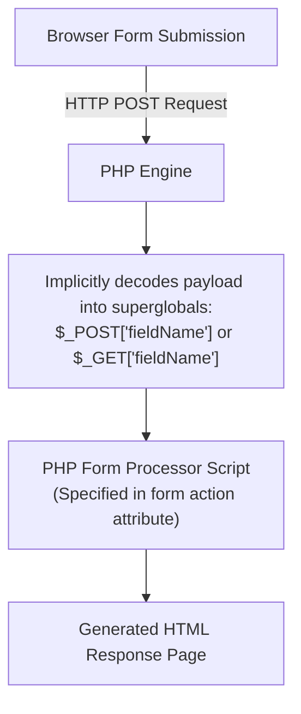

# PHP Pattern Matching and Server-Side Form Handling

## 9. Pattern Matching in PHP

PHP supports two regular expression engines:
1. **POSIX Regular Expressions**: Compiled directly into PHP core.
2. **Perl-Compatible Regular Expressions (PCRE)**: Powered by the PCRE library (matching JavaScript regex syntax).

---

### 9.1 `preg_match()`
Searches a string for a Perl-style regular expression match. Returns `1` if a match occurs, `0` if not.

```php
if (preg_match("/^PHP/", $str)) {
  print "\$str begins with PHP <br />";
} else {
  print "\$str does not begin with PHP <br />";
}
```

---

### 9.2 `preg_split()` & Word Frequency Case Study
Splits a string into an array of substrings using a Perl-style regex delimiter pattern.

```php
$fruit_string = "apple : orange : banana";
$fruits = preg_split("/ : /", $fruit_string); // Returns ["apple", "orange", "banana"]
```

#### 📜 Complete Program Code Listing: Word Frequency Table (`word_table.php`)

Uses `preg_split("/[ \.,;:!\?]\s*/", $str)` to split text into words by whitespace or punctuation delimiters, building a frequency count array sorted alphabetically.

```html
<!DOCTYPE html>
<!-- word_table.php
     Uses a function to split a given string of text into its constituent words.
     It also determines the frequency of occurrence of each word.
     -->
<html lang = "en">
  <head> 
    <title> word_table.php </title>
    <meta charset = "utf-8" />
  </head>
  <body>
  <?php
    // Function splitter
    // Parameter: a string of text containing words and punctuation
    // Returns: an array with unique words as keys and frequencies as values
    function splitter($str) {
      $freq = array();

      // Split string by whitespace or punctuation (, ; : ! ?) possibly followed by whitespace
      $words = preg_split("/[ \.,;:!\?]\s*/", $str);

      foreach ($words as $word) {
        $keys = array_keys($freq);
        if (in_array($word, $keys)) {
          $freq[$word]++;
        } else {
          $freq[$word] = 1;
        }
      }
      return $freq;
    }

    // Sample input text string
    $str = "apples are good for you, or don't you like apples? or maybe you like oranges better than apples";

    // Call splitter function
    $tbl = splitter($str);

    // Display words and frequencies in alphabetical order
    print "<br /> Word Frequency <br /><br />";
    $sorted_keys = array_keys($tbl);
    sort($sorted_keys);

    foreach ($sorted_keys as $word) {
      print "$word $tbl[$word] <br />";
    }
  ?>
  </body>
</html>
```

---

## 10. Server-Side Form Handling in PHP

Form handling allows web browsers to transmit encoded user input to the server via HTTP requests (`GET` or `POST`). PHP automatically decodes form payloads into predefined superglobal arrays.



---

### 10.1 Superglobal Arrays: `$_POST` and `$_GET`

> [!IMPORTANT]
> **Security & Access Rule**: Although PHP can be configured to register form parameters as global variables, this is disabled by default due to security vulnerabilities. Always use the **`$_POST`** or **`$_GET`** superglobal arrays.

- **`$_POST["element_name"]`**: Accesses form data submitted via `method="post"`.
- **`$_GET["element_name"]`**: Accesses query parameters submitted via `method="get"`.

---

### 10.2 📜 Complete Program Code Listing: Popcorn Order System (`popcorn3.html` & `popcorn3.php`)

#### 1. HTML Form Interface (`popcorn3.html`)
```html
<!DOCTYPE html>
<!-- popcorn3.html - This describes the popcorn sales form -->
<html lang = "en">
  <head>
    <title> Popcorn Sales - for PHP handling </title>
    <meta charset = "utf-8" />
    <style type = "text/css">
      td, th, table { border: thin solid black; }
    </style>
  </head>
  <body>
    <form action = "popcorn3.php" method = "post">
      <h2> Welcome to Millennium Gymnastics Booster Club Popcorn Sales </h2>
      <table>
        <!-- Text widgets for customer name and address -->
        <tr>
          <td> Buyer's Name: </td>
          <td> <input type = "text" name = "name" size = "30" /></td>
        </tr>
        <tr>
          <td> Street Address: </td>
          <td> <input type = "text" name = "street" size = "30" /></td>
        </tr>
        <tr>
          <td> City, State, Zip: </td>
          <td> <input type = "text" name = "city" size = "30" /></td>
        </tr>
      </table>
      <p />
      <table>
        <!-- Column headings -->
        <tr>
          <th> Product </th>
          <th> Price </th>
          <th> Quantity </th>
        </tr>
        <!-- Product items -->
        <tr>
          <td> Unpopped Popcorn (1 lb.) </td>
          <td> $3.00 </td>
          <td> <input type = "text" name = "unpop" size = "3" /></td>
        </tr>
        <tr>
          <td> Caramel Popcorn (2 lb. canister) </td>
          <td> $3.50 </td>
          <td> <input type = "text" name = "caramel" size = "3" /> </td>
        </tr>
        <tr>
          <td> Caramel Nut Popcorn (2 lb. canister) </td>
          <td> $4.50 </td>
          <td> <input type = "text" name = "caramelnut" size = "3" /> </td>
        </tr>
        <tr>
          <td> Toffey Nut Popcorn (2 lb. canister) </td>
          <td> $5.00 </td>
          <td> <input type = "text" name = "toffeynut" size = "3" /> </td>
        </tr>
      </table>
      <p />
      <!-- Radio buttons for payment method -->
      <h3> Payment Method </h3>
      <p>
        <input type = "radio" name = "payment" value = "visa" checked = "checked" /> Visa <br />
        <input type = "radio" name = "payment" value = "mc" /> Master Card <br />
        <input type = "radio" name = "payment" value = "discover" /> Discover <br />
        <input type = "radio" name = "payment" value = "check" /> Check <br /> <br />

        <!-- Submit and reset buttons -->
        <input type = "submit" value = "Submit Order" />
        <input type = "reset" value = "Clear Order Form" />
      </p>
    </form>
  </body>
</html>
```

#### 2. PHP Form Processing Script (`popcorn3.php`)
```html
<!DOCTYPE html>
<!-- popcorn3.php - Processes the form described in popcorn3.html -->
<html lang = "en">
  <head>
    <title> Process the popcorn3.html form </title>
    <meta charset = "utf-8" />
    <style type = "text/css">
      td, th, table { border: thin solid black; }
    </style>
  </head>
  <body>
    <?php
      // 1. Extract form data from $_POST superglobal array
      $unpop = $_POST["unpop"];
      $caramel = $_POST["caramel"];
      $caramelnut = $_POST["caramelnut"];
      $toffeynut = $_POST["toffeynut"];
      $name = $_POST["name"];
      $street = $_POST["street"];
      $city = $_POST["city"];
      $payment = $_POST["payment"];

      // 2. Sanitize empty quantity inputs to zero
      if ($unpop == "") $unpop = 0;
      if ($caramel == "") $caramel = 0;
      if ($caramelnut == "") $caramelnut = 0;
      if ($toffeynut == "") $toffeynut = 0;

      // 3. Compute item costs and grand total
      $unpop_cost = 3.0 * $unpop;
      $caramel_cost = 3.5 * $caramel;
      $caramelnut_cost = 4.5 * $caramelnut;
      $toffeynut_cost = 5.0 * $toffeynut;
      $total_price = $unpop_cost + $caramel_cost + $caramelnut_cost + $toffeynut_cost;
      $total_items = $unpop + $caramel + $caramelnut + $toffeynut;
    ?>

    <h4> Customer: </h4>
    <?php
      print ("$name <br /> $street <br /> $city <br />");
    ?>
    <p /> <p />
    <table>
      <caption> Order Information </caption>
      <tr>
        <th> Product </th>
        <th> Unit Price </th>
        <th> Quantity Ordered </th>
        <th> Item Cost </th>
      </tr>
      <tr>
        <td> Unpopped Popcorn </td>
        <td> $3.00 </td>
        <td> <?php print ("$unpop"); ?> </td>
        <td> <?php printf ("$ %4.2f", $unpop_cost); ?> </td>
      </tr>
      <tr>
        <td> Caramel Popcorn </td>
        <td> $3.50 </td>
        <td> <?php print ("$caramel"); ?> </td>
        <td> <?php printf ("$ %4.2f", $caramel_cost); ?> </td>
      </tr>
      <tr>
        <td> Caramel Nut Popcorn </td>
        <td> $4.50 </td>
        <td> <?php print ("$caramelnut"); ?> </td>
        <td> <?php printf ("$ %4.2f", $caramelnut_cost); ?> </td>
      </tr>
      <tr>
        <td> Toffey Nut Popcorn </td>
        <td> $5.00 </td>
        <td> <?php print ("$toffeynut"); ?> </td>
        <td> <?php printf ("$ %4.2f", $toffeynut_cost); ?> </td>
      </tr>
    </table>
    <p /> <p />
    <?php
      print "You ordered $total_items popcorn items <br />";
      printf ("Your total bill is: $ %5.2f <br />", $total_price);
      print "Your chosen method of payment is: $payment <br />";
    ?>
  </body>
</html>
```
