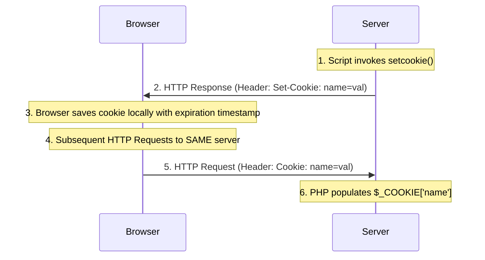
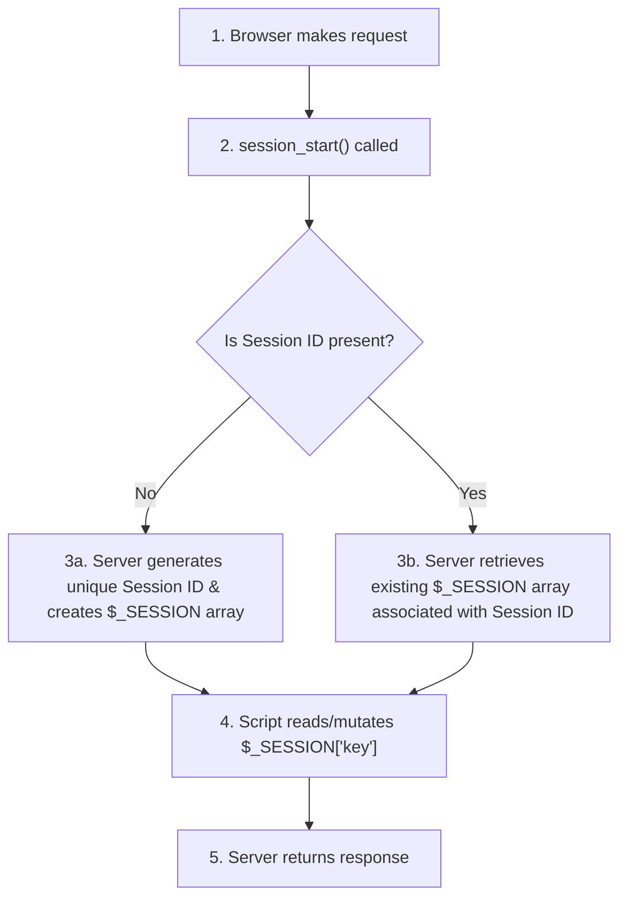

# Cookies and Session Tracking in PHP

## 11. Cookies in PHP

### 11.1 Introduction to HTTP Cookies & Session State
- **HTTP Statelessness**: HTTP is a stateless protocol; it maintains no memory of client interactions across multiple HTTP requests.
- **Session Definition**: A session is the continuous interaction span between a browser client and a web server, starting upon initial connection and terminating when the browser is closed or after a period of client inactivity (e.g. 30-minute timeout).
- **Cookie Definition**: A small data object consisting of a **name** and a **textual value** created by the server and stored locally on the browser host machine.
- **Primary Uses**:
  1. **Shopping Carts**: Storing customer session IDs across product selections.
  2. **Personalization / Profiling**: Tracking user preferences and perused site sections to target content or ads.
  3. **Customized Interfaces**: Recognizing returning users to customize UI configurations.



> [!CAUTION]
> **Client Privacy & Security Caveat**:
> 1. Cookies are exchangeable **ONLY between the creating server and the browser host**.
> 2. Users can set their browsers to **reject or delete cookies**, making cookies unreliable for mandatory application logic.

---

### 11.2 PHP Support for Cookies (`setcookie()`)

Cookies are created or updated using the built-in `setcookie()` function.

```php
setcookie(name, value, expireTimeSeconds, path, domain, secure);
```

| Parameter | Type | Required? | Description |
| :--- | :--- | :---: | :--- |
| **`name`** | String | **Mandatory** | The name identifier of the cookie. |
| **`value`** | String | Optional | The text string value stored in the cookie. If omitted, undefines the cookie. |
| **`expireTimeSeconds`**| Integer | Optional | Expiration timestamp in seconds since Unix epoch (`Jan 1, 1970`). Default `0` destroys cookie on browser exit. |

#### Calculating Expiration Time:
```php
// time() returns current Unix epoch timestamp in seconds.
// 86,400 seconds = 1 day (24 * 60 * 60)
setcookie("voted", "true", time() + 86400); // Cookie expires in 24 hours
```

---

### 11.3 CRITICAL RULE: Header Output Placement

> [!IMPORTANT]
> **Mandatory `setcookie()` Execution Order Rule**:
> `setcookie()` **MUST be called BEFORE any HTML output or single whitespace character is sent to the client!**
> 
> **Why?** Cookies are transmitted in HTTP response headers. The server sends HTTP headers immediately upon encountering the first character of document body content. Calling `setcookie()` after HTML output has started results in silent failure or header errors!

---

### 11.4 Accessing Incoming Cookies (`$_COOKIE`)

Incoming cookies are automatically unpacked into the **`$_COOKIE` superglobal array**.

```php
if (isset($_COOKIE["voted"])) {
  $hasVoted = $_COOKIE["voted"];
  print "Thank you for voting! <br />";
} else {
  print "Please cast your vote. <br />";
}
```

---

## 12. Session Tracking in PHP

Session tracking provides a mechanism to store state variables **on the web server** rather than on the client browser.



### 12.1 Key Differences: Cookies vs. Sessions

| Feature | Cookies (`$_COOKIE`) | Sessions (`$_SESSION`) |
| :--- | :--- | :--- |
| **Storage Location** | Client Browser Host Machine | **Web Server Machine** |
| **Security Level** | Lower (User can modify/inspect) | **High** (Client cannot alter server array data) |
| **Data Capacity** | Small (~4KB string limit) | Large (Server RAM/disk memory capacity) |
| **Lifetime** | Explicit expiration timestamp | Ends on browser close or server timeout |

---

### 12.2 Session Initialization & Management (`session_start()`)

- **`session_start()`**: **MUST be called at the beginning of any PHP script** that reads or writes session state.
  - On first call: Creates a unique session ID and initializes the empty **`$_SESSION` superglobal array**.
  - On subsequent calls: Re-hydrates the existing `$_SESSION` array associated with the current client.

---

### 12.3 📜 Complete Code Example: Page Visit Counter (`$_SESSION`)

Tracks the total number of page visits by a user across multiple page reloads during an active session.

```php
<?php
  // 1. Initialize or resume session tracking
  session_start();

  // 2. Check if page_number session variable exists
  if (!isset($_SESSION["page_number"])) {
    $_SESSION["page_number"] = 1; // Initial visit
  }

  // 3. Retrieve current visit count
  $page_num = $_SESSION["page_number"];

  // 4. Output user message
  print("You have now visited $page_num page(s) <br />");

  // 5. Increment visit counter for next request
  $_SESSION["page_number"]++;
?>
```

#### Destroying Session Variables:
```php
unset($_SESSION["page_number"]); // Destroys single session key
session_destroy();               // Destroys entire session on server
```
