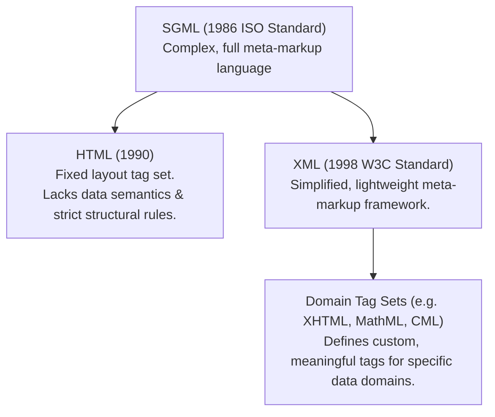
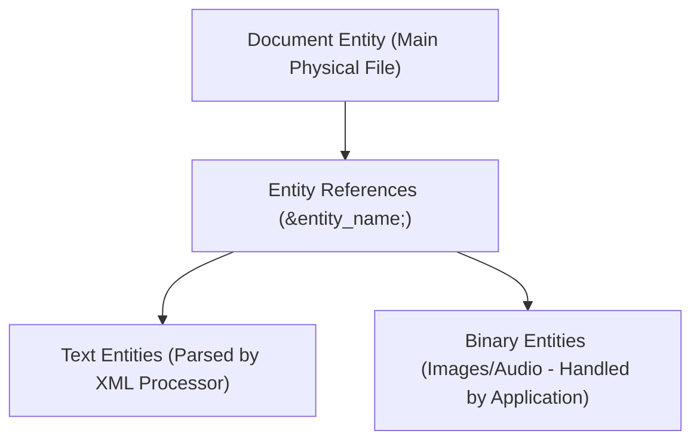

# Introduction to XML: Meta-Markup Languages, Syntax, and Document Structure

## 1. Introduction to XML

The **eXtensible Markup Language (XML)** is a W3C-standardized meta-markup language designed for universal data storage, interchange, and processing across systems.

### 1.1 Meta-Markup Languages: SGML vs. HTML vs. XML



- **Meta-Markup Language**: A language used to define new markup languages.
- **SGML (Standard Generalized Markup Language)**: The 1986 ISO meta-language standard. SGML is powerful but too large, complex, and costly to implement for standard web applications.
- **HTML Limitations**:
  1. **Layout-Only Focus**: HTML describes *how data looks* (formatting), not *what data means* (semantics). Content inside `<p>` cannot be queried categorically by machine applications.
  2. **Loose Syntax**: HTML 4 allowed overlapping or unclosed tags (e.g. `<strong>Now <em>is</strong> the time</em>`).
- **XML Purpose**: XML is **NOT a replacement for HTML**. HTML describes presentation, whereas XML provides a simplified framework for defining custom, domain-specific tag sets (e.g. `<price>`, `<model>`, `<patient>`).
- **Universal Data Interchange**: XML stores plain-text data without hidden formatting vendor codes, enabling seamless data exchange across disparate server platforms and databases.

---

### 1.2 Key Terminology
- **Tag Set (XML Application)**: A custom set of tags and structural rules created using XML for a specific domain.
- **XML Document**: A plain-text document conforming to low-level XML syntax rules and a specific tag set.
- **XML Processor (Parser)**: Software that analyzes an XML document, isolates constituent parts (tags, attributes, text data), and feeds them to an application program.

---

## 2. Low-Level Syntax of XML

All XML documents must adhere to a strict set of low-level syntactic rules to be considered **Well-Formed**.

### 2.1 The Rules of Well-Formed XML Documents

1. **XML Declaration**: Must appear on the very first line of code:
   ```xml
   <?xml version="1.0" encoding="utf-8"?>
   ```
2. **Single Root Element**: Every document **MUST define exactly ONE root element** enclosed around all other content.
3. **Strict Closing Tags**: Every element with content must have an explicit matching closing tag.
4. **Self-Closing Empty Tags**: Elements without content must use self-closing syntax: `<element_name />`.
5. **Attribute Quoting**: **ALL attribute values MUST be enclosed** in single (`'`) or double (`"`) quotes.
6. **Case Sensitivity**: XML names are **strictly case sensitive** (`<Body>`, `<body>`, and `<BODY>` are 3 distinct tags).
7. **Strict Nesting (No Overlapping)**: Elements must nest cleanly inside parent tags.

---

### 2.2 📜 Complete Code Example: Well-Formed Used Car Ad (`ad.xml`)

```xml
<?xml version = "1.0" encoding = "utf-8"?>
<ad>
  <year> 1960 </year>
  <make> Cessna </make>
  <model> Centurian </model>
  <color> Yellow with white trim </color>
  <location>
    <city> Gulfport </city>
    <state> Mississippi </state>
  </location>
</ad>
```

---

### 2.3 Design Decisions: Nested Elements vs. Attributes

When structuring data in XML, designers choose between nested child tags and tag attributes.

| Criteria | Prefer Nested Elements | Prefer Attributes |
| :--- | :--- | :--- |
| **Substructure** | Data has its own nested details or sub-parts. | Data is a atomic, simple value without sub-parts. |
| **Extensibility** | Data structure may expand or grow in the future. | Data represents fixed metadata (e.g. `id`, `name`). |
| **Data Nature** | Content is actual sub-data of the parent element. | Content is metadata *about* the element or selected from a fixed set. |
| **Binary Data** | Cannot hold binary data references directly. | **Required** for binary entity references (e.g. image URLs). |

#### Case Study: Patient Data Representation Options

```xml
<!-- Option 1: Single Attribute (Inflexible, cannot expand) -->
<patient name="Maggie Dee Magpie"> ... </patient>

<!-- Option 2: Single Nested Tag -->
<patient>
  <name> Maggie Dee Magpie </name>
</patient>

<!-- Option 3: Structured Nested Sub-Tags (PREFERRED BEST PRACTICE) -->
<patient>
  <name>
    <first> Maggie </first>
    <middle> Dee </middle>
    <last> Magpie </last>
  </name>
</patient>
```
*Option 3 is best because it provides direct program query access to individual name components.*

---

## 3. XML Document Structure and Entities

An XML document consists of one or more **Entities**—logically related units of information ranging from a single character to a full book chapter.



### 3.1 Entity Types & Purpose
- **Document Entity**: The primary physical file containing the XML document root.
- **Parsed Text Entities**: Replaced directly by their textual content by the XML processor during parsing. Used to modularize large files and prevent duplication.
- **Binary Entities**: Used for non-text data (e.g. PNG images, audio clips). XML processors ignore binary entities; host applications handle them.

---

### 3.2 Predefined Entities in XML
To include markup reserved characters (`<`, `>`, `&`, `'`, `"`) as literal text content without triggering parsing errors:

| Predefined Entity | Represents Character | Description |
| :---: | :---: | :--- |
| `&lt;` | `<` | Less-than symbol |
| `&gt;` | `>` | Greater-than symbol |
| `&amp;` | `&` | Ampersand symbol |
| `&apos;` | `'` | Single quote / apostrophe |
| `&quot;` | `"` | Double quotation mark |

---

### 3.3 Character Data Sections (`<![CDATA[ ... ]]>`)

When a block of text contains many markup characters (e.g. code listings or raw math inequalities), using individual entity references makes text unreadable. A **Character Data (CDATA) Section** instructs the XML parser to **skip parsing** the enclosed content entirely.

```xml
<![CDATA[ content ]]>
```

> [!CAUTION]
> **Strict CDATA Keyword Rule**:
> 1. No spaces are allowed between `[` and `C`, or between `A` and `[`. The opening construct MUST be exactly `<![CDATA[`.
> 2. The string `]]>` **cannot appear inside CDATA content**, as it terminates the section.
> 3. Entity references inside a CDATA block are **NOT expanded** (they remain literal text).

#### CDATA Comparison Example:

**Without CDATA (Cluttered Entity References)**:
```xml
The last word of the line is &gt;&gt;&gt; here &lt;&lt;&lt;.
```

**With CDATA (Clean Unparsed Representation)**:
```xml
<![CDATA[The last word of the line is >>> here <<<]]>
```
