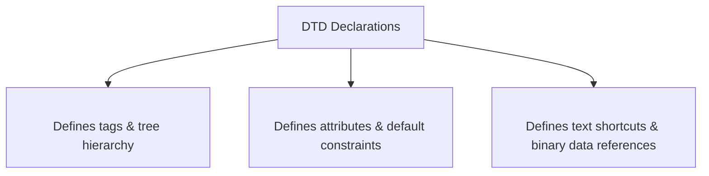
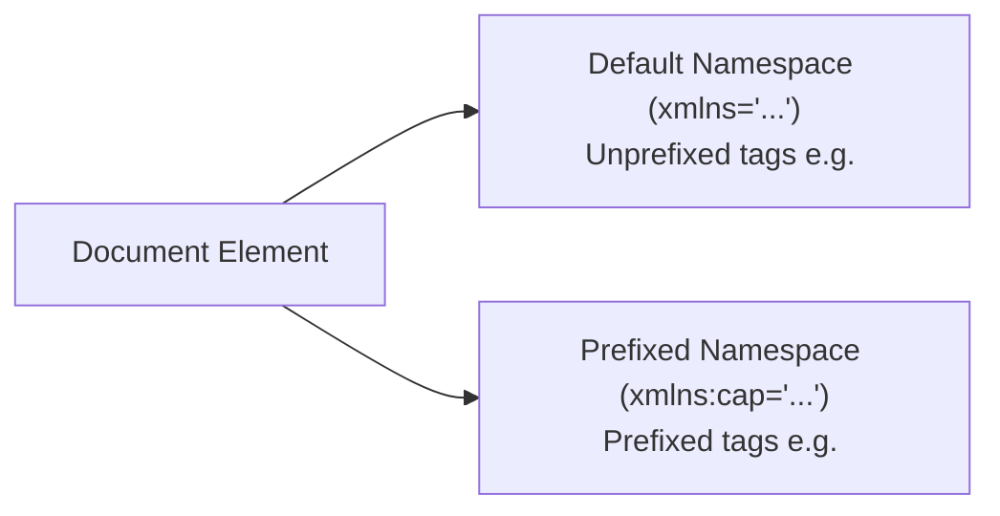

# Document Type Definitions (DTDs) and XML Namespaces

## 1. Document Type Definitions (DTDs)

A **Document Type Definition (DTD)** is a formal set of structural rules (declarations) that defines the valid elements, attributes, entities, and structural relationships for a class of XML documents.



### 1.1 Purpose of DTDs
- **Structural Uniformity**: Imposes a standard schema across documents created by different authors/organizations.
- **Validation**: Enables **Validating XML Parsers** to test XML documents and report structural inconsistencies.
- **Application Reliability**: Programs processing XML can rely on predictable tag hierarchies.

---

### 1.2 Element Declarations (`<!ELEMENT>`)

Element declarations use Backus-Naur Form (BNF) syntax to define the document tree structure.

```xml
<!ELEMENT element_name (child_element_list)>
```

#### Parent Node Hierarchy & Modifiers Table:

| Modifier Symbol | Meaning | Example |
| :---: | :--- | :--- |
| *(None)* | Exactly one occurrence (mandatory) | `<!ELEMENT memo (from, to)>` |
| `+` | **One or more** occurrences ($\ge 1$) | `<!ELEMENT parent+>` |
| `*` | **Zero or more** occurrences ($\ge 0$) | `<!ELEMENT sibling*>` |
| `?` | **Zero or one** occurrence (optional) | `<!ELEMENT spouse?>` |

```xml
<!ELEMENT person (parent+, age, spouse?, sibling*)>
```

#### Leaf Node Data Content Types:
- **`#PCDATA`**: Parsable Character Data (text content; cannot contain raw `<`, `>`, or `&`).
  ```xml
  <!ELEMENT year (#PCDATA)>
  ```
- **`EMPTY`**: Element contains no body content (e.g. `<photo ent="JFK" />`).
- **`ANY`**: Element may contain any arbitrary content.

---

### 1.3 Attribute Declarations (`<!ATTLIST>`)

Attributes are declared separately from elements using `<!ATTLIST>`.

```xml
<!ATTLIST element_name attribute_name attribute_type default_option>
```

#### Attribute Default Options Reference:

| Default Option | Meaning & Behavior |
| :--- | :--- |
| `"literal_value"` | Default quoted value used if attribute is omitted in XML tag. |
| **`#FIXED "value"`** | Constant value shared by all element instances; cannot be overridden. |
| **`#REQUIRED`** | **Mandatory attribute**; every tag instance MUST specify a value. |
| **`#IMPLIED`** | **Optional attribute**; no default supplied (application chooses fallback). |

```xml
<!ATTLIST airplane places CDATA "4">
<!ATTLIST airplane engine_type CDATA #REQUIRED>
<!ATTLIST airplane price CDATA #IMPLIED>
<!ATTLIST airplane manufacturer CDATA #FIXED "Cessna">
```

---

### 1.4 Entity Declarations (`<!ENTITY>`)

#### 1. General Internal Entities (Text Shortcuts)
```xml
<!ENTITY jfk "John Fitzgerald Kennedy">
<!-- In XML: &jfk; expands to "John Fitzgerald Kennedy" -->
```

#### 2. External Text Entities
```xml
<!ENTITY section2 SYSTEM "sections/section2.xml">
```

#### 3. Binary Entities (Images / Audio)
Binary entities use `NDATA` (not-parsed data) and require a notation specifier (e.g. `JPEG`, `GIF`).

```xml
<!ENTITY JFKPhoto SYSTEM "myEntities/JFKPhoto.jpg" NDATA JPEG>

<!ELEMENT photo EMPTY>
<!ATTLIST photo ent ENTITY #REQUIRED>

<!-- In XML: <photo ent = "JFKPhoto" /> -->
```

---

### 1.5 Internal vs. External DTDs

- **Internal DTD**: Embedded directly inside the XML document using `<!DOCTYPE root_name [...]>`.
- **External DTD**: Stored in a separate file (e.g. `planes.dtd`) and referenced on the second line of the XML document:
  ```xml
  <!DOCTYPE root_element SYSTEM "filename.dtd">
  ```

---

### 1.6 📜 Complete Code Listing: Airplanes DTD & Valid XML Document

#### 1. DTD File (`planes.dtd`)
```xml
<?xml version = "1.0" encoding = "utf-8"?>
<!-- planes.dtd - a document type definition for planes.xml -->
<!ELEMENT planes_for_sale (ad+)>
<!ELEMENT ad (year, make, model, color, description, price?, seller, location)>
<!ELEMENT year (#PCDATA)>
<!ELEMENT make (#PCDATA)>
<!ELEMENT model (#PCDATA)>
<!ELEMENT color (#PCDATA)>
<!ELEMENT description (#PCDATA)>
<!ELEMENT price (#PCDATA)>
<!ELEMENT seller (#PCDATA)>
<!ELEMENT location (city, state)>
<!ELEMENT city (#PCDATA)>
<!ELEMENT state (#PCDATA)>

<!ATTLIST seller phone CDATA #REQUIRED>
<!ATTLIST seller email CDATA #IMPLIED>

<!ENTITY c "Cessna">
<!ENTITY p "Piper">
<!ENTITY b "Beechcraft">
```

#### 2. Validating XML Document (`planes.xml`)
```xml
<?xml version = "1.0" encoding = "utf-8"?>
<!-- planes.xml - A document that lists ads for used airplanes -->
<!DOCTYPE planes_for_sale SYSTEM "planes.dtd">
<planes_for_sale>
  <ad>
    <year> 1977 </year>
    <make> &c; </make>
    <model> Skyhawk </model>
    <color> Light blue and white </color>
    <description> New paint, nearly new interior, 685 hours SMOH, full IFR King avionics </description>
    <price> 23,495 </price>
    <seller phone = "555-222-3333"> Skyway Aircraft </seller>
    <location>
      <city> Rapid City, </city>
      <state> South Dakota </state>
    </location>
  </ad>
  <ad>
    <year> 1965 </year>
    <make> &p; </make>
    <model> Cherokee </model>
    <color> Gold </color>
    <description> 240 hours SMOH, dual NAVCOMs, DME, new Cleveland brakes, great shape </description>
    <seller phone = "555-333-2222" email = "jseller@www.axl.com"> John Seller </seller>
    <location>
      <city> St. Joseph, </city>
      <state> Missouri </state>
    </location>
  </ad>
</planes_for_sale>
```

---

## 2. XML Namespaces

### 2.1 Purpose: Resolving Name Collisions

When combining multiple XML tag sets in a single document (e.g. a furniture catalog with `<table`> tags alongside HTML formatting `<table>` tags), element name collisions occur. XML Namespaces resolve ambiguities by qualified scope prefixes.



---

### 2.2 Namespace Declaration Syntax

Namespaces are declared using the special `xmlns` attribute, usually on the root element.

```xml
<element_name xmlns[:prefix] = "URI_or_URL">
```

- **Prefixed Namespace**: Requires all associated tags to carry `prefix:` (e.g. `<bd:lark>`).
- **Default Namespace**: Omits prefix; applies automatically to all unprefixed child elements.
- **URI Nature**: Namespace URIs (e.g. `http://www.w3.org/1999/xhtml`) serve **only as unique string identifiers**; XML processors **never request or download content from these URLs**.

---

### 2.3 📜 Complete Code Example: Multi-Namespace XML Document (`states.xml`)

Demonstrates a default namespace alongside a prefixed namespace (`cap:`).

```xml
<states xmlns = "http://www.states-info.org/states"
        xmlns:cap = "http://www.states-info.org/state-capitals">
  <state>
    <name> South Dakota </name>
    <population> 754844 </population>  
    <capital>
      <cap:name> Pierre </cap:name>
      <cap:population> 12429 </cap:population>
    </capital>
  </state>
  <!-- Additional states -->
</states>
```

> [!NOTE]
> **Attribute Namespace Exemption**: Attribute names are **NOT included in namespaces** because attributes are inherently local to their containing element.
