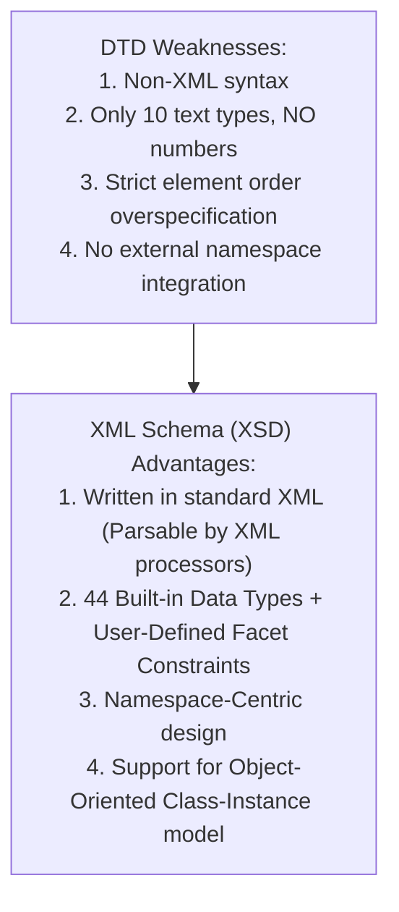
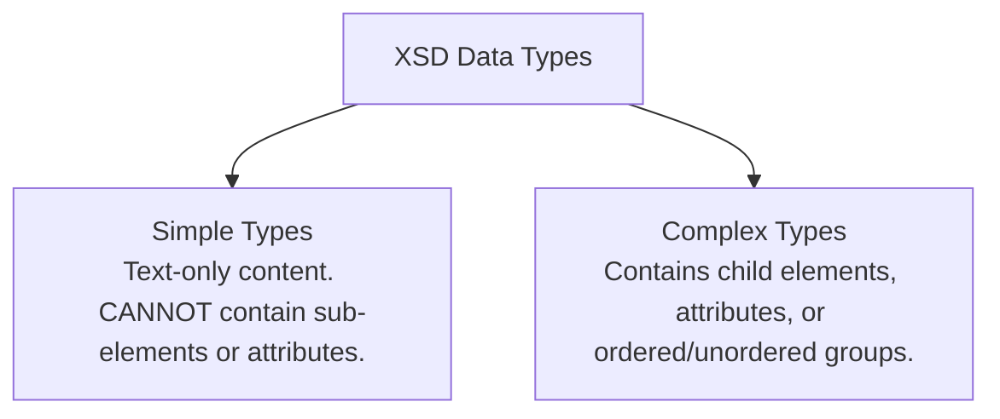

# XML Schema (XSD): Architecture, Types, Declarations, and Validation

## 1. Introduction to XML Schema

**XML Schema (XSD)** is a W3C-standardized meta-language for defining the structure, content, and data types of XML instance documents.



### 1.1 Disadvantages of DTDs vs. Advantages of XML Schema

| Feature | Document Type Definitions (DTDs) | XML Schema (XSD) |
| :--- | :--- | :--- |
| **Syntax** | Non-XML proprietary BNF notation | **Native XML Syntax** (Parsed by standard XML parsers) |
| **Data Types** | 10 string types (No integers, floats, dates) | **44 Predefined Types** + User-Defined Facet Restrictions |
| **Namespaces** | Poor support (cannot integrate external namespaces) | **First-Class Namespace Support** (Namespace-centric) |
| **Ordering Flexibility**| Strict sequence required | Allows unordered groups (`<xsd:all>`), choices (`<xsd:choice>`) |
| **OO Paradigm** | Structurally rigid | Class (Schema) $\rightarrow$ Object (Instance XML Document) |

---

## 2. Defining an XML Schema (`.xsd`)

Schemas are written using the XMLSchema namespace: `http://www.w3.org/2001/XMLSchema` (typically assigned prefix `xsd:`).

### 2.1 Schema Root Tag Attributes (`<xsd:schema>`)

```xml
<xsd:schema
  xmlns:xsd = "http://www.w3.org/2001/XMLSchema"
  targetNamespace = "http://cs.uccs.edu/planeSchema"
  xmlns = "http://cs.uccs.edu/planeSchema"
  elementFormDefault = "qualified">
```

- **`xmlns:xsd`**: Specifies the XMLSchema namespace for schema definition elements (`<xsd:element>`, `<xsd:complexType>`).
- **`targetNamespace`**: Defines the namespace where elements defined in this schema belong.
- **`xmlns`**: Default namespace for unprefixed elements defined inside the schema file.
- **`elementFormDefault="qualified"`**: Requires nested child elements in instance documents to belong to the target namespace.

---

### 2.2 Schema Instance Root Tag (`.xml`)

An XML document instance specifies its schema using `xsi:schemaLocation`:

```xml
<planes
  xmlns = "http://cs.uccs.edu/planeSchema"
  xmlns:xsi = "http://www.w3.org/2001/XMLSchema-instance"
  xsi:schemaLocation = "http://cs.uccs.edu/planeSchema planes.xsd">
  <!-- Content -->
</planes>
```
*Note: `xsi:schemaLocation` takes two whitespace-separated values: the Target Namespace URI and the Schema File Path (`planes.xsd`).*

---

## 3. Data Types in XML Schema

XML Schema includes **44 predefined data types** (19 primitive like `string`, `boolean`, `float`, `time`, `anyURI`; 25 derived like `integer`, `decimal`, `byte`, `long`, `unsignedInt`, `NMTOKEN`).



---

### 3.1 Simple Types & Facet Restrictions (`<xsd:simpleType>`)

Simple user-defined data types constrain existing base types using **Facets** inside `<xsd:restriction>`.

#### Common Facets:
- `length`, `minLength`, `maxLength`: String character bounds.
- `minInclusive`, `maxInclusive`, `minExclusive`, `maxExclusive`: Numeric boundary constraints.
- `precision` / `totalDigits`: Total decimal digits.
- `pattern`, `enumeration`, `whitespace`.

#### Code Examples:

```xml
<!-- 1. Restricting string length to max 10 characters -->
<xsd:simpleType name = "firstName">
  <xsd:restriction base = "xsd:string">
    <xsd:maxLength value = "10" />
  </xsd:restriction>
</xsd:simpleType>

<!-- 2. Restricting decimal precision for phone number -->
<xsd:simpleType name = "phoneNumber">
  <xsd:restriction base = "xsd:decimal">
    <xsd:precision value = "7" />
  </xsd:restriction>
</xsd:simpleType>

<!-- 3. Numeric range restriction (1900 to 2012) -->
<xsd:element name = "year">
  <xsd:simpleType>
    <xsd:restriction base = "xsd:decimal">
      <xsd:minInclusive value = "1900" />
      <xsd:maxInclusive value = "2012" />
    </xsd:restriction>
  </xsd:simpleType>
</xsd:element>
```

---

### 3.2 Complex Types (`<xsd:complexType>`)

Complex types define element-only containers or elements with attributes.

#### Element Ordering Group Containers:
- **`<xsd:sequence>`**: Elements must appear in the exact ordered sequence.
- **`<xsd:all>`**: Elements can appear in **any order** (unordered group).
- **`<xsd:choice>`**: Only **one** of the listed child elements may appear.

#### Occurrence Bounds (`minOccurs` / `maxOccurs`):
- `minOccurs`: Nonnegative integer (default `1`). `0` makes element optional.
- `maxOccurs`: Nonnegative integer or **`unbounded`** (unlimited repetitions).

```xml
<xsd:complexType name = "sports_car">
  <xsd:sequence>
    <xsd:element name = "make" type = "xsd:string" />
    <xsd:element name = "model" type = "xsd:string" />
    <xsd:element name = "engine" type = "xsd:string" />
    <!-- Referencing global element -->
    <xsd:element ref = "year" />
  </xsd:sequence>
</xsd:complexType>
```

---

### 3.3 📜 Complete Code Listing: Airplane Schema (`planes.xsd` & `planes1.xml`)

#### 1. Schema File (`planes.xsd`)
```xml
<?xml version = "1.0" encoding = "utf-8"?>
<!-- planes.xsd - A simple schema for planes.xml -->
<xsd:schema
  xmlns:xsd = "http://www.w3.org/2001/XMLSchema"
  targetNamespace = "http://cs.uccs.edu/planeSchema"
  xmlns = "http://cs.uccs.edu/planeSchema"
  elementFormDefault = "qualified">

  <xsd:element name = "planes">
    <xsd:complexType>
      <xsd:all>
        <xsd:element name = "make"
                     type = "xsd:string"
                     minOccurs = "1"
                     maxOccurs = "unbounded" />
      </xsd:all>
    </xsd:complexType>
  </xsd:element>
</xsd:schema>
```

#### 2. Instance Document (`planes1.xml`)
```xml
<?xml version = "1.0" encoding = "utf-8"?>
<!-- planes1.xml - A simple XML document illustrating planes.xsd -->
<planes
  xmlns = "http://cs.uccs.edu/planeSchema"
  xmlns:xsi = "http://www.w3.org/2001/XMLSchema-instance"
  xsi:schemaLocation = "http://cs.uccs.edu/planeSchema planes.xsd">
    <make> Cessna </make>
    <make> Piper </make>
    <make> Beechcraft </make>
</planes>
```

---

### 3.4 Entity Definitions in Schemas

Schemas do not have direct entity tags like DTDs. Entities can be defined in two ways:
1. **Internal DTD inside Instance Document**:
   ```xml
   <!DOCTYPE planes [ <!ENTITY c "Cessna"> ]>
   <planes ...> <make> &c; </make> </planes>
   ```
2. **Fixed Constant Elements in Schema**:
   ```xml
   <xsd:element name = "c" type = "xsd:token" fixed = "Cessna" />
   <!-- Instance usage: <make> <c/> </make> -->
   ```

---

## 4. Validating Schema Instances with `xsv`

**XSV (XML Schema Validator)** is a command-line and web validation tool developed at the University of Edinburgh.

- Output of `xsv` is an XML document detailing `instanceErrors` and `schemaErrors`.

#### Sample Output of `xsv` Validation Run:
```xml
<?XML version='1.0' encoding = 'utf-8'?>
<xsv docElt='{http://cs.uccs.edu/planeSchema}planes' 
     instanceAssessed='true'
     instanceErrors = '0' 
     rootType='[Anonymous]' 
     schemaErrors='0'
     schemaLocs='http://cs.uccs.edu/planeSchema -> planes.xsd' 
     target='file:/c:/wbook2/xml/planes.xml'
     validation='strict' 
     version='XSV 1.197/1.101 of 2001/07/07 12:10:19'
     xmlns='http://www.w3.org/2000/05/xsv' >
  <importAttempt URI='file:/c:wbook2/xml/planes.xsd'
                 namespace='http://cs.uccs.edu/planeSchema'
                 outcome='success' />
</xsv>
```
*`instanceErrors="0"` and `schemaErrors="0"` indicate clean schema validation.*
