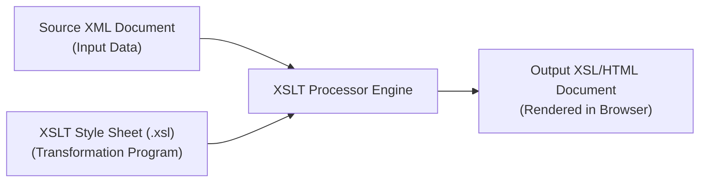

# Displaying XML Documents: Default Browser Styles, CSS, and XSLT Transformations

## 1. Displaying Raw XML Documents

When an XML-enabled web browser requests an XML document without an attached style sheet, it cannot infer formatting rules for custom tags.

- **Default Browser Style Sheets**: Contemporary browsers (Firefox, IE/Edge) render raw XML as a collapsible tree listing.
- **Tree Eliding**: Clicking the minus/dash symbol (`-`) next to a tag suppresses (collapses) that element and all of its nested children.
- **Purpose**: Raw XML display is primarily used for debugging document structure during development.

---

## 2. Formatting XML with Cascading Style Sheets (CSS)

An XML document can link to a standard CSS style sheet using the `<?xml-stylesheet?>` processing instruction.

```xml
<?xml-stylesheet type="text/css" href="planes.css"?>
```

### 2.1 Display Behavior: `display: block` vs `inline`
- **Default Display**: All custom XML elements default to `display: inline`.
- **Block Layout**: To force element content onto new lines with margins, explicitly set `display: block;`.

---

### 2.2 📜 Complete Code Example: CSS Formatted XML (`planes.css`)

```css
/* planes.css - Style sheet for planes.xml */
ad { display: block; margin-top: 15px; color: blue; }
year, make, model { color: red; font-size: 16pt; }
color { display: block; margin-left: 20px; font-size: 12pt; }
description { display: block; margin-left: 20px; font-size: 12pt; }
seller { display: block; margin-left: 15px; font-size: 14pt; }
location { display: block; margin-left: 40px; }
city { font-size: 12pt; }
state { font-size: 12pt; }
```

---

## 3. XSLT Style Sheets (XSL Transformations)

The **eXtensible Stylesheet Language (XSL)** family consists of three standards:
1. **XSLT (XSL Transformations)**: Transforms XML data trees into HTML, plain text, or XSL-FO.
2. **XPath (XML Path Language)**: Expression language used to select and address nodes inside an XML document tree.
3. **XSL-FO (XSL Formatting Objects)**: Generates high-quality PDF/PostScript print documents.



---

### 3.1 XSLT Architecture & Processing Instruction

To link an XSLT style sheet to an XML document:

```xml
<?xml-stylesheet type="text/xsl" href="xslplanes.xsl"?>
```

#### XSLT Root Tag & Namespaces (`<xsl:stylesheet>`):
```xml
<xsl:stylesheet version="1.0"
                xmlns:xsl="http://www.w3.org/1999/XSL/Transform"
                xmlns="http://www.w3.org/1999/xhtml">
```

---

### 3.2 XSLT Template Rules & Selectors

XSLT is a declarative pattern-matching language. Templates match nodes selected via XPath expressions.

- **`<xsl:template match="pattern">`**: Defines a processing rule for a node (e.g. `match="/"`, `match="plane"`, `match="year"`).
- **`<xsl:apply-templates />`**: Recursively applies matching templates to all child nodes of the current element.
  - `select="make"`: Applies templates ONLY to child `<make>` nodes.
  - `select="not(year)"`: Applies templates to all children EXCEPT `<year>`.
- **`<xsl:value-of select="pattern" />`**: Copies text content of selected XML element into output HTML.
  - `select="."`: Selects content of current node.
- **`<xsl:for-each select="pattern">`**: Iterates through collections of repeating XML elements.
- **`<xsl:sort select="pattern" data-type="text|number" order="ascending|descending" />`**: Sorts element iterations before generating output.

---

### 3.3 📜 Complete Code Listings & Approaches

#### Approach 1: Explicit Child Templates (`xslplane.xml` & `xslplane1.xsl`)

##### Source XML (`xslplane.xml`):
```xml
<?xml version = "1.0" encoding = "utf-8"?>
<?xml-stylesheet type = "text/xsl" href = "xslplane1.xsl" ?>
<plane>
  <year> 1977 </year>
  <make> Cessna </make>
  <model> Skyhawk </model>
  <color> Light blue and white </color>
</plane>
```

##### XSLT Style Sheet with Child Templates (`xslplane1.xsl`):
```xml
<?xml version = "1.0" encoding = "utf-8"?>
<!-- xslplane1.xsl - XSLT stylesheet using child templates -->
<xsl:stylesheet version = "1.0"
                xmlns:xsl = "http://www.w3.org/1999/XSL/Transform"
                xmlns = "http://www.w3.org/1999/xhtml">

  <!-- Main Root Template -->
  <xsl:template match = "plane">
    <html><head><title> Style sheet for xslplane.xml </title></head>
    <body>
      <h2> Airplane Description </h2>
      <xsl:apply-templates />
    </body></html>
  </xsl:template>

  <!-- Child Templates -->
  <xsl:template match = "year">
    <span style = "font-style: italic; color: blue;"> Year: </span>
    <xsl:value-of select = "." /> <br />
  </xsl:template>

  <xsl:template match = "make">
    <span style = "font-style: italic; color: blue;"> Make: </span>
    <xsl:value-of select = "." /> <br />
  </xsl:template>

  <xsl:template match = "model">
    <span style = "font-style: italic; color: blue;"> Model: </span>
    <xsl:value-of select = "." /> <br />
  </xsl:template>

  <xsl:template match = "color">
    <span style = "font-style: italic; color: blue;"> Color: </span>
    <xsl:value-of select = "." /> <br />
  </xsl:template>

</xsl:stylesheet>
```

---

#### Approach 2: Compact Implicit Template (`xslplane2.xsl`)

Replaces child templates by accessing values directly via `<xsl:value-of select="tag_name"/>`.

```xml
<?xml version = "1.0" encoding = "utf-8"?>
<!-- xslplane2.xsl - XSLT Stylesheet using implicit templates -->
<xsl:stylesheet version = "1.0"
                xmlns:xsl = "http://www.w3.org/1999/XSL/Transform"
                xmlns = "http://www.w3.org/1999/xhtml">

  <xsl:template match = "plane" >
    <html><head><title> Style sheet for xslplane.xml </title></head>
    <body>
      <h2> Airplane Description </h2>
      <span style = "font-style: italic; color: blue;"> Year: </span>
      <xsl:value-of select = "year" /> <br />
      <span style = "font-style: italic; color: blue;"> Make: </span>
      <xsl:value-of select = "make" /> <br />
      <span style = "font-style: italic; color: blue;"> Model: </span> 
      <xsl:value-of select = "model" /> <br />
      <span style = "font-style: italic; color: blue;"> Color: </span> 
      <xsl:value-of select = "color" /> <br />
    </body></html>
  </xsl:template>

</xsl:stylesheet>
```

---

#### Approach 3: Iteration & Sorting (`xslplanes.xml` & `xslplanes.xsl`)

Uses `<xsl:for-each>` and `<xsl:sort>` to loop through multiple airplane records and sort them numerically by year.

##### Source XML with Multiple Records (`xslplanes.xml`):
```xml
<?xml version = "1.0" encoding = "utf-8"?>
<?xml-stylesheet type = "text/xsl" href = "xslplanes.xsl" ?>
<planes>
  <plane>
    <year> 1977 </year>
    <make> Cessna </make>
    <model> Skyhawk </model>
    <color> Light blue and white </color>
  </plane>
  <plane>
    <year> 1975 </year>
    <make> Piper </make>
    <model> Apache </model>
    <color> White </color>
  </plane>   
  <plane>
    <year> 1960 </year>
    <make> Cessna </make>
    <model> Centurian </model>
    <color> Yellow and white </color>
  </plane>
  <plane>
    <year> 1956 </year>
    <make> Piper </make>
    <model> Tripacer </model>
    <color> Blue </color>
  </plane>
</planes>
```

##### XSLT Style Sheet with `for-each` and `sort` (`xslplanes.xsl`):
```xml
<?xml version = "1.0" encoding = "utf-8"?>
<!-- xslplanes.xsl -->
<xsl:stylesheet version = "1.0"
                xmlns:xsl = "http://www.w3.org/1999/XSL/Transform"
                xmlns = "http://www.w3.org/1999/xhtml" >

  <xsl:template match = "planes">
    <html><head><title> Airplane Descriptions </title></head>
    <body>
      <h2> Airplane Descriptions </h2>

      <!-- Loop through each plane element sorted by year -->
      <xsl:for-each select = "plane">
        <xsl:sort select = "year" data-type = "number" order = "ascending" />

        <span style = "font-style: italic; color: blue;"> Year: </span>
        <xsl:value-of select = "year" /> <br />
        <span style = "font-style: italic; color: blue;"> Make: </span>
        <xsl:value-of select = "make" /> <br />
        <span style = "font-style: italic; color: blue;"> Model: </span>
        <xsl:value-of select = "model" /> <br />
        <span style = "font-style: italic; color: blue;"> Color: </span>
        <xsl:value-of select = "color" /> <br /> <br />
      </xsl:for-each>

    </body></html>
  </xsl:template>

</xsl:stylesheet>
```
