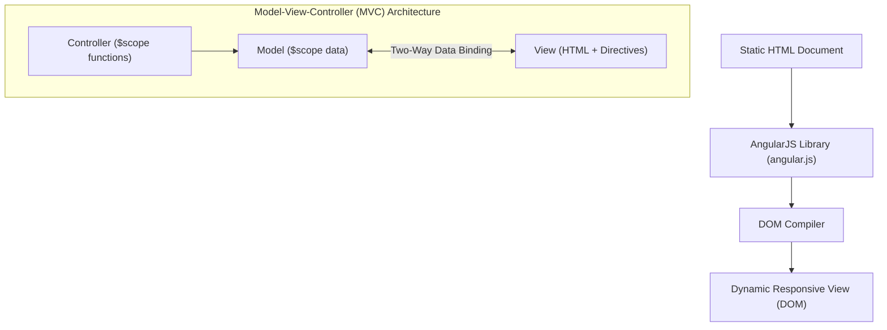

# Introduction to AngularJS & AngularJS Expressions

## 1. Introduction to AngularJS

**AngularJS** (Angular 1.x) is an open-source, client-side JavaScript Model-View-Controller (MVC) framework maintained by Google. It extends static HTML into a dynamic web application environment by introducing custom HTML attributes called **Directives** and enabling automatic **Two-Way Data Binding**.



---

### 1.1 Key Architectural Features of AngularJS

1. **Model-View-Controller (MVC) Architecture**:
   - **Model**: The raw data stored in JavaScript objects attached to the `$scope` object.
   - **View**: The HTML template enriched with AngularJS directives (`ng-app`, `ng-model`) and expressions (`{{ }}`).
   - **Controller**: JavaScript constructor functions that initialize `$scope` properties and define business logic/behavior.
2. **Two-Way Data Binding**: Any change in the UI input automatically updates the JavaScript model data, and any change in the model data instantly updates the rendered View—eliminating manual DOM manipulation (`document.getElementById`).
3. **Client-Side SPA Capability**: Powers **Single Page Applications (SPAs)** by asynchronously routing views without full page reloads.
4. **Declarative User Interface**: UI layout is defined using HTML markup rather than imperative JavaScript code.

---

### 1.2 Including AngularJS in a Web Page

AngularJS is distributed as a single JavaScript library file (`angular.js` or `angular.min.js`).

```html
<script src="https://ajax.googleapis.com/ajax/libs/angularjs/1.8.2/angular.min.js"></script>
```

---

### 1.3 Core Coreboot Directives

| Directive | Purpose & Description |
| :--- | :--- |
| **`ng-app`** | **Initializes the AngularJS Application**. Marks the root element of the application (usually `<html>` or `<body>`). |
| **`ng-init`** | Initializes inline application model variables before execution. |
| **`ng-model`** | Binds the value of HTML controls (input, select, textarea) to a model variable on the scope. |
| **`ng-bind`** | Replaces the text content of an HTML element with the value of a given expression. |

---

### 1.4 📜 Complete Code Example: Minimal AngularJS Hello World

```html
<!DOCTYPE html>
<!-- hello_angular.html -->
<html lang="en">
<head>
  <meta charset="utf-8" />
  <title>AngularJS First App</title>
  <!-- Load AngularJS Library -->
  <script src="https://ajax.googleapis.com/ajax/libs/angularjs/1.8.2/angular.min.js"></script>
</head>
<!-- ng-app directive boots up the AngularJS application -->
<body ng-app="">

  <h2>AngularJS Two-Way Data Binding Demo</h2>

  <div>
    <label>Enter your name:</label>
    <!-- ng-model binds input box directly to model variable 'userName' -->
    <input type="text" ng-model="userName" placeholder="Type name here..." />
  </div>

  <br />

  <!-- Expressions evaluate 'userName' in real time -->
  <h3>Hello, {{ userName }}!</h3>
  <p>Using ng-bind: <span ng-bind="userName"></span></p>

</body>
</html>
```

---

## 2. AngularJS Expressions

**AngularJS Expressions** are JavaScript-like code snippets enclosed within **double curly braces: `{{ expression }}`**.

```html
{{ 5 + 5 }}
```

Expressions are evaluated by the AngularJS compiler, and the result is interpolated directly into the HTML View DOM.

---

### 2.1 Characteristics: AngularJS Expressions vs. Standard JavaScript Expressions

| Feature | AngularJS Expressions (`{{ }}`) | Standard JavaScript Expressions |
| :--- | :--- | :--- |
| **Context** | Evaluated against the **`$scope` object**, not the global `window`. | Evaluated against the global `window` object. |
| **Error Handling** | **Forgiving / Null-Safe**: Undefined properties or `null` values produce empty output without throwing errors. | Throws `TypeError` or `ReferenceError` on undefined variables/methods. |
| **Control Flow** | **No Control Flow Statements**: Loops (`for`), conditionals (`if`), or exceptions (`try-catch`) are **prohibited**. | Full imperative control flow statements allowed. |
| **Bitwise / Assignment**| Bitwise operators and assignment operators (`=`, `+=`) are **not allowed**. | All operators allowed. |
| **Filters Support** | Supports pipe formatting filters (e.g. `{{ price | currency }}`). | No native pipe filter syntax. |

---

### 2.2 Types of AngularJS Expressions

AngularJS expressions can process numbers, strings, objects, arrays, and boolean logic.

#### 1. Number Expressions
Supports standard mathematical calculations:
```html
<p>Total Cost: {{ quantity * unitPrice }}</p>
<p>Discounted Amount: {{ (price * 0.90) + shippingFee }}</p>
```

#### 2. String Expressions
Supports concatenation and string methods:
```html
<p>Full Name: {{ firstName + " " + lastName }}</p>
<p>Uppercase Name: {{ (firstName + " " + lastName).toUpperCase() }}</p>
```

#### 3. Object Expressions
Accesses JavaScript object properties directly via dot notation:
```html
<div ng-init="student={name:'Alex', gpa:3.8, major:'CS'}">
  <p>Student Name: {{ student.name }}</p>
  <p>GPA: {{ student.gpa }} (Major: {{ student.major }})</p>
</div>
```

#### 4. Array Expressions
Accesses array elements via bracket indices:
```html
<div ng-init="colors=['Red', 'Green', 'Blue']">
  <p>First Color: {{ colors[0] }}</p>
  <p>Total Colors: {{ colors.length }}</p>
</div>
```

---

### 2.3 `ng-bind` Directive vs. `{{ }}` Double Curly Braces

Both `{{ expression }}` and `<span ng-bind="expression"></span>` achieve the exact same DOM output result.

> [!TIP]
> **FOUC (Flash of Unrendered Content) Exam Note**:
> When a page loads slowly over a network, the browser displays raw template markup like `{{ userName }}` to the user before `angular.js` finishes loading.
> 
> **Solution**: Using **`ng-bind="userName"`** or adding the **`ng-cloak`** directive hides raw uncompiled template braces until AngularJS compilation is complete.

```html
<!-- Prevents FOUC flickering -->
<span ng-bind="userName"></span>
```

---

### 2.4 📜 Complete Code Example: Comprehensive Expressions Showcase

```html
<!DOCTYPE html>
<!-- angular_expressions.html -->
<html lang="en">
<head>
  <meta charset="utf-8" />
  <title>AngularJS Expressions Showcase</title>
  <script src="https://ajax.ajax.googleapis.com/ajax/libs/angularjs/1.8.2/angular.min.js"></script>
  <style type="text/css">
    body { font-family: Arial, sans-serif; margin: 30px; background-color: #f4f6f9; }
    .card { background: white; padding: 20px; border-radius: 8px; box-shadow: 0 2px 8px rgba(0,0,0,0.1); margin-bottom: 20px; }
    h3 { color: #2c3e50; border-bottom: 2px solid #3498db; padding-bottom: 5px; }
  </style>
</head>

<!-- Initialize App and Data Models via ng-init -->
<body ng-app="" ng-init="
  quantity=5; 
  cost=25.50; 
  user={firstName:'John', lastName:'Doe', age:22}; 
  marks=[85, 92, 78, 90]">

  <h2>AngularJS Expressions Comprehensive Demo</h2>

  <!-- 1. NUMERIC EXPRESSIONS -->
  <div class="card">
    <h3>1. Number Expressions</h3>
    <p>Quantity: {{ quantity }}</p>
    <p>Unit Cost: ${{ cost }}</p>
    <p><strong>Subtotal: ${{ quantity * cost }}</strong></p>
    <p>With 10% Tax: ${{ (quantity * cost) * 1.10 }}</p>
  </div>

  <!-- 2. STRING EXPRESSIONS -->
  <div class="card">
    <h3>2. String Expressions & Operations</h3>
    <p>First Name: {{ user.firstName }}</p>
    <p>Last Name: {{ user.lastName }}</p>
    <p><strong>Full Name Concatenation: {{ user.firstName + ' ' + user.lastName }}</strong></p>
    <p>Uppercase Name: {{ (user.firstName + ' ' + user.lastName).toUpperCase() }}</p>
  </div>

  <!-- 3. OBJECT EXPRESSIONS -->
  <div class="card">
    <h3>3. Object Property Access</h3>
    <p>User Details: {{ user }}</p>
    <p>User Age: {{ user.age }} years old</p>
    <p>Is Adult? {{ user.age >= 18 ? 'Yes (Eligible)' : 'No' }}</p>
  </div>

  <!-- 4. ARRAY EXPRESSIONS -->
  <div class="card">
    <h3>4. Array Index Access</h3>
    <p>All Marks: {{ marks }}</p>
    <p>First Subject Mark (Index 0): {{ marks[0] }}</p>
    <p>Second Subject Mark (Index 1): {{ marks[1] }}</p>
    <p>Total Array Elements: {{ marks.length }}</p>
    <p>Sum of First Two Marks: {{ marks[0] + marks[1] }}</p>
  </div>

  <!-- 5. NULL SAFETY DEMO -->
  <div class="card">
    <h3>5. Null / Undefined Safety Behavior</h3>
    <!-- 'nonExistentVar' does not exist in model, but produces NO error -->
    <p>Undefined Variable Output: [{{ nonExistentVar }}] (Fails silently without throwing JS errors)</p>
  </div>

</body>
</html>
```
