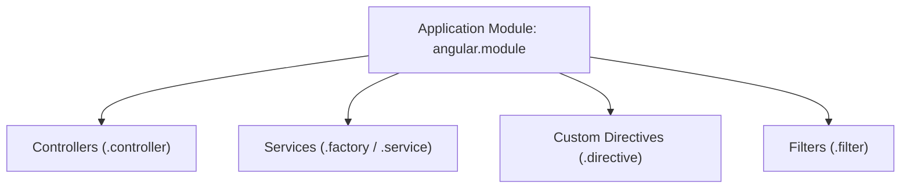
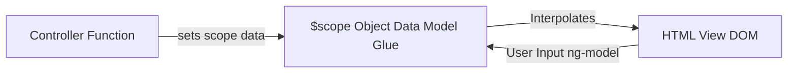
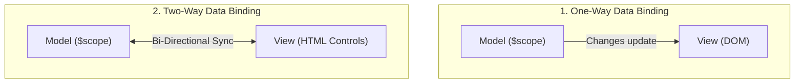

# AngularJS Modules, Data Binding, Controllers, and DOM Manipulation

## 1. AngularJS Modules

An **AngularJS Module** (`angular.module`) is a container for the different parts of an application—including controllers, services, directives, and filters. Modules eliminate global namespace pollution and structure web applications into modular, reusable components.



---

### 1.1 Creating and Retrieving Modules

The `angular.module()` global function is used for both module creation and retrieval:

#### 1. Creating a Module (Setter Syntax - 2 Arguments)
Passing an array of dependency module names (even an empty array `[]`) **creates a new module**:
```javascript
// Creates a new module named 'studentApp' with no dependent modules
var app = angular.module("studentApp", []);
```

#### 2. Retrieving an Existing Module (Getter Syntax - 1 Argument)
Omitting the second array argument **retrieves an already existing module**:
```javascript
// Retrieves the existing 'studentApp' module
var app = angular.module("studentApp");
```

---

### 1.2 Binding a Module to HTML View (`ng-app`)

To connect a JavaScript module to an HTML document, assign the module name to the `ng-app` directive on an HTML element:

```html
<html lang="en" ng-app="studentApp">
```

---

## 2. AngularJS Controllers and `$scope`

A **Controller** is a JavaScript constructor function that controls the data and behavior of a specific DOM region.



### 2.1 The `$scope` Object: Data Model Glue
- **`$scope`** is a built-in AngularJS service object that acts as the **glue between the Controller and the View**.
- Properties attached to `$scope` in the controller become directly accessible inside the View HTML as expression variables or model bindings.
- **Nested Scopes & Scope Inheritance**: If controllers are nested in the HTML tree, child `$scope` objects inherit properties from parent `$scope` objects via JavaScript prototype inheritance.

---

### 2.2 Registering Controllers (`ng-controller`)

Controllers are defined using the `.controller()` method on a module:

```javascript
app.controller("StudentController", function($scope) {
  // Model Data
  $scope.firstName = "John";
  $scope.lastName = "Doe";
  
  // Controller Method (Behavior)
  $scope.getFullName = function() {
    return $scope.firstName + " " + $scope.lastName;
  };
});
```

Attach the controller to a DOM region using `ng-controller="ControllerName"`:

```html
<div ng-controller="StudentController">
  <p>Full Name: {{ getFullName() }}</p>
</div>
```

---

## 3. AngularJS Data Binding Architecture

Data binding is the automatic synchronization of data between the Model (`$scope`) and the View (DOM).



### 3.1 Data Binding Types Comparison

| Binding Type | Syntax / Directive | Direction | Description |
| :--- | :--- | :--- | :--- |
| **One-Way Binding** | `{{ expression }}` or `ng-bind` | Model $\rightarrow$ View | Changes in `$scope` model automatically update the View. View changes do not alter Model. |
| **Two-Way Binding** | `ng-model` | Model $\leftrightarrow$ View | Changes in HTML form controls (`<input>`, `<select>`) instantly update `$scope` model, and vice versa. |
| **One-Time Binding**| `{{ ::expression }}` | Model $\rightarrow$ View (Once) | Evaluates data once until initialized, then unbinds watcher to conserve memory. |

---

### 3.2 The Digest Cycle (`$digest` and `$apply`)

AngularJS tracks model changes through the **Digest Cycle**:
- **`$watch` List**: AngularJS maintains a list of watchers for every property bound in the View.
- **`$digest()` Loop**: Runs through all registered watchers to check if any `$scope` property value has changed (**Dirty Checking**). If a value changed, it re-runs until all values stabilize.
- **`$apply()`**: Integrates external third-party asynchronous events (e.g. `setTimeout`, native AJAX) into the AngularJS Digest Cycle:
  ```javascript
  $scope.$apply(function() {
    $scope.time = new Date();
  });
  ```

---

## 4. AngularJS DOM Manipulation Directives

In traditional JavaScript or jQuery, developers manually query and alter DOM elements (`document.getElementById()`, `element.style.display = 'none'`). In AngularJS, DOM elements are manipulated **declaratively using built-in directives**.

### 4.1 DOM Control Directives Reference

| Directive | Function & Behavior |
| :--- | :--- |
| **`ng-show="expr"`** | Displays element if `expr` evaluates to `true`. Hides it via CSS `display: none` if `false` (Element remains in DOM). |
| **`ng-hide="expr"`** | Hides element via CSS `display: none` if `expr` evaluates to `true`. |
| **`ng-if="expr"`** | **Physically removes** the element from the DOM tree if `false`, and recreates it if `true` (Conserves DOM memory). |
| **`ng-disabled="expr"`**| Sets the HTML `disabled` attribute on buttons/inputs when `expr` is `true`. |
| **`ng-click="fn()"`**| Executes a `$scope` function when the element is clicked. |
| **`ng-repeat="item in items"`**| Iterates over a collection, instantiating a DOM template for each item in the array. |

---

### 4.2 📜 Complete Code Example: Student Management App (Modules, Controllers, 2-Way Binding, & DOM Directives)

```html
<!DOCTYPE html>
<!-- angular_mvc_dom.html -->
<html lang="en" ng-app="studentApp">
<head>
  <meta charset="utf-8" />
  <title>AngularJS Modules, Controllers & DOM Demo</title>
  <!-- Load AngularJS Library -->
  <script src="https://ajax.googleapis.com/ajax/libs/angularjs/1.8.2/angular.min.js"></script>
  <style type="text/css">
    body { font-family: Arial, sans-serif; margin: 30px; background-color: #f4f6f9; }
    .card { background: white; padding: 20px; border-radius: 8px; box-shadow: 0 2px 8px rgba(0,0,0,0.1); margin-bottom: 20px; }
    .table { width: 100%; border-collapse: collapse; margin-top: 15px; }
    .table th, .table td { border: 1px solid #ddd; padding: 10px; text-align: left; }
    .table th { background: #3498db; color: white; }
    .badge-pass { background: #2ecc71; color: white; padding: 4px 8px; border-radius: 4px; }
    .badge-fail { background: #e74c3c; color: white; padding: 4px 8px; border-radius: 4px; }
    .btn { padding: 8px 14px; background: #3498db; color: white; border: none; border-radius: 4px; cursor: pointer; }
    .btn:disabled { background: #bdc3c7; cursor: not-allowed; }
  </style>
</head>
<body>

  <h2>Student Management Portal (AngularJS MVC)</h2>

  <!-- ATTACH CONTROLLER TO DOM REGION -->
  <div ng-controller="StudentController" class="card">

    <h3>1. Two-Way Data Binding & Scope Integration</h3>

    <div style="margin-bottom: 15px;">
      <label>Filter Students by Name: </label>
      <!-- Two-way data binding with ng-model -->
      <input type="text" ng-model="searchQuery" placeholder="Type to search..." />
    </div>

    <!-- DOM Directives: ng-show / ng-hide -->
    <button class="btn" ng-click="toggleDetails()">
      {{ showDetails ? 'Hide Extra Details' : 'Show Extra Details' }}
    </button>

    <!-- 2. REPEATING & DOM MANIPULATION DIRECTIVES -->
    <h3>2. Student Directory (ng-repeat & ng-if)</h3>

    <table class="table">
      <thead>
        <tr>
          <th>ID</th>
          <th>Student Name</th>
          <th>Major</th>
          <th>GPA</th>
          <th>Status</th>
          <th ng-show="showDetails">Email Contact</th>
        </tr>
      </thead>
      <tbody>
        <!-- ng-repeat iterates through student list with built-in filter -->
        <tr ng-repeat="s in students | filter:searchQuery">
          <td>{{ s.id }}</td>
          <td>{{ s.name }}</td>
          <td>{{ s.major }}</td>
          <td>{{ s.gpa }}</td>
          <td>
            <!-- ng-if physical DOM removal/creation -->
            <span ng-if="s.gpa >= 3.0" class="badge-pass">Passed</span>
            <span ng-if="s.gpa < 3.0" class="badge-fail">Probation</span>
          </td>
          <!-- Conditional DOM visibility via ng-show -->
          <td ng-show="showDetails">{{ s.email }}</td>
        </tr>
      </tbody>
    </table>

    <br />

    <!-- 3. ADD NEW STUDENT FORM (TWO-WAY BINDING) -->
    <h3>3. Add New Student</h3>
    <form ng-submit="addStudent()">
      <input type="text" ng-model="newStudent.name" placeholder="Name" required />
      <input type="text" ng-model="newStudent.major" placeholder="Major" required />
      <input type="number" step="0.1" ng-model="newStudent.gpa" placeholder="GPA" required />
      <input type="email" ng-model="newStudent.email" placeholder="Email" required />
      
      <!-- ng-disabled disables button if form fields are incomplete -->
      <button type="submit" class="btn" ng-disabled="!newStudent.name || !newStudent.gpa">
        Add Student to Model
      </button>
    </form>

  </div>

  <script type="text/javascript">
    // =========================================================================
    // 1. MODULE CREATION (Setter Syntax: 2 Arguments)
    // =========================================================================
    var app = angular.module("studentApp", []);

    // =========================================================================
    // 2. CONTROLLER REGISTRATION & $SCOPE MODEL DEFINITION
    // =========================================================================
    app.controller("StudentController", function($scope) {

      // Model State 1: UI Toggle State
      $scope.showDetails = true;
      $scope.searchQuery = "";

      // Model State 2: Initial Student List Array
      $scope.students = [
        { id: 101, name: "Alice Smith", major: "Computer Science", gpa: 3.9, email: "alice@univ.edu" },
        { id: 102, name: "Bob Jones", major: "Electrical Eng", gpa: 2.7, email: "bob@univ.edu" },
        { id: 103, name: "Charlie Brown", major: "Web Development", gpa: 3.5, email: "charlie@univ.edu" }
      ];

      // Model State 3: New Student Draft Object
      $scope.newStudent = {};

      // Behavior Method 1: Toggle Extra Table Column
      $scope.toggleDetails = function() {
        $scope.showDetails = !$scope.showDetails;
      };

      // Behavior Method 2: Add Student to Model Array
      $scope.addStudent = function() {
        var nextId = $scope.students.length + 101;
        $scope.students.push({
          id: nextId,
          name: $scope.newStudent.name,
          major: $scope.newStudent.major,
          gpa: parseFloat($scope.newStudent.gpa),
          email: $scope.newStudent.email
        });

        // Reset newStudent form model
        $scope.newStudent = {};
      };

    });
  </script>

</body>
</html>
```
