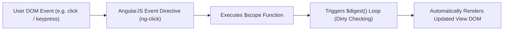
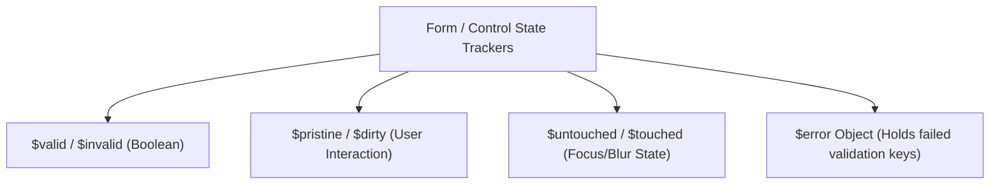

# AngularJS Event Handling, Form Processing, and Form Validation

## 1. AngularJS Event Handling

AngularJS provides custom event directives that override standard HTML event handlers. These directives execute controller methods while automatically triggering the **AngularJS `$digest` cycle** to update the View.



---

### 1.1 Core Event Directives Reference

| Event Directive | Native Equivalent | Trigger Condition |
| :--- | :--- | :--- |
| **`ng-click="fn()"`** | `onclick` | Triggered when element is clicked. |
| **`ng-dblclick="fn()"`**| `ondblclick` | Triggered on double click. |
| **`ng-mouseenter="fn()"`**| `onmouseenter` | Triggered when mouse cursor enters element bounds. |
| **`ng-mouseleave="fn()"`**| `onmouseleave` | Triggered when mouse cursor leaves element bounds. |
| **`ng-mousemove="fn()"`**| `onmousemove` | Triggered continuously while moving mouse inside element. |
| **`ng-keydown="fn()"`** | `onkeydown` | Triggered when a key is pressed down. |
| **`ng-keyup="fn()"`** | `onkeyup` | Triggered when a key is released. |
| **`ng-change="fn()"`** | `onchange` | Triggered when an input control value changes due to user interaction. Requires `ng-model`. |

---

### 1.2 Passing the Event Object (`$event`)

To inspect mouse coordinates, key codes, or prevent default browser behavior, pass the special **`$event`** object parameter to controller methods:

```html
<button ng-click="trackCursor($event)">Click Me</button>
```

```javascript
$scope.trackCursor = function(event) {
  console.log("X Position: " + event.clientX + ", Y Position: " + event.clientY);
};
```

---

## 2. AngularJS Form Handling

AngularJS forms enrich standard HTML form controls (`<input>`, `<select>`, `<textarea>`) by binding their state directly to the `$scope` model via **`ng-model`**.

### 2.1 Standard Form Control Directives

1. **Text Inputs / Textarea**: `ng-model="user.name"`
2. **Checkboxes**: `ng-model="user.agree"` (Binds boolean `true`/`false`).
3. **Radio Buttons**: `ng-model="user.gender" ng-value="'female'"` (Grouped by matching `ng-model`).
4. **Select Dropdowns**: `ng-options="item.id as item.name for item in items"` (Populates options dynamically from array).

---

### 2.2 Form Submission Directive (`ng-submit`)

To prevent standard HTML page reloads during form submission, use **`ng-submit`** on the `<form>` element instead of `onclick` on the submit button:

```html
<form ng-submit="saveData()">
  <input type="submit" value="Save" />
</form>
```

---

## 3. AngularJS Form Validation Architecture

AngularJS tracks the validation state of both individual form input controls and the overall form.



---

### 3.1 Form and Input State Properties

For state tracking to work, **both the `<form>` and the `<input>` elements MUST have a `name` attribute**.

| Property | Description / Condition |
| :--- | :--- |
| **`$valid`** | Returns `true` if all validation rules are currently satisfied. |
| **`$invalid`**| Returns `true` if one or more validation rules fail. |
| **`$pristine`**| Returns `true` if the user has **NOT yet modified** the field. |
| **`$dirty`** | Returns `true` if the user has **modified** the field value. |
| **`$untouched`**| Returns `true` if the field has **NOT yet lost focus** (`blur`). |
| **`$touched`** | Returns `true` if the field has **lost focus** (`blur`). |
| **`$error`** | Hash object containing validation failures (e.g. `$error.required`, `$error.email`, `$error.minlength`). |

---

### 3.2 Built-in HTML5 / AngularJS Validation Directives

- **`required`**: Field cannot be empty.
- **`ng-minlength="n"`**: Minimum character count restriction.
- **`ng-maxlength="n"`**: Maximum character count restriction.
- **`type="email"`**: Enforces valid email pattern.
- **`type="number"`**: Enforces numeric input (`min="x"`, `max="y"`).
- **`ng-pattern="/regex/"`**: Enforces custom regular expression matching.

---

### 3.3 Automatic CSS Validation Classes

AngularJS automatically attaches/removes CSS classes on form elements based on state:

- `.ng-valid` / `.ng-invalid`
- `.ng-pristine` / `.ng-dirty`
- `.ng-untouched` / `.ng-touched`

```css
/* Red border on touched invalid fields */
input.ng-invalid.ng-touched {
  border: 2px solid #e74c3c;
}
/* Green border on valid fields */
input.ng-valid.ng-dirty {
  border: 2px solid #2ecc71;
}
```

---

### 3.4 📜 Complete Code Example: Student Registration Form with Real-Time Validation & Events

```html
<!DOCTYPE html>
<!-- angular_forms_validation.html -->
<html lang="en" ng-app="registrationApp">
<head>
  <meta charset="utf-8" />
  <title>AngularJS Form Validation & Event Handling</title>
  <script src="https://ajax.googleapis.com/ajax/ajax/angularjs/1.8.2/angular.min.js"></script>
  <style type="text/css">
    body { font-family: Arial, sans-serif; background-color: #f4f6f9; margin: 30px; }
    .card { background: white; padding: 25px; border-radius: 8px; box-shadow: 0 4px 10px rgba(0,0,0,0.1); width: 550px; margin: auto; }
    .form-group { margin-bottom: 18px; }
    label { display: block; font-weight: bold; margin-bottom: 6px; }
    input[type="text"], input[type="email"], select { width: 95%; padding: 8px; border: 1px solid #ccc; border-radius: 4px; font-size: 14px; }
    
    /* AUTOMATIC ANGULARJS VALIDATION STYLES */
    input.ng-invalid.ng-touched { border-color: #e74c3c; background-color: #fdf2f2; }
    input.ng-valid.ng-touched { border-color: #2ecc71; background-color: #f2fbf5; }

    .error-msg { color: #e74c3c; font-size: 12px; margin-top: 4px; }
    .btn { padding: 10px 18px; background: #3498db; color: white; border: none; border-radius: 4px; font-size: 15px; cursor: pointer; }
    .btn:disabled { background: #95a5a6; cursor: not-allowed; }
    .log-box { background: #eef2f5; padding: 10px; border-radius: 4px; margin-top: 15px; font-family: monospace; }
  </style>
</head>
<body>

<div class="card" ng-controller="RegistrationController">

  <h2>Student Registration Form</h2>

  <!-- FORM WITH NAME FOR VALIDATION TRACKING -->
  <form name="regForm" ng-submit="submitForm()" novalidate>

    <!-- 1. FULL NAME FIELD -->
    <div class="form-group">
      <label>Full Name *</label>
      <input type="text" 
             name="fullName" 
             ng-model="user.fullName" 
             required 
             ng-minlength="4" 
             ng-keyup="onKeyStroke($event)" 
             placeholder="Enter at least 4 letters..." />

      <!-- Real-time error messages triggered on touched/dirty state -->
      <div class="error-msg" ng-show="regForm.fullName.$touched && regForm.fullName.$invalid">
        <span ng-show="regForm.fullName.$error.required">Full Name is required.</span>
        <span ng-show="regForm.fullName.$error.minlength">Must be at least 4 characters long.</span>
      </div>
    </div>

    <!-- 2. EMAIL ADDRESS FIELD -->
    <div class="form-group">
      <label>Email Address *</label>
      <input type="email" 
             name="userEmail" 
             ng-model="user.email" 
             required 
             placeholder="student@university.edu" />

      <div class="error-msg" ng-show="regForm.userEmail.$touched && regForm.userEmail.$invalid">
        <span ng-show="regForm.userEmail.$error.required">Email is required.</span>
        <span ng-show="regForm.userEmail.$error.email">Invalid email format.</span>
      </div>
    </div>

    <!-- 3. PHONE NUMBER FIELD (REGEX PATTERN VALIDATION) -->
    <div class="form-group">
      <label>Phone Number (10 Digits) *</label>
      <input type="text" 
             name="userPhone" 
             ng-model="user.phone" 
             required 
             ng-pattern="/^[0-9]{10}$/" 
             placeholder="9876543210" />

      <div class="error-msg" ng-show="regForm.userPhone.$touched && regForm.userPhone.$invalid">
        <span ng-show="regForm.userPhone.$error.required">Phone number is required.</span>
        <span ng-show="regForm.userPhone.$error.pattern">Must be exactly 10 numeric digits.</span>
      </div>
    </div>

    <!-- 4. DEPARTMENT DROPDOWN -->
    <div class="form-group">
      <label>Department *</label>
      <select name="userDept" ng-model="user.dept" required>
        <option value="">-- Select Department --</option>
        <option value="CS">Computer Science</option>
        <option value="IT">Information Technology</option>
        <option value="ECE">Electronics & Communication</option>
      </select>
      <div class="error-msg" ng-show="regForm.userDept.$touched && regForm.userDept.$error.required">
        Please select a department.
      </div>
    </div>

    <!-- 5. EVENT DEMO: MOUSE ENTER/LEAVE -->
    <div style="padding: 10px; background: #e8f4f8; text-align:center; margin-bottom: 15px;"
         ng-mouseenter="onHover(true)" 
         ng-mouseleave="onHover(false)">
      {{ hoverText }}
    </div>

    <!-- SUBMIT BUTTON (DISABLED IF FORM IS INVALID) -->
    <button type="submit" class="btn" ng-disabled="regForm.$invalid">
      Register Student
    </button>

  </form>

  <!-- EVENT LOG DISPLAY BOX -->
  <div class="log-box">
    <strong>Event Log:</strong>
    <p>Last Pressed Key Code: {{ lastKeyCode }}</p>
    <p>Form Overall Valid State ($valid): <strong>{{ regForm.$valid }}</strong></p>
  </div>

</div>

<script type="text/javascript">
  var app = angular.module("registrationApp", []);

  app.controller("RegistrationController", function($scope) {
    // Model Initialization
    $scope.user = {};
    $scope.hoverText = "Hover your mouse over this box!";
    $scope.lastKeyCode = "None";

    // Mouse Event Handler
    $scope.onHover = function(isInside) {
      $scope.hoverText = isInside ? "Mouse inside box! (ng-mouseenter)" : "Mouse left box! (ng-mouseleave)";
    };

    // Keyboard Event Handler with $event object
    $scope.onKeyStroke = function(event) {
      $scope.lastKeyCode = event.keyCode + " (Char: " + String.fromCharCode(event.keyCode) + ")";
    };

    // Form Submission Handler
    $scope.submitForm = function() {
      if ($scope.regForm.$valid) {
        alert("Success! Student Registered: " + $scope.user.fullName + " (" + $scope.user.dept + ")");
      }
    };
  });
</script>

</body>
</html>
```
