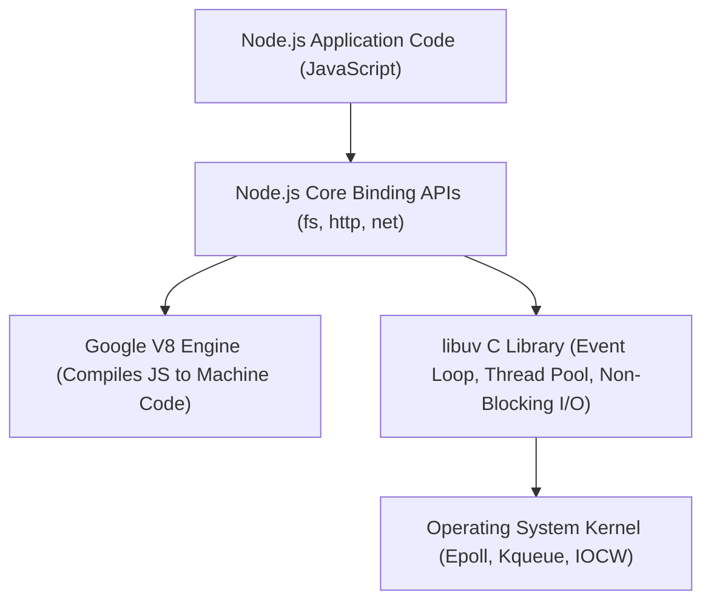
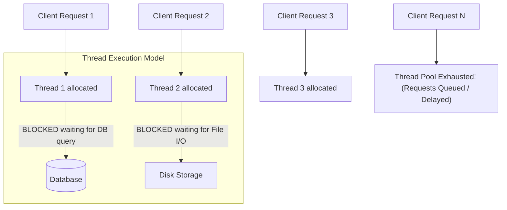
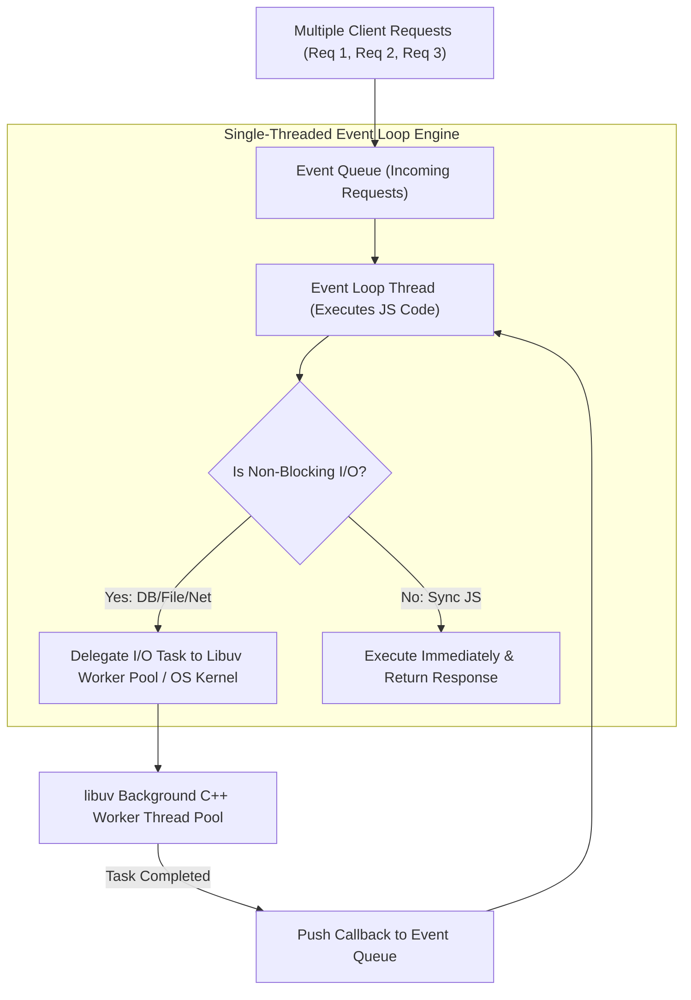

# Introduction to Node.js, Web Server Architecture, and Process Models

## 1. Introduction to Node.js

**Node.js** is an open-source, cross-platform, single-threaded runtime environment created by **Ryan Dahl in 2009**. It allows developers to execute JavaScript code on the server side outside of a web browser.

Node.js is built on top of Google Chrome's **V8 JavaScript Engine** (which compiles JavaScript directly into native machine code) and utilizes an asynchronous, **Event-Driven, Non-Blocking I/O Architecture** powered by the **libuv** C library.



---

### 1.1 Key Technical Advantages of Node.js

1. **High Performance & Velocity**: Powered by Chrome’s V8 engine, executing JavaScript at near-native C/C++ compilation speeds.
2. **Asynchronous Non-Blocking I/O**: Server operations (reading files, querying databases, network requests) execute asynchronously without blocking execution threads.
3. **Unified Full-Stack Language (JavaScript Everywhere)**: Developers use a single programming language (JavaScript) across both client frontend (browser) and server backend.
4. **Single-Threaded Concurrent Scalability**: Handles thousands of simultaneous concurrent connections efficiently with minimal RAM/CPU footprint compared to multi-threaded servers.
5. **Rich Package Ecosystem (npm)**: Access to **npm** (Node Package Manager), the world's largest open-source library registry.
6. **Built-in Streaming Architecture**: Natively processes data streams (`fs.createReadStream()`) in chunks without loading entire files into memory.

---

## 2. Traditional Web Server Model (Multi-Threaded / Thread-per-Request)

Traditional web servers (such as **Apache HTTP Server**, Tomcat, or IIS) follow a **Multi-Threaded Blocking Thread-per-Request Architecture**.



### 2.1 How the Traditional Model Works:
1. Every incoming HTTP request is assigned a dedicated worker thread from a finite **Thread Pool**.
2. The allocated thread processes the request sequentially from start to finish.
3. **Blocking I/O Trap**: When a thread requests disk file reads or database queries, **the entire thread goes idle (blocks)** while waiting for the I/O device to return data.
4. **Context Switching & Memory Overhead**: Each OS thread consumes significant memory (~1 MB to 2 MB RAM). When thousands of concurrent requests arrive, CPU performance drops dramatically due to heavy **thread context switching**.
5. **Thread Pool Exhaustion**: Once all threads in the thread pool are busy/blocked, new incoming client requests are queued or rejected with connection timeout errors.

---

## 3. Node.js Process Model (Single-Threaded Event Loop)

Node.js fundamentally alters server architecture by operating on a **Single-Threaded Event Loop Model with Non-Blocking I/O**.



---

### 3.1 How the Node.js Process Model Works:

1. **Single Main Event Loop Thread**: Node.js executes JavaScript application code on a single primary thread.
2. **Non-Blocking Delegation**: When an asynchronous I/O operation (e.g. database query, file read, network fetch) is encountered:
   - Node.js registers a **Callback Function** for the task.
   - It delegates the heavy I/O task off to the underlying OS Kernel or the **libuv C++ Worker Thread Pool**.
   - The main Event Loop thread **immediately returns** to accept new incoming client requests without waiting!
3. **Callback Notification**: Once the background I/O operation completes:
   - The libuv worker thread places the completed callback into the **Event Queue**.
   - The Event Loop picks up the callback and executes it on the main thread when idle.

---

### 3.2 Architectural Comparison Matrix

| Feature | Traditional Web Server Model (e.g. Apache) | Node.js Process Model |
| :--- | :--- | :--- |
| **Threading Model** | **Multi-Threaded** (One thread per request). | **Single-Threaded Event Loop** (with background worker pool). |
| **I/O Execution** | **Blocking / Synchronous**: Thread waits for I/O to finish. | **Non-Blocking / Asynchronous**: Event loop delegates I/O. |
| **RAM / CPU Footprint**| **High**: Each thread reserves ~1-2 MB memory + context switching overhead. | **Extremely Low**: Single thread handles thousands of connections. |
| **Scalability Limit** | Limited by maximum thread pool count & RAM capacity. | Highly scalable for **I/O-intensive** concurrent web traffic. |
| **Best Suited For** | Heavy **CPU-bound** computation (e.g. video rendering, data processing). | **I/O-bound**, real-time applications (e.g. REST APIs, Chat, Streaming). |

---

## 4. 📜 Complete Code Demonstration: Building an Asynchronous HTTP Server in Node.js

Below is a complete, self-contained Node.js program demonstrating the creation of a non-blocking web server using the core `http` and `fs` modules.

```javascript
// server.js - Node.js Native Asynchronous Non-Blocking HTTP Web Server

// 1. IMPORT CORE NODE.JS MODULES
const http = require('http');
const fs = require('fs');
const path = require('path');

// Server configuration
const PORT = 3000;
const HOSTNAME = '127.0.0.1';

// 2. CREATE HTTP SERVER INSTANCE
// The callback function is invoked by the Event Loop whenever a client request arrives
const server = http.createServer((req, res) => {

  console.log(`[${new Date().toISOString()}] Incoming Request: ${req.method} ${req.url}`);

  // Route Handling
  if (req.url === '/' || req.url === '/index.html') {

    // ASYNCHRONOUS NON-BLOCKING FILE READ (fs.readFile)
    // The main event loop is NOT blocked while the file is being read from disk!
    const filePath = path.join(__dirname, 'index.html');

    // Mock creating file if absent for demonstration
    if (!fs.existsSync(filePath)) {
      fs.writeFileSync(filePath, '<h1>Welcome to Node.js Non-Blocking Server!</h1><p>Served asynchronously via Event Loop.</p>');
    }

    fs.readFile(filePath, 'utf8', (err, data) => {
      if (err) {
        res.writeHead(500, { 'Content-Type': 'text/plain' });
        res.end('500 Internal Server Error');
        return;
      }

      // Send successful HTTP 200 header response
      res.writeHead(200, { 'Content-Type': 'text/html' });
      res.end(data);
    });

  } else if (req.url === '/api/status') {

    // ASYNCHRONOUS API ENDPOINT
    const statusData = {
      status: 'Online',
      nodeVersion: process.version,
      uptimeSeconds: Math.floor(process.uptime()),
      memoryUsage: process.memoryUsage()
    };

    res.writeHead(200, { 'Content-Type': 'application/json' });
    res.end(JSON.stringify(statusData, null, 2));

  } else {

    // 404 NOT FOUND ROUTE
    res.writeHead(404, { 'Content-Type': 'text/html' });
    res.end('<h1>404 Not Found</h1><p>The requested URL does not exist.</p>');

  }

});

// 3. START LISTENING FOR CLIENT CONNECTIONS
server.listen(PORT, HOSTNAME, () => {
  console.log(`====================================================`);
  console.log(` Node.js Server Running at http://${HOSTNAME}:${PORT}/`);
  console.log(` Single-Threaded Event Loop Ready for Requests...`);
  console.log(`====================================================`);
});
```
