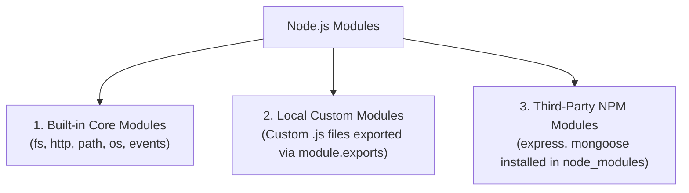
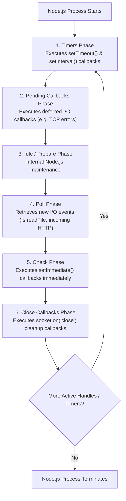

# Installation of Node.js, Basics, Modules System, and Event Loop Phases

## 1. Installation and Verification of Node.js

Node.js is distributed as an installer or binary package for Windows, macOS, and Linux from the official website (`nodejs.org`).

### 1.1 Installation Steps (Cross-Platform)

1. **Download Installer**: Download the **LTS (Long Term Support)** version installer for your OS.
2. **Execute Setup Wizard**: Run the installer (`.msi` on Windows, `.pkg` on macOS).
   - Ensure the checkbox **"Add to PATH"** (Environment Variable) is selected.
3. **Verify Environment Installation**: Open a command terminal (PowerShell, Command Prompt, or Terminal) and execute:

```bash
# Check Node.js runtime version
node -v
# Output: v18.16.0 (or current LTS version)

# Check Node Package Manager (npm) version
npm -v
# Output: 9.5.1
```

---

### 1.2 Interactive REPL vs. Script Execution Mode

Node.js provides two execution modes:

#### 1. REPL Mode (Read-Eval-Print-Loop)
An interactive terminal shell for testing quick JavaScript expressions.
- **Start REPL**: Type `node` in terminal.
- **Exit REPL**: Type `.exit` or press `Ctrl + C` twice.

```bash
$ node
> console.log("Hello from REPL!");
Hello from REPL!
> 10 + 20
30
> .exit
```

#### 2. Script Execution Mode
Runs a `.js` JavaScript file saved on disk:

```bash
node app.js
```

---

## 2. Node.js Basics & Global Objects

Unlike browser JavaScript, Node.js does **NOT** have a `window` or `document` object (as there is no browser DOM). Instead, Node.js provides a set of built-in **Global Objects**.

### 2.1 Built-in Node.js Global Objects & Functions

| Global Object | Description |
| :--- | :--- |
| **`global`** | The top-level root global namespace object (equivalent to browser `window`). |
| **`process`** | Provides information & control over the current running Node.js process (e.g. `process.env`, `process.exit()`, `process.argv`). |
| **`__dirname`** | Absolute path string of the directory containing the currently executing script file. |
| **`__filename`** | Absolute path string of the currently executing script file including the file name. |
| **`Buffer`** | Global class used to handle raw binary data streams in memory. |
| **`setTimeout()` / `setInterval()`** | Global timer functions for delayed or recurring asynchronous execution. |

---

## 3. Node.js Module System (CommonJS vs. ES Modules)

Modules are encapsulated blocks of reusable code. Node.js supports two module formats:
1. **CommonJS (CJS)**: Traditional default Node.js module system (`require` & `module.exports`).
2. **ECMAScript Modules (ESM)**: Standard modern JavaScript syntax (`import` & `export`).



---

### 3.1 CommonJS Module Syntax (`require` and `module.exports`)

#### 1. Exporting Code (Local Module `mathUtils.js`):
```javascript
// mathUtils.js

const add = (a, b) => a + b;
const multiply = (a, b) => a * b;
const PI = 3.14159;

// Exporting functions & constants via module.exports
module.exports = {
  add,
  multiply,
  PI
};
```

#### 2. Importing & Consuming Code (`app.js`):
```javascript
// app.js

// Import local custom module (requires relative path ./ or ../)
const math = require('./mathUtils');

// Import built-in core module (requires module name string directly)
const path = require('path');

console.log("Add Result: " + math.add(10, 20));          // Output: 30
console.log("Multiply Result: " + math.multiply(5, 4)); // Output: 20
console.log("PI Value: " + math.PI);                    // Output: 3.14159
```

---

### 3.2 Types of Node.js Modules

1. **Core Built-in Modules**: Shipped directly with Node.js installation (e.g. `fs`, `http`, `path`, `os`, `events`, `util`, `stream`). No npm install required!
2. **Local Modules**: User-created JS files within the project codebase (imported via relative paths: `./myModule`).
3. **Third-Party Modules**: Downloaded via `npm install <package>` into the local `node_modules/` directory (e.g. `express`, `lodash`).

---

## 4. Node.js Event Loop Architecture & Execution Phases

The **Event Loop** is an infinite loop inside the **libuv** C library that orchestrates asynchronous non-blocking task execution in Node.js.



---

### 4.1 Detailed Breakdown of the 6 Event Loop Phases

1. **Timers Phase**: Executes callbacks scheduled by `setTimeout(fn, delay)` and `setInterval(fn, delay)`.
2. **Pending Callbacks Phase**: Executes I/O callbacks deferred to the next loop iteration (e.g., system-level errors like `ECONNREFUSED`).
3. **Idle, Prepare Phase**: Used internally by Node.js for engine preparation.
4. **Poll Phase**: 
   - Calculates how long it should block and poll for new I/O events.
   - Processes incoming I/O events (file reading, incoming HTTP network requests, database response returns).
5. **Check Phase**: Executes callbacks registered with **`setImmediate()`**. `setImmediate()` callbacks run right after the Poll phase completes!
6. **Close Callbacks Phase**: Executes socket or handle cleanup callbacks (e.g. `socket.on('close', fn)`).

---

### 4.2 Microtask Queue: `process.nextTick()` vs `Promise.then()`

In addition to the 6 Event Loop phases, Node.js features a **Microtask Queue** that has higher priority than any phase of the Event Loop:

- **`process.nextTick()`**: Executes callbacks **immediately** before the Event Loop advances to the next phase or step (Highest priority microtask).
- **`Promise.then()`**: Executes right after `process.nextTick()` microtasks complete.

> [!CAUTION]
> **Starvation Warning**: Recursive calls to `process.nextTick()` will starve the Event Loop, completely blocking the Timers and Poll phases from executing!

---

### 4.3 📜 Complete Code Demonstration: Event Loop Execution Order & Custom CommonJS Module

#### 1. Custom Math & Utility Module (`customMath.js`)
```javascript
// customMath.js - Local Custom Module
function calculateFactorial(n) {
  if (n === 0 || n === 1) return 1;
  let result = 1;
  for (let i = 2; i <= n; i++) {
    result *= i;
  }
  return result;
}

function formatCurrency(amount) {
  return `$${amount.toFixed(2)}`;
}

module.exports = {
  calculateFactorial,
  formatCurrency
};
```

#### 2. Main Script Demonstrating Event Loop Order (`eventLoopDemo.js`)
```javascript
// eventLoopDemo.js - Event Loop Phases & Execution Priorities

const fs = require('fs');
const path = require('path');
const { calculateFactorial, formatCurrency } = require('./customMath');

console.log("=== 1. MAIN THREAD EXECUTION STARTED (Synchronous) ===");

// Global Variables Check
console.log(`Script File: ${__filename}`);
console.log(`Directory:  ${__dirname}`);
console.log(`Factorial of 5: ${calculateFactorial(5)}`);
console.log(`Formated Price: ${formatCurrency(99.5)}`);

// --- 2. SCHEDULING ASYNCHRONOUS TASKS ---

// Task A: Timers Phase (setTimeout)
setTimeout(() => {
  console.log("=== 6. TIMERS PHASE: setTimeout(..., 0) Executed ===");
}, 0);

// Task B: Check Phase (setImmediate)
setImmediate(() => {
  console.log("=== 5. CHECK PHASE: setImmediate(...) Executed ===");
});

// Task C: Microtask Queue 1 (process.nextTick)
process.nextTick(() => {
  console.log("=== 3. MICROTASK QUEUE: process.nextTick(...) Executed ===");
});

// Task D: Microtask Queue 2 (Promise)
Promise.resolve().then(() => {
  console.log("=== 4. MICROTASK QUEUE: Promise.then(...) Executed ===");
});

// Task E: Poll Phase Asynchronous File I/O (fs.readFile)
const sampleFile = path.join(__dirname, 'test.txt');

// Create sample file if absent
if (!fs.existsSync(sampleFile)) {
  fs.writeFileSync(sampleFile, 'Node.js Event Loop Test Content');
}

fs.readFile(sampleFile, 'utf8', (err, data) => {
  console.log("=== 7. POLL PHASE: Asynchronous File I/O Completed ===");
  
  // Nested inside I/O callback: setImmediate ALWAYS runs before setTimeout in I/O phase
  setImmediate(() => {
    console.log("   --> Inside I/O: setImmediate Executed First");
  });
  
  setTimeout(() => {
    console.log("   --> Inside I/O: setTimeout Executed Second");
  }, 0);
});

console.log("=== 2. MAIN THREAD EXECUTION FINISHED (Synchronous Stack Empty) ===");
```

#### Expected Execution Output Log:
```text
=== 1. MAIN THREAD EXECUTION STARTED (Synchronous) ===
Script File: /project/eventLoopDemo.js
Directory:  /project
Factorial of 5: 120
Formated Price: $99.50
=== 2. MAIN THREAD EXECUTION FINISHED (Synchronous Stack Empty) ===
=== 3. MICROTASK QUEUE: process.nextTick(...) Executed ===
=== 4. MICROTASK QUEUE: Promise.then(...) Executed ===
=== 5. CHECK PHASE: setImmediate(...) Executed ===
=== 6. TIMERS PHASE: setTimeout(..., 0) Executed ===
=== 7. POLL PHASE: Asynchronous File I/O Completed ===
   --> Inside I/O: setImmediate Executed First
   --> Inside I/O: setTimeout Executed Second
```
