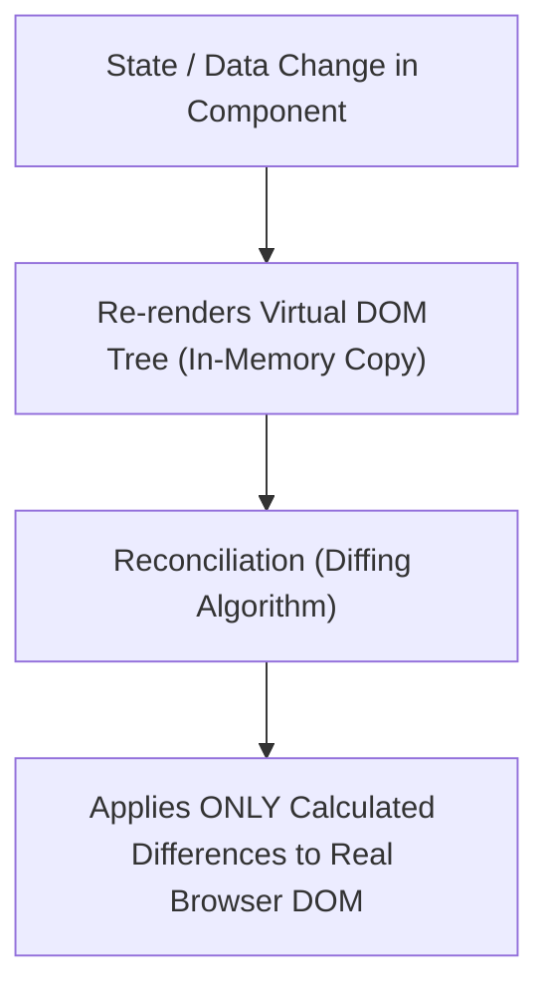
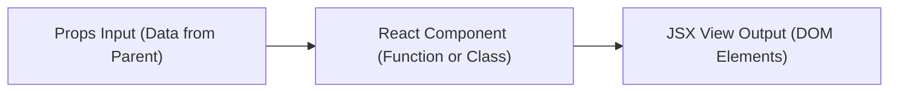

# Introduction to React.js, Advantages, Components, and Props

## 1. Introduction to React.js

**React.js** (commonly referred to as React) is an open-source, component-based front-end JavaScript library created by **Jordan Walke at Meta (Facebook) in 2013**. 

Unlike full-fledged frameworks (like AngularJS or Angular), React is technically a **UI library** focused solely on the **View layer (V in MVC)** of web applications. It allows developers to build fast, interactive Single Page Applications (SPAs) by composing modular, reusable user interface components.



---

### 1.1 Key Technical Advantages of React.js

1. **Virtual DOM Engine**:
   - Instead of directly manipulating the slow browser DOM, React creates an in-memory lightweight copy called the **Virtual DOM**.
   - When component state changes, React compares the new Virtual DOM with a pre-update snapshot using its high-speed **Reconciliation (Diffing) Algorithm** and batches *only* the specific changed nodes to the real browser DOM.
2. **Component-Based Architecture**: UIs are split into independent, self-contained, and reusable building blocks (Components), making large applications easier to scale and maintain.
3. **Declarative UI Programming**: Developers describe *what* the UI should look like for a given state, and React handles rendering and DOM updates automatically.
4. **JSX (JavaScript XML)**: A syntax extension allowing developers to write HTML-like markup directly inside JavaScript code.
5. **Unidirectional (One-Way) Data Flow**: Data flows predictably downwards from parent components to child components via `props`, simplifying state debugging.
6. **Cross-Platform Ecosystem (React Native)**: Learning React architecture allows web developers to build native mobile apps for iOS and Android using React Native.

---

## 2. JSX (JavaScript XML) Syntax Rules

JSX is a XML-like syntax extension for JavaScript used by React to describe what the UI should look like.

```jsx
const element = <h1 className="greeting">Hello, React!</h1>;
```

### 2.1 Essential JSX Rules:

1. **Single Root Element**: Every JSX block MUST return a single root element (or a `<React.Fragment>` / `<>...</>` fragment).
2. **CamelCase Attributes**: Standard HTML attributes use camelCase in JSX (`class` $\rightarrow$ `className`, `for` $\rightarrow$ `htmlFor`, `onclick` $\rightarrow$ `onClick`).
3. **Closing Tags**: All tags MUST be explicitly closed (e.g. ``, `<br />`).
4. **Embedding JS Expressions**: Any valid JavaScript expression can be embedded inside JSX using **single curly braces `{ expression }`**:
   ```jsx
   const name = "Alice";
   const element = <h2>Welcome back, {name.toUpperCase()}!</h2>;
   ```

---

## 3. React Components (Functional vs. Class Components)

Components are the primary building blocks of React applications. A component takes inputs (called **Props**) and returns React elements describing what should appear on screen.



---

### 3.1 1. Functional Components (Modern Best Practice)

Functional Components are JavaScript functions that accept `props` as an argument and return JSX elements. With the introduction of **React Hooks** (e.g. `useState`, `useEffect`), Functional Components are the modern standard for React development.

```jsx
// Functional Component
function WelcomeCard(props) {
  return (
    <div className="card">
      <h2>Welcome, {props.userName}!</h2>
      <p>Role: {props.userRole}</p>
    </div>
  );
}
```

---

### 3.2 2. Class Components (Legacy Standard)

Class Components are ES6 JavaScript classes that extend `React.Component` and implement a required `render()` method.

```jsx
// Class Component
class WelcomeCardClass extends React.Component {
  render() {
    return (
      <div className="card">
        <h2>Welcome, {this.props.userName}!</h2>
        <p>Role: {this.props.userRole}</p>
      </div>
    );
  }
}
```

---

### 3.3 Functional vs. Class Components Comparison

| Feature | Functional Components | Class Components |
| :--- | :--- | :--- |
| **Syntax** | Plain JavaScript Functions | ES6 JavaScript Classes |
| **State Handling** | Uses **`useState()` Hook** | Uses `this.state` & `this.setState()` |
| **Lifecycle Methods**| Uses **`useEffect()` Hook** | Uses `componentDidMount()`, `componentWillUnbound()`, etc. |
| **Boilerplate** | Concise, readable, lightweight code | Heavy class boilerplate, `this` binding issues |

---

## 4. Understanding React Props (Properties)

**Props** (short for Properties) are read-only inputs passed from a parent component down to a child component.

```mermaid
flowchart TD
    ParentComp["Parent Component (<App />)"] -->|Passes Props: name='Alex', role='Admin'| ChildComp["Child Component (<UserCard />)"]
    ChildComp -->|Reads props.name (READ-ONLY)| RenderedUI["Rendered HTML View"]
```

### 4.1 Fundamental Rules of Props:

1. **Unidirectional (One-Way) Flow**: Props pass down strictly from Parent $\rightarrow$ Child.
2. **Props are IMMUTABLE (Read-Only)**: A child component **MUST NEVER modify its own props**. React strictly enforces pure functional behavior for components with respect to their props.
3. **Destructuring Props**: Props can be destructured directly in functional component signatures for cleaner syntax:
   ```jsx
   const UserCard = ({ userName, age, isOnline }) => (
     <div>
       <h3>{userName} ({age} yrs)</h3>
       <p>Status: {isOnline ? "Active Now" : "Offline"}</p>
     </div>
   );
   ```

---

### 4.2 Children Prop (`props.children`)

`props.children` is a special prop that automatically passes whatever nested content is placed between opening and closing component tags:

```jsx
function ContainerCard({ title, children }) {
  return (
    <div className="container-box">
      <h2>{title}</h2>
      <div className="body">{children}</div>
    </div>
  );
}

// Usage:
<ContainerCard title="Profile Notice">
  <p>This paragraph is passed automatically as props.children!</p>
</ContainerCard>
```

---

## 5. 📜 Complete Code Demonstration: Standalone React Component & Props App

Below is a complete, single-file HTML executable application loading React 18, ReactDOM, and Babel via CDN to demonstrate Functional Components, Class Components, Props, Destructuring, and `props.children`.

```html
<!DOCTYPE html>
<!-- react_components_props.html -->
<html lang="en">
<head>
  <meta charset="utf-8" />
  <title>React.js Components & Props Demonstration</title>
  
  <!-- 1. LOAD REACT & REACT-DOM CORE LIBRARIES FROM CDN -->
  <script src="https://unpkg.com/react@18/umd/react.development.js" crossorigin></script>
  <script src="https://unpkg.com/react-dom@18/umd/react-dom.development.js" crossorigin></script>
  
  <!-- 2. LOAD BABEL COMPILER TO TRANSPILE JSX IN BROWSER -->
  <script src="https://unpkg.com/@babel/standalone/babel.min.js"></script>

  <style type="text/css">
    body { font-family: Arial, sans-serif; background-color: #f0f4f8; margin: 30px; }
    .app-wrapper { width: 650px; margin: auto; }
    .card { background: white; padding: 18px; border-radius: 8px; box-shadow: 0 4px 8px rgba(0,0,0,0.1); margin-bottom: 15px; border-left: 5px solid #61dafb; }
    .badge { padding: 4px 8px; border-radius: 4px; font-weight: bold; font-size: 12px; }
    .badge-admin { background: #e74c3c; color: white; }
    .badge-user { background: #2ecc71; color: white; }
    .wrapper-box { border: 2px dashed #3498db; padding: 15px; background: #eaf2f8; border-radius: 6px; }
  </style>
</head>
<body>

  <!-- TARGET ROOT CONTAINER FOR REACT APPLICATION -->
  <div id="root"></div>

  <!-- BABEL SCRIPT TYPE ENABLES JSX TRANSCOMPILATION -->
  <script type="text/babel">

    // =========================================================================
    // 1. CHILD FUNCTIONAL COMPONENT (Using Props Destructuring)
    // =========================================================================
    function StudentProfileCard({ studentId, name, major, gpa, isAdmin }) {
      return (
        <div className="card">
          <h3 style={{ marginTop: 0, color: '#2c3e50' }}>{name} (ID: {studentId})</h3>
          <p><strong>Major:</strong> {major}</p>
          <p><strong>GPA Score:</strong> {gpa} / 4.0</p>
          <p>
            <strong>Role: </strong>
            <span className={`badge ${isAdmin ? 'badge-admin' : 'badge-user'}`}>
              {isAdmin ? 'System Admin' : 'Standard Student'}
            </span>
          </p>
        </div>
      );
    }

    // Default Props Fallback values
    StudentProfileCard.defaultProps = {
      major: "Undeclared",
      gpa: 0.0,
      isAdmin: false
    };

    // =========================================================================
    // 2. CHILD CLASS COMPONENT (Legacy Syntax Demo)
    // =========================================================================
    class CourseInfoBadge extends React.Component {
      render() {
        return (
          <div style={{ background: '#34495e', color: 'white', padding: '10px', borderRadius: '5px', marginBottom: '15px' }}>
            <h4>Course: {this.props.courseCode} - {this.props.title}</h4>
            <p>Instructor: {this.props.instructor}</p>
          </div>
        );
      }
    }

    // =========================================================================
    // 3. CONTAINER COMPONENT (Demonstrating props.children)
    // =========================================================================
    function LayoutContainer({ sectionTitle, children }) {
      return (
        <div className="wrapper-box">
          <h2 style={{ marginTop: 0, color: '#2980b9' }}>{sectionTitle}</h2>
          {/* props.children renders nested components inside */}
          {children}
        </div>
      );
    }

    // =========================================================================
    // 4. MAIN PARENT COMPONENT (<App />)
    // =========================================================================
    function App() {
      // Parent Data Array
      const studentList = [
        { id: 201, name: "Alice Johnson", major: "Computer Science", gpa: 3.9, admin: true },
        { id: 202, name: "Bob Smith", major: "Web Engineering", gpa: 3.4, admin: false },
        { id: 203, name: "Charlie Davis", major: "Cyber Security", gpa: 3.7, admin: false }
      ];

      return (
        <div className="app-wrapper">
          <h1 style={{ textAlign: 'center', color: '#2c3e50' }}>React.js Architecture & Props Portal</h1>

          <!-- Class Component Usage -->
          <CourseInfoBadge 
            courseCode="CS-601" 
            title="Advanced Web Technologies" 
            instructor="Dr. Robert Sebesta" />

          <!-- Container Component utilizing props.children -->
          <LayoutContainer sectionTitle="Registered Students Directory">
            {/* Mapping array data into Functional Components */}
            {studentList.map(student => (
              <StudentProfileCard 
                key={student.id}
                studentId={student.id}
                name={student.name}
                major={student.major}
                gpa={student.gpa}
                isAdmin={student.admin} 
              />
            ))}
          </LayoutContainer>
        </div>
      );
    }

    // =========================================================================
    // 5. RENDER REACT APPLICATION TO DOM (React 18 API)
    // =========================================================================
    const rootElement = document.getElementById('root');
    const root = ReactDOM.createRoot(rootElement);
    root.render(<App />);

  </script>
</body>
</html>
```
