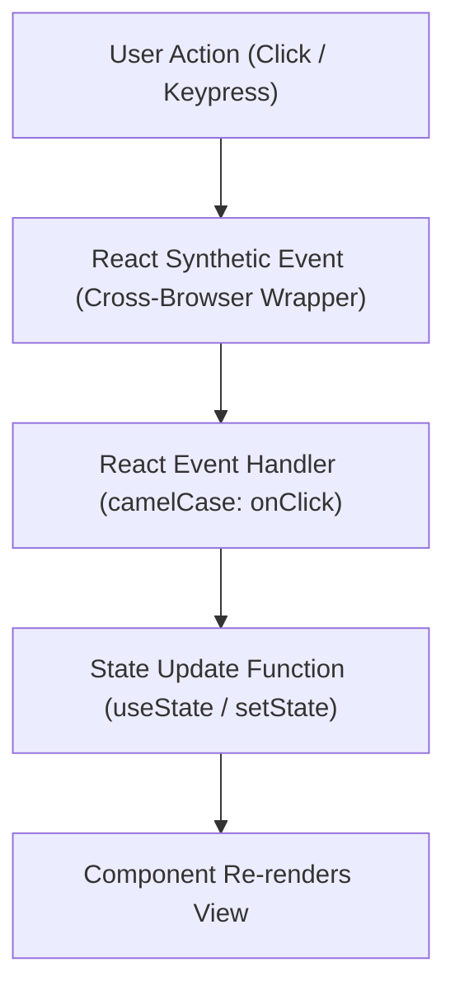
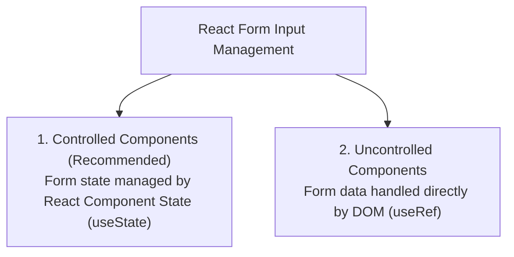

# React.js Event Handling and Working with Forms

## 1. Event Handling in React.js

Handling events in React is syntactically similar to handling events on DOM elements, but with a few crucial architectural differences.



---

### 1.1 Key Differences: React Synthetic Events vs. Native DOM Events

| Feature | Native HTML / DOM Events | React Event Handling |
| :--- | :--- | :--- |
| **Naming Convention** | All lowercase (`onclick`, `onchange`, `onsubmit`) | **camelCase** (`onClick`, `onChange`, `onSubmit`) |
| **Value Type** | Passed as a string (`onclick="handleClick()"`) | Passed as a **Function Reference** (`onClick={handleClick}`) |
| **Preventing Defaults** | Can return `false` inside inline HTML | Must explicitly invoke **`e.preventDefault()`** |
| **Event Object** | Browser-specific native `Event` | Wrapped in a cross-browser **`SyntheticEvent`** object |
| **Event Delegation** | Handlers attached directly to DOM nodes | **Single Delegation**: React attaches all events at the Root DOM node |

---

### 1.2 SyntheticEvent Wrapper
React wraps browser-native events in a cross-browser instance called **`SyntheticEvent`**. It has the exact same interface as native browser events (including `e.target`, `e.preventDefault()`, and `e.stopPropagation()`), ensuring identical behavior across Chrome, Firefox, Safari, and Edge.

---

### 1.3 Passing Arguments to Event Handlers

To pass custom parameters to an event handler, wrap the invocation inside an **arrow function**:

```jsx
// 1. Direct function reference (no parameters)
<button onClick={handleClick}>Click Me</button>

// 2. Passing arguments via Arrow Function
<button onClick={(e) => handleDelete(itemId, e)}>Delete Item</button>
```

---

## 2. Working with Forms in React.js

Form handling in React revolves around managing input state. There are two primary approaches to form handling in React:



---

### 2.1 Controlled Components (Recommended Best Practice)

In a **Controlled Component**, the HTML form input's value is driven by **React Component State (`useState`)**. 

1. The input's `value` prop is set to a state variable.
2. Every keystroke triggers an `onChange` event handler that calls the state updater function.
3. React state acts as the **"Single Source of Truth"** for the input value.

```jsx
function ControlledInput() {
  const [name, setName] = useState("");

  return (
    <input 
      type="text" 
      value={name} 
      onChange={(e) => setName(e.target.value)} 
    />
  );
}
```

---

### 2.2 Uncontrolled Components & `useRef`

In an **Uncontrolled Component**, form data is maintained by the DOM itself rather than React state. Developers use a **`useRef()`** hook to pull values directly from DOM nodes when the form is submitted.

```jsx
function UncontrolledInput() {
  const inputRef = useRef(null);

  const handleSubmit = (e) => {
    e.preventDefault();
    alert("Submitted Name: " + inputRef.current.value);
  };

  return (
    <form onSubmit={handleSubmit}>
      <input type="text" ref={inputRef} />
      <button type="submit">Submit</button>
    </form>
  );
}
```

---

### 2.3 Handling Multiple Input Fields with a Single Handler

Instead of writing separate state handlers for every input field, manage all inputs using a **single state object** and compute dynamic property names using `[e.target.name]`:

```jsx
const [formData, setFormData] = useState({
  username: "",
  email: "",
  department: "CS",
  isAgreed: false
});

const handleChange = (e) => {
  const { name, value, type, checked } = e.target;
  setFormData(prev => ({
    ...prev,
    [name]: type === "checkbox" ? checked : value
  }));
};
```

---

### 2.4 Form Submission & Client-Side Validation

1. **Preventing Reload**: Always invoke `e.preventDefault()` inside the `onSubmit` handler to prevent traditional page refreshes.
2. **Real-time Validation**: Validate inputs during `onChange` or `onSubmit` and render inline error messages dynamically.

---

## 3. 📜 Complete Code Demonstration: Interactive Student Portal with Controlled Forms & Synthetic Events

Below is a complete, standalone executable React application demonstrating Controlled Forms, Multiple Input Field State, Checkboxes, Select Dropdowns, Real-Time Validation, and Synthetic Events (`onClick`, `onBlur`, `onSubmit`).

```html
<!DOCTYPE html>
<!-- react_events_forms.html -->
<html lang="en">
<head>
  <meta charset="utf-8" />
  <title>React.js Event Handling & Forms Demonstration</title>
  
  <!-- LOAD REACT, REACT-DOM, AND BABEL CDN -->
  <script src="https://unpkg.com/react@18/umd/react.development.js" crossorigin></script>
  <script src="https://unpkg.com/react-dom@18/umd/react-dom.development.js" crossorigin></script>
  <script src="https://unpkg.com/@babel/standalone/babel.min.js"></script>

  <style type="text/css">
    body { font-family: Arial, sans-serif; background-color: #f4f6f9; margin: 30px; }
    .form-card { width: 550px; margin: auto; background: white; padding: 25px; border-radius: 8px; box-shadow: 0 4px 10px rgba(0,0,0,0.1); }
    .form-group { margin-bottom: 16px; }
    label { display: block; font-weight: bold; margin-bottom: 6px; }
    input[type="text"], input[type="email"], select { width: 95%; padding: 8px; border: 1px solid #ccc; border-radius: 4px; font-size: 14px; }
    input.error-border { border-color: #e74c3c; background-color: #fdf2f2; }
    .error-msg { color: #e74c3c; font-size: 12px; margin-top: 4px; }
    .btn { padding: 10px 18px; background: #27ae60; color: white; border: none; border-radius: 4px; cursor: pointer; font-size: 15px; }
    .btn:disabled { background: #bdc3c7; cursor: not-allowed; }
    .event-log { background: #2c3e50; color: #ecf0f1; padding: 12px; border-radius: 6px; margin-top: 20px; font-family: monospace; font-size: 13px; }
    .results-table { width: 100%; border-collapse: collapse; margin-top: 15px; }
    .results-table th, .results-table td { border: 1px solid #ddd; padding: 8px; text-align: left; }
    .results-table th { background: #2980b9; color: white; }
  </style>
</head>
<body>

  <div id="root"></div>

  <script type="text/babel">
    const { useState, useRef } = React;

    function StudentRegistrationApp() {
      // =========================================================================
      // 1. STATE MANAGEMENT FOR CONTROLLED FORM
      // =========================================================================
      const [formData, setFormData] = useState({
        fullName: "",
        email: "",
        department: "Computer Science",
        agreeTerms: false
      });

      const [errors, setErrors] = useState({});
      const [registeredStudents, setRegisteredStudents] = useState([]);
      const [lastEventType, setLastEventType] = useState("None");

      // Ref for Uncontrolled Component comparison
      const notesRef = useRef(null);

      // =========================================================================
      // 2. UNIFIED INPUT CHANGE HANDLER (Controlled Components)
      // =========================================================================
      const handleInputChange = (e) => {
        const { name, value, type, checked } = e.target;
        
        // Update State dynamically
        const fieldValue = (type === "checkbox") ? checked : value;
        setFormData(prev => ({
          ...prev,
          [name]: fieldValue
        }));

        // Synthetic Event Tracking
        setLastEventType(`onChange on field: '${name}'`);

        // Real-time error clearing
        if (errors[name]) {
          setErrors(prev => ({ ...prev, [name]: "" }));
        }
      };

      // Blur Event Handler for Validation
      const handleBlur = (e) => {
        const { name, value } = e.target;
        setLastEventType(`onBlur on field: '${name}'`);

        if (name === "fullName" && value.trim().length < 3) {
          setErrors(prev => ({ ...prev, fullName: "Name must be at least 3 characters long." }));
        }
        if (name === "email" && !/\S+@\S+\.\S+/.test(value)) {
          setErrors(prev => ({ ...prev, email: "Please enter a valid email address." }));
        }
      };

      // =========================================================================
      // 3. FORM SUBMISSION HANDLER
      // =========================================================================
      const handleSubmit = (e) => {
        // PREVENT DEFAULT PAGE RELOAD
        e.preventDefault();
        setLastEventType("onSubmit triggered");

        // Validate Form
        let validationErrors = {};
        if (!formData.fullName.trim()) validationErrors.fullName = "Full Name is required.";
        if (!formData.email.trim()) validationErrors.email = "Email is required.";
        if (!formData.agreeTerms) validationErrors.agreeTerms = "You must agree to terms.";

        if (Object.keys(validationErrors).length > 0) {
          setErrors(validationErrors);
          return;
        }

        // Extract Uncontrolled Ref Value
        const adminNotes = notesRef.current ? notesRef.current.value : "";

        // Push new entry to registered array
        const newRecord = {
          id: Date.now(),
          ...formData,
          notes: adminNotes
        };

        setRegisteredStudents(prev => [...prev, newRecord]);

        // Reset Controlled State Form
        setFormData({
          fullName: "",
          email: "",
          department: "Computer Science",
          agreeTerms: false
        });
        if (notesRef.current) notesRef.current.value = "";
        setErrors({});
      };

      return (
        <div className="form-card">
          <h2 style={{ marginTop: 0, color: '#2c3e50' }}>Student Portal (Controlled Forms)</h2>

          <!-- FORM WITH CONTROLLED INPUTS -->
          <form onSubmit={handleSubmit} novalidate>

            <!-- FULL NAME INPUT -->
            <div className="form-group">
              <label>Student Full Name *</label>
              <input 
                type="text" 
                name="fullName"
                value={formData.fullName} 
                onChange={handleInputChange} 
                onBlur={handleBlur}
                className={errors.fullName ? "error-border" : ""}
                placeholder="John Doe" 
              />
              {errors.fullName && <div className="error-msg">{errors.fullName}</div>}
            </div>

            <!-- EMAIL INPUT -->
            <div className="form-group">
              <label>Email Address *</label>
              <input 
                type="email" 
                name="email"
                value={formData.email} 
                onChange={handleInputChange} 
                onBlur={handleBlur}
                className={errors.email ? "error-border" : ""}
                placeholder="john@univ.edu" 
              />
              {errors.email && <div className="error-msg">{errors.email}</div>}
            </div>

            <!-- DEPARTMENT SELECT DROPDOWN -->
            <div className="form-group">
              <label>Department</label>
              <select 
                name="department" 
                value={formData.department} 
                onChange={handleInputChange}
              >
                <option value="Computer Science">Computer Science</option>
                <option value="Information Technology">Information Technology</option>
                <option value="Electronics">Electronics</option>
              </select>
            </div>

            <!-- UNCONTROLLED COMPONENT DEMO (useRef) -->
            <div className="form-group">
              <label>Admin Remarks (Uncontrolled Field via useRef)</label>
              <input type="text" ref={notesRef} placeholder="Optional notes..." />
            </div>

            <!-- CHECKBOX INPUT -->
            <div className="form-group">
              <label style={{ fontWeight: 'normal' }}>
                <input 
                  type="checkbox" 
                  name="agreeTerms"
                  checked={formData.agreeTerms} 
                  onChange={handleInputChange} 
                />
                I agree to the University Registration Terms *
              </label>
              {errors.agreeTerms && <div className="error-msg">{errors.agreeTerms}</div>}
            </div>

            <!-- SUBMIT BUTTON -->
            <button type="submit" className="btn">
              Submit Registration
            </button>
          </form>

          <!-- SYNTHETIC EVENT MONITOR -->
          <div className="event-log">
            <strong>Synthetic Event Tracker:</strong>
            <div>Last Captured Event: <span style={{ color: '#f1c40f' }}>{lastEventType}</span></div>
          </div>

          <!-- REGISTERED STUDENTS TABLE -->
          {registeredStudents.length > 0 && (
            <div>
              <h3>Registered Students Records</h3>
              <table className="results-table">
                <thead>
                  <tr>
                    <th>Name</th>
                    <th>Email</th>
                    <th>Dept</th>
                    <th>Notes (ref)</th>
                  </tr>
                </thead>
                <tbody>
                  {registeredStudents.map(s => (
                    <tr key={s.id}>
                      <td>{s.fullName}</td>
                      <td>{s.email}</td>
                      <td>{s.department}</td>
                      <td>{s.notes || 'None'}</td>
                    </tr>
                  ))}
                </tbody>
              </table>
            </div>
          )}

        </div>
      );
    }

    // RENDER REACT APP
    const root = ReactDOM.createRoot(document.getElementById('root'));
    root.render(<StudentRegistrationApp />);
  </script>
</body>
</html>
```
