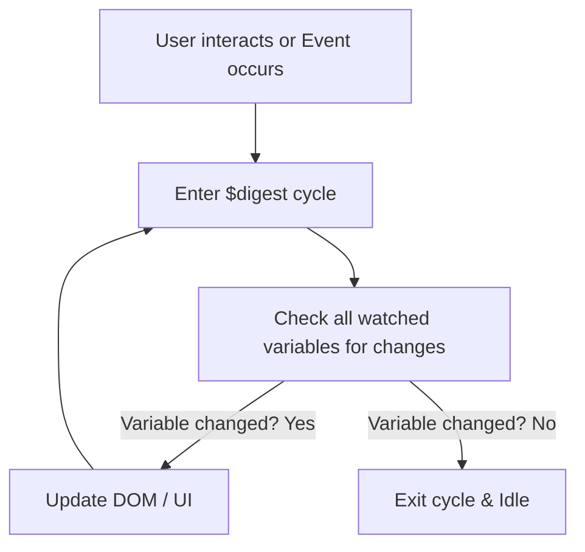

# AngularJS: Expressions & Data Binding

This note explores how AngularJS binds data to the UI using expressions and the mechanics of data binding.

---

## 1. AngularJS Expressions

### What are Expressions?
Expressions are code snippets written inside double curly braces: `{{ expression }}`. They are evaluated by AngularJS, and the result is written directly into the HTML document.

### Common Expression Types

| Type | Syntax Example | Output Example |
| :--- | :--- | :--- |
| **Numbers** | `{{ 5 + 5 }}` | `10` |
| **Strings** | `{{ "Hello " + "World" }}` | `Hello World` |
| **Objects** | `{{ user.firstName }}` | `John` |
| **Arrays** | `{{ colors[2] }}` | `Blue` |

### AngularJS Expressions vs. Classical JavaScript Expressions
Although they look similar, AngularJS expressions behave differently than normal JavaScript expressions:
1.  **Context:** Evaluated against a `$scope` object, not the global `window` object.
2.  **Forgiving:** If an expression evaluates to `null` or `undefined`, the browser does not throw an error (e.g., `ReferenceError`). It simply displays nothing (blank).
3.  **No Control Flow:** You cannot use conditional loops (`if-else`, `for`, `while`) or throw exceptions inside expressions. You must use ternary operators (`a ? b : c`) or filters instead.
4.  **Filters:** You can format expressions using the pipe symbol `|` (e.g., `{{ total | currency }}`).

### Introduction to Filters
Filters can be added to expressions to format the data:
*   `uppercase`: `{{ "hello" | uppercase }}` -> `HELLO`
*   `lowercase`: `{{ "HELLO" | lowercase }}` -> `hello`
*   `currency`: `{{ 250 | currency }}` -> `$250.00`
*   `orderBy`: Orders an array by an expression.

---

## 2. Understanding Data Binding

Data binding is the automatic synchronization of data between the **Model** (JavaScript variables) and the **View** (HTML interface).

### A. One-Way Data Binding (`ng-bind`)
*   **Concept:** Data flows in only one direction: from the Model to the View. If the JavaScript model changes, the HTML updates. However, changes in the HTML view (like a user typing) do not update the Model.
*   **Directive:** `ng-bind` attribute or double curly braces `{{ }}`.

```html
<!-- If userName is "Alice" in JavaScript, this displays "Alice" -->
<span ng-bind="userName"></span> 
<!-- Equivalent to: -->
<span>{{ userName }}</span>
```

### B. Two-Way Data Binding (`ng-model`)
*   **Concept:** Data flows in both directions. 
    1.  When the Model changes, the View updates.
    2.  When the View changes (e.g., user types in an input box), the Model updates automatically.
*   **Directive:** `ng-model`.

```html
<div ng-app="">
  <input type="text" ng-model="color"> <!-- View updates Model -->
  <p>The selected color is: <span ng-bind="color"></span></p> <!-- Model updates View -->
</div>
```

---

## 3. How Data Binding Works Under the Hood (Beginner's Guide)

AngularJS uses a process called **Dirty Checking** to keep the View and Model synchronized.



### 1. The `$watch` List
Whenever you use `{{ }}` or `ng-bind` in your HTML, AngularJS automatically registers a **watcher** for that variable on the `$watch` list. A watcher is a function that monitors changes to the variable.

### 2. The `$digest` Cycle
When an event happens (like typing in an input, clicking a button, or an HTTP response arriving), AngularJS triggers a **$digest cycle**. During this cycle, AngularJS loops through all registered watchers and checks if the current value of each watched variable is different from its previous value. This checking is called **Dirty Checking**.

### 3. Loop and Update
*   If a watched variable has changed ("dirty"), AngularJS runs the listener function associated with it to update the HTML DOM.
*   Because updating one variable might trigger changes in another, AngularJS loops through the `$watch` list again. It continues looping until none of the watched variables change.
*   Once everything is stable ("clean"), the cycle stops and the browser renders the updated screen.
