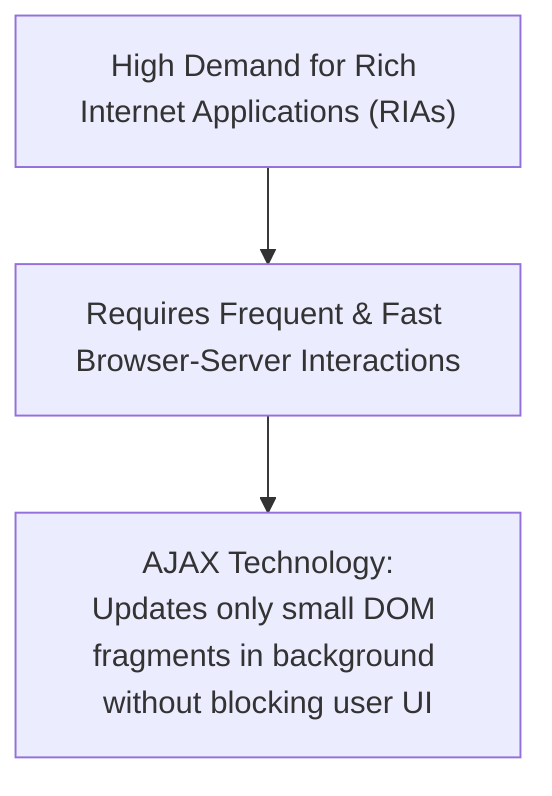
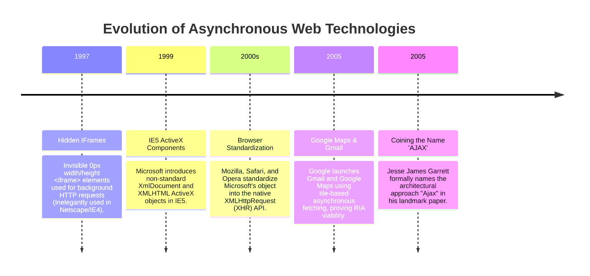
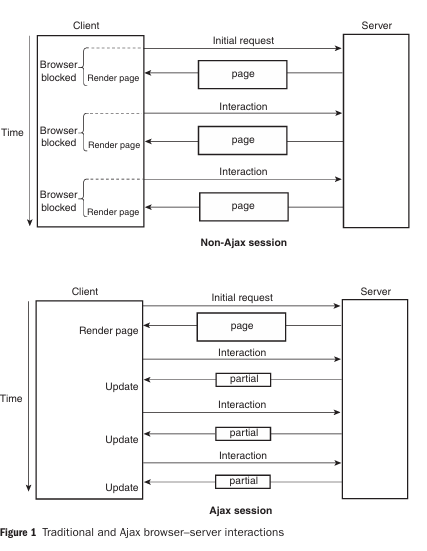
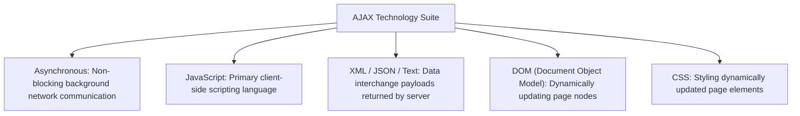
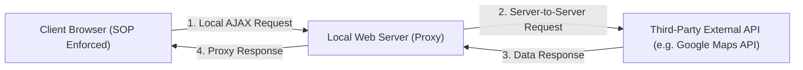

# Introduction to AJAX: Overview, History, Architecture, and Implementation

## 1. Overview of AJAX

**AJAX** (Asynchronous JavaScript and XML) is a suite of web development techniques that allows web applications to send and retrieve data asynchronously from a server in the background **without reloading the entire web page**.

- **Primary Goal**: To provide web-based applications with rich user interfaces, instant responsiveness, and seamless interactive workflows similar to native desktop software.
- **Rich Internet Applications (RIAs)**: Applications that present elaborate user interfaces requiring frequent interactions with the server (e.g., live search auto-complete, interactive mapping, dynamic chat systems).

---

## 2. History & Evolution of AJAX

The evolution of asynchronous server communications spans several key historical milestones:

### Key Milestones:
1. **Hidden IFrames (Late 1990s)**: Programmers hid `<iframe>` elements by setting width and height to `0px` to perform background server requests. This worked but was architecturally inelegant.
2. **Microsoft's `XMLHTML` (1999)**: Introduced in IE5 as an ActiveX component to support background server data retrieval.
3. **`XMLHttpRequest` Standardization**: Standardized across all modern browsers (including Mozilla, Safari, Opera, and IE9+).
4. **Google Maps & Gmail (2004–2005)**: Google Maps demonstrated that small map "tiles" (image blocks) could be fetched asynchronously and rendered on the growing edges of the viewport as the user dragged the map, without ever re-rendering the whole screen.
5. **Jesse James Garrett (2005)**: Formally coined the acronym **AJAX** (Asynchronous JavaScript and XML) in February 2005, sparking widespread adoption.

---

## 3. Traditional Web Model vs. AJAX Architecture

### 3.1 Traditional (Non-AJAX) Model
- **Synchronous Locking**: Every user action requiring server data sends an HTTP request and **completely locks (blocks) the browser**.
- **Full Page Re-rendering**: The server returns a complete HTML document, forcing the browser to discard the old page and re-render the entire screen from scratch.
- **High Latency & Workflow Disruption**: Even tiny updates require full page roundtrips.

---

### 3.2 AJAX Model
- **Asynchronous Non-Blocking**: The browser sends requests in the background via the `XMLHttpRequest` object. The user continues interacting with the current page without UI locking.
- **Partial Content Updates**: The server returns only the small piece of data that changed (in JSON, XML, or HTML fragment form).
- **Instant Partial Rendering**: JavaScript updates specific DOM nodes directly. Network bandwidth transmission time and rendering time are dramatically reduced.

---

### 3.3 Visual Interaction Comparison

The image below illustrates the fundamental difference between traditional blocking full-page sessions and asynchronous partial AJAX sessions:

---

### 3.4 Mobile Device Optimization Advantage
Mobile devices (smartphones and tablets) operate under strict hardware constraints:
- Slower CPU processors and smaller RAM capacities.
- Limited wireless network bandwidth and higher latency.
- Smaller screen sizes.

**How AJAX Helps Mobile Devices**: By transmitting tiny partial payload fragments instead of heavy full-page markup files, AJAX reduces network bandwidth consumption and minimizes client-side CPU rendering overhead on mobile processors.

---

## 4. Technology Stack & Implementation Options

AJAX is **NOT a new programming language** or a new proprietary API. It is an architectural combination of existing standard web technologies:

### 4.1 Server-Side Tech Independence
While AJAX relies on JavaScript on the client side, it is **100% agnostic to server-side backend technologies**. An AJAX client can communicate seamlessly with backends written in:
- **PHP**
- **Node.js**
- **Java Servlets / Spring**
- **ASP.NET**
- **Python (Django / Flask)**

---

### 4.2 Implementation Approaches

1. **Native JavaScript & `XMLHttpRequest`**: Raw implementation using native JavaScript and the browser's `XMLHttpRequest` (or modern `fetch()` API).
2. **Client-Side Libraries & Toolkits**: JavaScript toolkits such as **jQuery (`$.ajax()`)**, **Dojo**, or **Prototype** that abstract browser inconsistencies.
3. **Server-Side AJAX Frameworks**: DWR (Direct Web Remoting), GWT (Google Web Toolkit), ASP.NET AJAX, JavaServer Faces (JSF), and Ruby on Rails.

---

### 4.3 Same-Origin Security Policy (SOP) & Mashups

> [!CAUTION]
> **Same-Origin Security Policy (SOP)**:
> For security reasons, browser engines enforce the **Same-Origin Policy** on `XMLHttpRequest` calls. An AJAX request **can ONLY be sent to the exact same domain, protocol, and port** from which the original web page was served.

#### Building Web Mashups:
A **Mashup** is an application or website that combines data from two or more third-party external services (e.g. combining real estate listings with Google Maps data).
- Since SOP blocks direct client-side cross-domain `XMLHttpRequest` calls to third-party APIs, web developers use a **Server-Side Proxy**.
- The client AJAX script makes a request to its own backend server, which acts as a proxy to fetch data from the third-party external API server.

