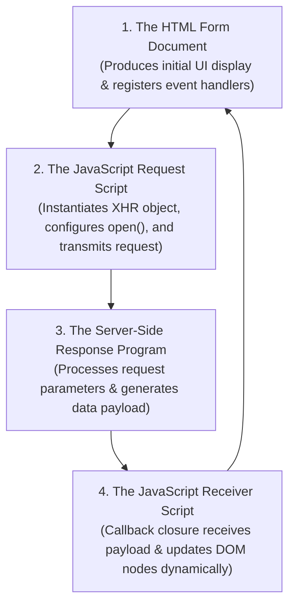
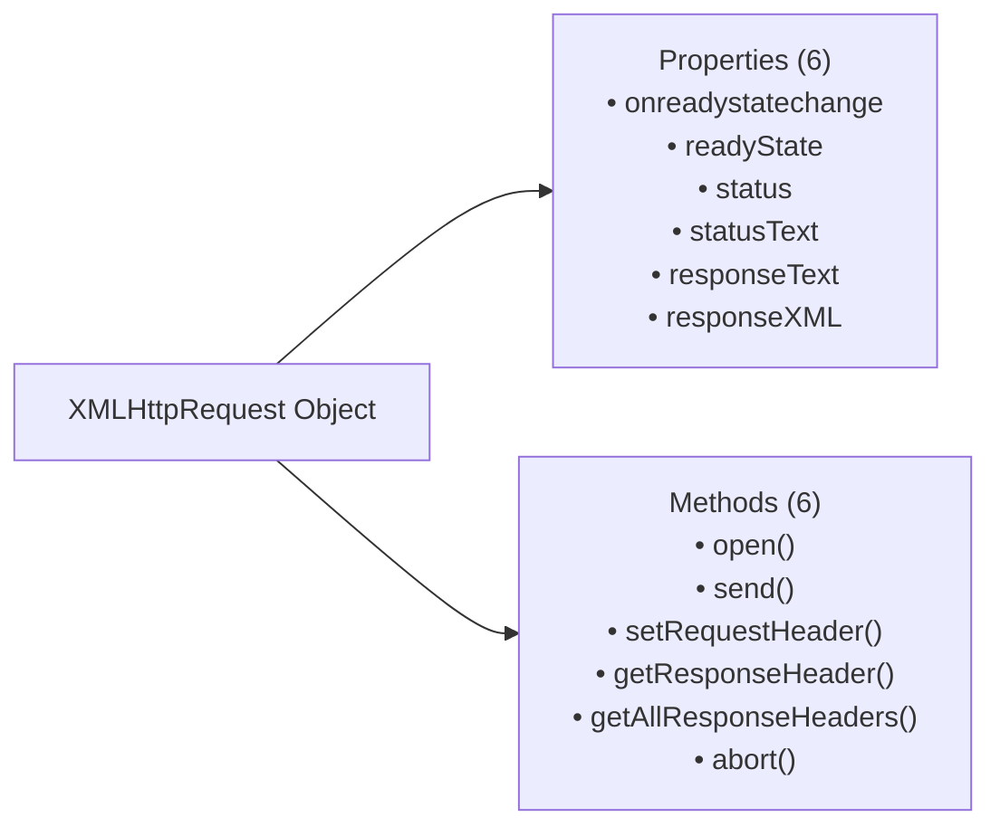
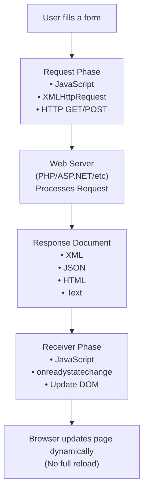

# The Basics of AJAX: Comprehensive Request/Response Workflow, API Reference, and Complete Case Study

## 1. Structure of an AJAX Application

An AJAX web application is built upon **four fundamental interacting parts**:



1. **The HTML Document**: Presents the initial form interface to the user and binds DOM event listeners (e.g. `onblur`).
2. **The Request Script**: Creates the `XMLHttpRequest` object, sets up HTTP request parameters, registers the callback, and sends data to the server asynchronously.
3. **The Server-Side Program**: A server script (e.g., PHP, Node.js, Java Servlet) that receives query inputs, queries data/databases, and returns a response payload with appropriate MIME content headers.
4. **The Receiver Script**: A callback function (closure) that receives progress notifications, validates response status, parses the return payload, and updates DOM element properties without page refreshes.

---

## 2. Deep-Dive: The `XMLHttpRequest` (XHR) Object API

The **`XMLHttpRequest`** (XHR) object is the primary communication channel between client JavaScript and web servers.



---

### 2.1 All Key XHR Properties

| Property                 | Data Type          | Detailed Description & Values                                                                                                                                                                                                                         |
| :----------------------- | :----------------- | :---------------------------------------------------------------------------------------------------------------------------------------------------------------------------------------------------------------------------------------------------- |
| **`onreadystatechange`** | Function Reference | Holds the function reference of the receiver callback. Automatically invoked every time `readyState` changes.                                                                                                                                         |
| **`readyState`**         | Integer (0 – 4)    | Tracks current request progress state: <br/>`0` = **UNSENT** (object created)<br/>`1` = **OPENED** (`open()` called)<br/>`2` = **HEADERS_RECEIVED** (`send()` called)<br/>`3` = **LOADING** (downloading data)<br/>`4` = **DONE** (transfer complete) |
| **`status`**             | Integer            | HTTP response status code from server:<br/>`200` = **OK (Success)**<br/>`404` = **Not Found**<br/>`500` = **Internal Server Error**                                                                                                                   |
| **`statusText`**         | String             | HTTP status text string (e.g., `"OK"`, `"Not Found"`, `"Internal Server Error"`).                                                                                                                                                                     |
| **`responseText`**       | String             | Contains the server response as a plain text string (used for plain text, HTML, or JSON).                                                                                                                                                             |
| **`responseXML`**        | XML DOM Document   | Contains server response parsed as an XML DOM Document (populated ONLY if `Content-Type` is `text/xml` and payload is valid XML).                                                                                                                     |

---

### 2.2 Detailed Explanation of `open()` Method Parameters

The `open()` method configures the network request:

```javascript
xhr.open(method, url, async, username, password);
```

1. **`method` (Mandatory String)**:
   - **`"GET"`**: Used when retrieving small amounts of data without side effects. Data is appended to the URL query string (`?zip=80201`).
   - **`"POST"`**: Used when sending lengthy form data or when sensitive data must not appear in browser URL histories/logs.
2. **`url` (Mandatory String)**: The target server endpoint URL (e.g. `"getCityState.php?zip=" + zip`). Can be a relative filename if hosted in the same directory.
3. **`async` (Optional Boolean)**:
   - **`true` (Default & Recommended)**: Request is executed **asynchronously**. The browser does not lock up while waiting.
   - **`false`**: Executes synchronously, freezing the browser until response returns (deprecated bad practice).
4. **`username` & `password` (Optional Strings)**: Included for HTTP basic authentication. _Exam Note: Storing credentials inside client JavaScript is insecure and rarely used._

---

### 2.3 `send()` Method Mechanics

- **`xhr.send(null)`**: Used for `GET` requests where all data is already encoded in the URL query string.
- **`xhr.send(stringData)`**: Used for `POST` requests to transmit form body payload data across the wire.

---

## 3. Step-by-Step AJAX Phase Analysis



### 3.1 1. The Request Phase (`getPlace`)

- Triggered by user interaction (e.g. `onblur` event on an input field passing `this.value`).
- Instantiates XHR object across browsers.
- Registers receiver callback to `xhr.onreadystatechange`. Note: **Do NOT include parentheses `()` when assigning callback references** (`xhr.onreadystatechange = receivePlace;`).

---

### 3.2 2. The Server Response Phase (`getCityState.php`)

- Receives parameter from `$_GET["zip"]`.
- Sets Content-Type header explicitly using PHP `header()`:
  ```php
  header("Content-Type: text/plain");
  ```
- Outputs data payload using `print` or `echo`.

---

### 3.3 3. The Receiver Phase & The Closure Solution

#### Why Anonymous Closures are Mandatory:

If a single global `xhr` variable or named external function is used for receiver callbacks, a race condition occurs: if a user triggers a second request quickly before the first completes, **the second request overwrites the global `xhr` object reference**, causing lost responses.

#### The Closure Solution:

By declaring an **anonymous closure function** directly assigned to `onreadystatechange` inside `getPlace()`, the callback retains access to its own private `xhr` variable instance:

```javascript
xhr.onreadystatechange = function () {
  // Guard condition: Process ONLY when transfer is complete (4) and successful (200)
  if (xhr.readyState == 4 && xhr.status == 200) {
    var result = xhr.responseText; // Reads "Denver, Colorado"
    var place = result.split(", "); // Splitting by comma and space -> ["Denver", "Colorado"]

    // Selection constructs prevent overwriting existing user-entered text
    if (document.getElementById("city").value == "")
      document.getElementById("city").value = place[0];
    if (document.getElementById("state").value == "")
      document.getElementById("state").value = place[1];
  }
};
```

---

## 4. Cross-Browser Support Architecture

Legacy browsers (Internet Explorer 5 and IE6) do not support the standard `XMLHttpRequest` object. Instead, they support a proprietary ActiveX control named `Microsoft.XMLHTTP`.

### 4.1 Cross-Browser Instantiation Pattern

To ensure 100% cross-browser compatibility across legacy and modern browser engines:

```javascript
var xhr;
if (window.XMLHttpRequest) {
  // Standard object for Chrome, Firefox, Safari, Opera, Edge, and IE7+
  xhr = new XMLHttpRequest();
} else {
  // Legacy ActiveX object for IE5 and IE6
  xhr = new ActiveXObject("Microsoft.XMLHTTP");
}
```

---

## 5. 📜 Complete Code Case Study: Popcorn Sales Address Auto-Fill

This complete, production-ready case study automatically fills in City and State fields when the user types a 5-digit Zip Code and triggers the `onblur` event.

---

### 5.1 HTML View Document (`popcornA.html`)

```html
<!DOCTYPE html>
<!-- popcornA.html 
     This describes popcorn sales form page which uses
     Ajax and the zip code to fill in the city and state
     of the customer's address
     -->
<html lang="en">
  <head>
    <title>Popcorn Sales Form (Ajax)</title>
    <meta charset="utf-8" />
    <style type="text/css">
      input.name {
        position: absolute;
        left: 120px;
      }
      input.address {
        position: absolute;
        left: 120px;
      }
      input.zip {
        position: absolute;
        left: 120px;
      }
      input.city {
        position: absolute;
        left: 120px;
      }
      input.state {
        position: absolute;
        left: 120px;
      }
      img {
        position: absolute;
        left: 400px;
        top: 50px;
      }
    </style>
    <!-- Reference external JavaScript file containing Ajax request code -->
    <script type="text/JavaScript" src="popcornA.js"></script>
  </head>
  <body>
    <h2>Welcome to Millennium Gymnastics Booster Club Popcorn Sales</h2>
    <form action="">
      <p>
        Buyer's Name:
        <input class="name" type="text" name="name" size="30" />
      </p>
      <p>
        Street Address:
        <input class="address" type="text" name="street" size="30" />
      </p>
      <p>
        Zip code:
        <!-- onblur event triggers getPlace() handler, passing this.value -->
        <input
          class="zip"
          type="text"
          name="zip"
          size="10"
          onblur="getPlace(this.value)"
        />
      </p>
      <p>
        City:
        <input class="city" type="text" name="city" id="city" size="30" />
      </p>
      <p>
        State:
        <input class="state" type="text" name="state" id="state" size="30" />
      </p>
      
      <p>
        <input type="submit" value="Submit Order" />
        <input type="reset" value="Clear Order Form" />
      </p>
    </form>
  </body>
</html>
```

---

### 5.2 JavaScript Request & Embedded Closure Receiver (`popcornA.js`)

```javascript
// popcornA.js
//  Ajax JavaScript code for the popcornA.html document
/********************************************************/
// function getPlace
//   parameter: zip code
//   action:   create the XMLHttpRequest object (with cross-browser fallbacks),
//             register the handler for onreadystatechange, prepare to send
//             the request (with open), and send the request,
//             along with the zip code, to the server
//   includes: the anonymous handler for onreadystatechange,
//             which is the receiver function, which gets the
//             response text, splits it into city and state,
//             and puts them into the document
function getPlace(zip) {
  var xhr;

  // 1. Cross-Browser Instantiation: Get object for all browsers
  if (window.XMLHttpRequest) {
    xhr = new XMLHttpRequest(); // Standard modern browsers (Chrome, Firefox, Safari, IE7+)
  } else {
    xhr = new ActiveXObject("Microsoft.XMLHTTP"); // Legacy IE5 and IE6
  }

  // 2. Register the embedded anonymous closure receiver function as the handler
  xhr.onreadystatechange = function () {
    // Check if response is complete (readyState 4) and HTTP request was successful (status 200)
    if (xhr.readyState == 4 && xhr.status == 200) {
      var result = xhr.responseText;
      var place = result.split(", ");

      // Assign city and state if target input fields are currently empty
      if (document.getElementById("city").value == "")
        document.getElementById("city").value = place[0];
      if (document.getElementById("state").value == "")
        document.getElementById("state").value = place[1];
    }
  };

  // 3. Prepare asynchronous HTTP GET request appending zip parameter
  xhr.open("GET", "getCityState.php?zip=" + zip, true);

  // 4. Send asynchronous request to server
  xhr.send(null);
}
```

---

### 5.3 Server-Side PHP Response Script (`getCityState.php`)

```php
<?php
// getCityState.php
//   Gets the form value from the "zip" widget, looks up the
//   city and state for that zip code, and prints it for the form

  // Mock Database Array mapping Zip Codes to "City, State"
  $cityState = array(
    "81611" => "Aspen, Colorado",
    "81411" => "Bedrock, Colorado",
    "80908" => "Black Forest, Colorado",
    "80301" => "Boulder, Colorado",
    "81127" => "Chimney Rock, Colorado",
    "80901" => "Colorado Springs, Colorado",
    "81223" => "Cotopaxi, Colorado",
    "80201" => "Denver, Colorado",
    "81657" => "Vail, Colorado",
    "80435" => "Keystone, Colorado",
    "80536" => "Virginia Dale, Colorado",
  );

  // Set HTTP response Content-Type header to plain text
  header("Content-Type: text/plain");

  // Retrieve zip code from $_GET superglobal array
  $zip = $_GET["zip"];

  // Check if zip exists in array and print result; otherwise return blank space separator
  if (array_key_exists($zip, $cityState))
    print $cityState[$zip];
  else
    print " , ";
?>
```
