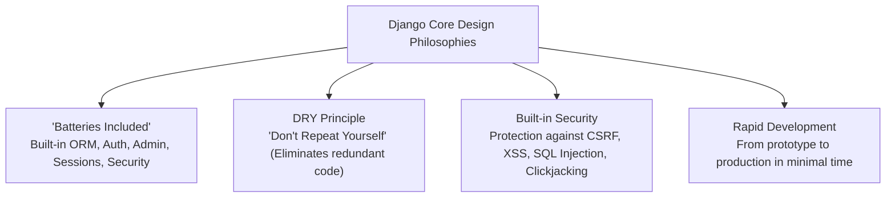
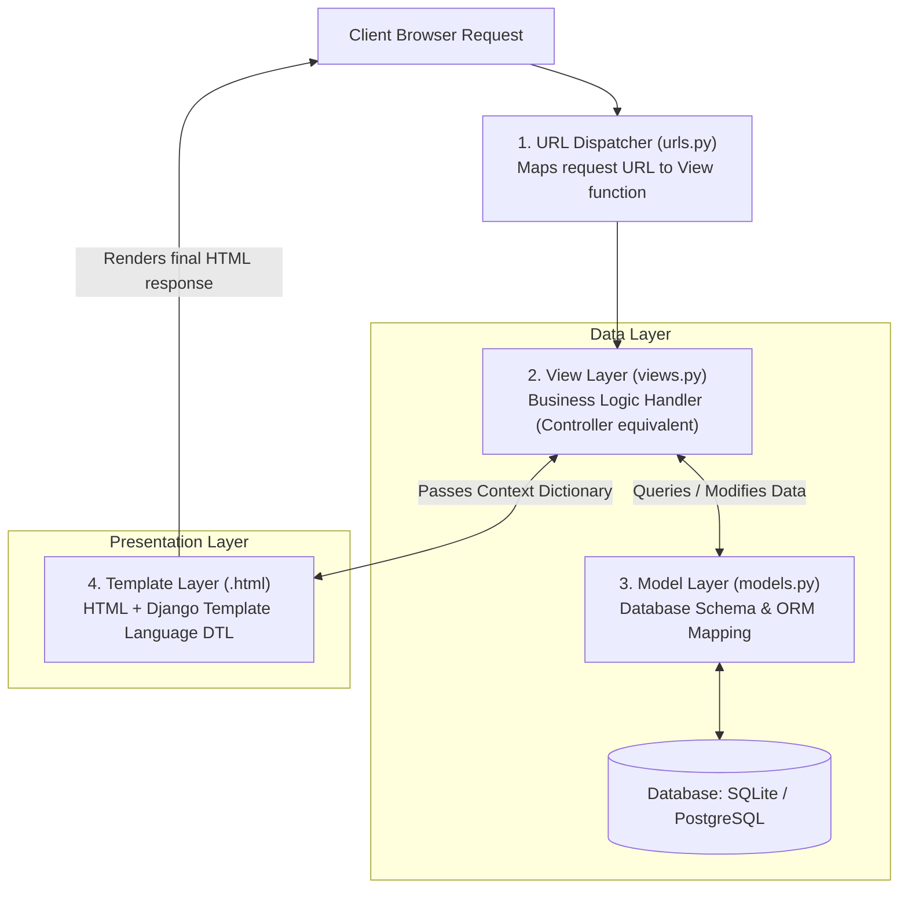

# Introduction to Django Framework & MVT Architecture

## 1. What is Django?

**Django** is a high-level, open-source Python web framework created by **Adrian Holovaty and Simon Willison in 2003** (released publicly in 2005) while working at the Lawrence Journal-World newspaper. 

Django encourages rapid development, clean pragmatic design, and follows the philosophy of **"Batteries Included"**—meaning it provides out-of-the-box built-in tools for database ORM, user authentication, security protection, sessions, and an automatically generated administrative interface.



---

## 2. Django and Python Integration

Django is built 100% on top of **Python**, leveraging Python’s clean syntax, object-oriented paradigms, and vast library ecosystem.

### 2.1 Technical Synergies:
1. **Pythonic Codebase**: Models are defined as standard Python classes, URL routes as Python lists/tuples, and settings as Python modules.
2. **Object-Relational Mapping (ORM)**: Developers interact with SQL databases (SQLite, PostgreSQL, MySQL) purely using Python code without writing raw SQL queries.
3. **Cross-Platform Portability**: Runs on Linux, Windows, macOS, or any server supporting Python 3.x.
4. **Virtual Environment Isolation**: Uses Python virtual environments (`venv`) to isolate project dependencies cleanly.

---

## 3. The Django MVT (Model-View-Template) Architecture

While traditional web frameworks follow the standard **MVC (Model-View-Controller)** pattern, Django uses a specialized variant called **MVT (Model-View-Template)** architecture.



---

### 3.1 Detailed Component Breakdown: MVT vs. MVC Comparison

| MVT Component | MVC Equivalent | Responsibility & Description | Primary File |
| :--- | :--- | :--- | :--- |
| **Model (M)** | **Model** | Defines the data structure, database tables, field types, and relationships using Python ORM classes. | `models.py` |
| **View (V)** | **Controller** | Contains the **Business Logic**. Accepts HTTP requests, interacts with Models, and selects Templates to return HTTP responses. | `views.py` |
| **Template (T)**| **View** | The **Presentation Layer**. HTML files enriched with **Django Template Language (DTL)** tags (``) and variables (`{{ }}`). | `*.html` |
| **URL Dispatcher**| **Router** | RegEx/Path parser matching incoming URLs to specific View handler functions. | `urls.py` |

---

## 4. Step-by-Step Django Application Execution Flow

1. **HTTP Request Arrival**: Client browser requests a URL (e.g. `http://example.com/students/`).
2. **URL Routing (`urls.py`)**: Django inspects `urls.py` and matches `/students/` to `views.student_list`.
3. **View Logic (`views.py`)**: The `student_list` view function executes:
   - Queries the database using the Model: `Student.objects.filter(is_active=True)`.
   - The ORM executes the database query and returns Python model instances.
   - Packages data into a context dictionary: `context = {'students': student_list}`.
4. **Template Rendering (`student_list.html`)**: The View passes the context dictionary to the template engine. DTL evaluates tags like `` and outputs pure HTML.
5. **HTTP Response Return**: The View returns an `HttpResponse` containing the rendered HTML payload back to the user browser.

---

## 5. 📜 Complete Code Case Study: Student Directory App in Django MVT Architecture

Below is a complete, modular code showcase implementing a Student Directory app using Django's MVT pattern.

---

### 5.1 1. The Model Layer (`models.py`)

```python
# models.py - Defines Database Schema via Django ORM
from django.db import models

class Student(models.Model):
    # Field Declarations with SQL Types & Constraints
    student_id = models.CharField(max_length=10, unique=True)
    full_name = models.CharField(max_length=100)
    email = models.EmailField(unique=True)
    department = models.CharField(max_length=50)
    gpa = models.DecimalField(max_digits=3, decimal_places=2)
    enrollment_date = models.DateField(auto_now_add=True)
    is_active = models.BooleanField(default=True)

    def __str__(self):
        return f"{self.full_name} ({self.student_id})"

    class Meta:
        ordering = ['-gpa'] # Order by highest GPA by default
```

---

### 5.2 2. The View Layer (`views.py`)

```python
# views.py - Business Logic Handler (Controller equivalent)
from django.shortcuts import render, get_object_or_404
from django.http import HttpResponse
from .models import Student

def student_directory(request):
    """
    View handler to list all active students.
    """
    # Query database using Django ORM
    active_students = Student.objects.filter(is_active=True)
    
    # Context dictionary passed to Template
    context = {
        'title': 'University Student Directory',
        'students': active_students,
        'total_count': active_students.count()
    }
    
    # Render Template with Context and return HTTP Response
    return render(request, 'students/directory.html', context)


def student_detail(request, student_id):
    """
    View handler for individual student profile.
    """
    student = get_object_or_404(Student, student_id=student_id)
    return render(request, 'students/detail.html', {'student': student})
```

---

### 5.3 3. The URL Dispatcher (`urls.py`)

```python
# urls.py - URL Routing Configuration
from django.urls import path
from . import views

urlpatterns = [
    # Route matching root to student_directory view
    path('', views.student_directory, name='student_directory'),
    
    # Dynamic parameter path matching student_id (e.g., /student/STU-101/)
    path('student/<str:student_id>/', views.student_detail, name='student_detail'),
]
```

---

### 5.4 4. The Template Layer (`directory.html`)

```html
<!-- directory.html - Presentation Layer using Django Template Language (DTL) -->
<!DOCTYPE html>
<html lang="en">
<head>
  <meta charset="utf-8" />
  <title>{{ title }}</title>
  <style type="text/css">
    body { font-family: Arial, sans-serif; background-color: #f4f6f9; margin: 30px; }
    .container { width: 750px; margin: auto; background: white; padding: 25px; border-radius: 8px; box-shadow: 0 4px 10px rgba(0,0,0,0.1); }
    h2 { color: #2c3e50; border-bottom: 2px solid #3498db; padding-bottom: 8px; }
    table { width: 100%; border-collapse: collapse; margin-top: 15px; }
    th, td { border: 1px solid #ddd; padding: 10px; text-align: left; }
    th { background: #3498db; color: white; }
    .badge-pass { background: #2ecc71; color: white; padding: 3px 6px; border-radius: 4px; font-size: 12px; }
    .badge-prob { background: #e74c3c; color: white; padding: 3px 6px; border-radius: 4px; font-size: 12px; }
  </style>
</head>
<body>

<div class="container">
  <!-- DTL Variable Interpolation -->
  <h2>{{ title }}</h2>
  <p>Total Registered Students: <strong>{{ total_count }}</strong></p>

  <table>
    <thead>
      <tr>
        <th>ID</th>
        <th>Full Name</th>
        <th>Department</th>
        <th>GPA</th>
        <th>Academic Status</th>
      </tr>
    </thead>
    <tbody>
      <!-- DTL Loop Construct -->
      
        <tr>
          <td><a href="">{{ student.student_id }}</a></td>
          <td>{{ student.full_name }}</td>
          <td>{{ student.department }}</td>
          <td>{{ student.gpa }}</td>
          <td>
            <!-- DTL Conditional Logic -->
            
              <span class="badge-pass">Good Standing</span>
            
              <span class="badge-prob">Academic Probation</span>
            
          </td>
        </tr>
      
        <tr>
          <td colspan="5">No active students found in directory.</td>
        </tr>
      
    </tbody>
  </table>
</div>

</body>
</html>
```
