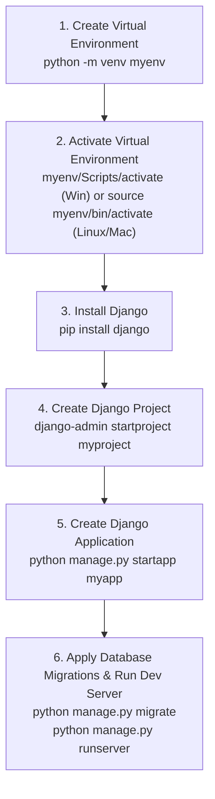
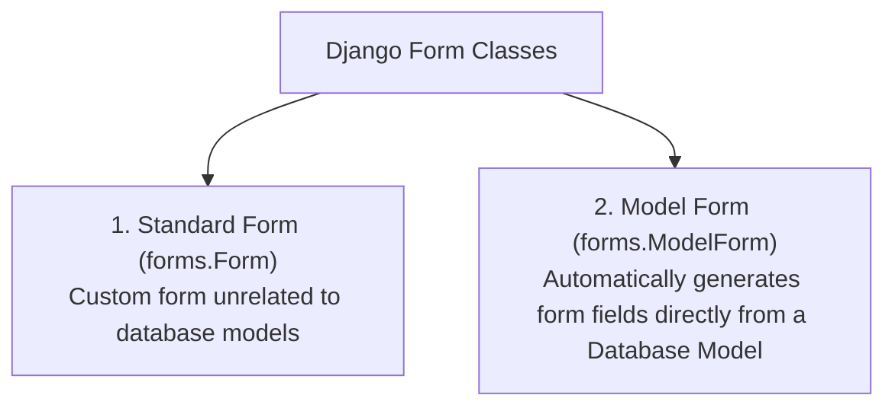
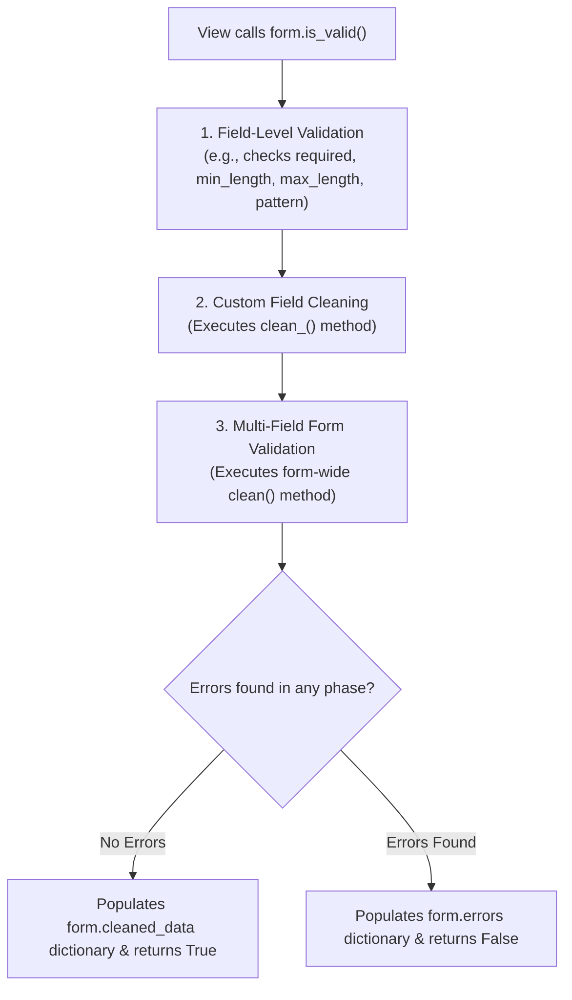

# Django Installation, Form Classes, and Form Validation

## 1. Installation and Project Setup of Django

Django is installed using `pip` (Python Package Manager) inside an isolated Python Virtual Environment (`venv`).



---

### 1.1 Complete Command CLI Workflow

```bash
# 1. Verify Python & pip installation
python --version
pip --version

# 2. Create and activate a Virtual Environment
python -m venv env
# On Windows:
env\Scripts\activate
# On macOS/Linux:
source env/bin/activate

# 3. Install Django via pip
pip install django

# 4. Verify Django Installation
python -m django --version
# Output: 4.2.0 (or current version)

# 5. Initialize a new Django Project
django-admin startproject student_portal .

# 6. Create a new App module inside project
python manage.py startapp registration

# 7. Apply initial SQLite database migrations
python manage.py migrate

# 8. Start local development web server (http://127.0.0.1:8000/)
python manage.py runserver
```

---

## 2. Django Form Classes (`forms.Form` and `forms.ModelForm`)

In Django, HTML form generation, data extraction, security sanitization, and validation are handled cleanly by **Form Classes**.



---

### 2.1 Standard Form (`forms.Form`) vs. Model Form (`forms.ModelForm`)

| Feature | Standard Form (`forms.Form`) | Model Form (`forms.ModelForm`) |
| :--- | :--- | :--- |
| **Field Source** | Explicitly declared Python fields (`forms.CharField`, etc.). | Auto-generated from Model (`class Meta: model = Student`). |
| **Database Persistence**| Requires manual extraction (`form.cleaned_data`) & saving. | Calls **`form.save()`** directly to create/update database records. |
| **Validation Rules** | Reuses field validation + custom `clean()` methods. | Inherits validation rules defined on the database Model. |

---

## 3. Django Form Validation Architecture

Django executes a structured validation pipeline when **`form.is_valid()`** is called in a View.



---

### 3.1 Validation Methods & Pipeline Phases:

1. **Built-in Field Validators**: Automatic checks based on field types (e.g. `EmailField` checks `@` format, `IntegerField` checks numeric types, `validators=[...]`).
2. **Single Field Custom Validator (`clean_<fieldname>()`)**: Validates a specific single field. Must return the cleaned value or raise `forms.ValidationError`:
   ```python
   def clean_student_id(self):
       data = self.cleaned_data['student_id']
       if not data.startswith('STU-'):
           raise forms.ValidationError("Student ID must begin with prefix 'STU-'.")
       return data
   ```
3. **Multi-Field Custom Validator (`clean()`)**: Validates relationships across **multiple fields simultaneously** (e.g. verifying password and confirm_password match).
4. **`cleaned_data` Dictionary**: Once `form.is_valid()` passes, normalized and sanitized form inputs are stored safely in the **`form.cleaned_data`** dictionary.

---

## 4. 📜 Complete Code Case Study: Student Registration & Validation App

Below is a complete, production-ready Django application showcasing `forms.Form`, `forms.ModelForm`, custom field-level cleaning (`clean_phone`), multi-field cleaning (`clean()`), CSRF protection, and template rendering.

---

### 4.1 1. The Form Classes (`forms.py`)

```python
# forms.py - Django Form Classes & Validation Logic
from django import forms
from django.core.validators import RegexValidator
from .models import Student

# =========================================================================
# 1. STANDARD FORM (forms.Form) WITH CUSTOM VALIDATIONS
# =========================================================================
class StudentRegistrationForm(forms.Form):
    # Field Declarations with Built-in & Regex Validators
    full_name = forms.CharField(
        max_length=100,
        widget=forms.TextInput(attrs={'class': 'form-control', 'placeholder': 'Enter full name'})
    )
    
    email = forms.EmailField(
        widget=forms.EmailInput(attrs={'class': 'form-control', 'placeholder': 'user@domain.com'})
    )
    
    # Custom Regex Validator for Phone Number (10 digits)
    phone_regex = RegexValidator(
        regex=r'^[0-9]{10}$',
        message="Phone number must be exactly 10 digits."
    )
    phone_number = forms.CharField(validators=[phone_regex], max_length=10)

    password = forms.CharField(
        widget=forms.PasswordInput(attrs={'class': 'form-control'})
    )
    confirm_password = forms.CharField(
        widget=forms.PasswordInput(attrs={'class': 'form-control'})
    )

    # -------------------------------------------------------------------------
    # 2. SINGLE FIELD CUSTOM CLEAN METHOD (clean_<fieldname>)
    # -------------------------------------------------------------------------
    def clean_email(self):
        email = self.cleaned_data.get('email')
        if not email.endswith('.edu'):
            raise forms.ValidationError("Registration is restricted to institutional (.edu) email addresses.")
        return email

    # -------------------------------------------------------------------------
    # 3. MULTI-FIELD CUSTOM CLEAN METHOD (clean)
    # -------------------------------------------------------------------------
    def clean(self):
        cleaned_data = super().clean()
        pwd = cleaned_data.get("password")
        confirm_pwd = cleaned_data.get("confirm_password")

        # Verify password matching
        if pwd and confirm_pwd and pwd != confirm_pwd:
            raise forms.ValidationError("Password and Confirm Password do not match!")
            
        return cleaned_data


# =========================================================================
# 2. MODEL FORM (forms.ModelForm) BOUND TO DATABASE MODEL
# =========================================================================
class StudentModelForm(forms.ModelForm):
    class Meta:
        model = Student
        fields = ['student_id', 'full_name', 'email', 'department', 'gpa']
        widgets = {
            'student_id': forms.TextInput(attrs={'class': 'form-control'}),
            'full_name': forms.TextInput(attrs={'class': 'form-control'}),
            'email': forms.EmailInput(attrs={'class': 'form-control'}),
            'department': forms.TextInput(attrs={'class': 'form-control'}),
            'gpa': forms.NumberInput(attrs={'class': 'form-control', 'step': '0.01'}),
        }
```

---

### 4.2 2. The View Layer handling Form Processing (`views.py`)

```python
# views.py - Form Processing View Handler
from django.shortcuts import render, redirect
from django.contrib import messages
from .forms import StudentRegistrationForm, StudentModelForm

def register_student(request):
    """
    View handling GET (display form) and POST (validate & save form data).
    """
    if request.method == 'POST':
        # Bind incoming HTTP POST payload data to Form instance
        form = StudentRegistrationForm(request.POST)
        
        # Execute Validation Pipeline
        if form.is_valid():
            # Extract safe sanitized data from cleaned_data dictionary
            name = form.cleaned_data['full_name']
            email = form.cleaned_data['email']
            phone = form.cleaned_data['phone_number']

            messages.success(request, f"Student '{name}' registered successfully!")
            return redirect('register_student')
    else:
        # GET Request: Instantiate empty unbound form
        form = StudentRegistrationForm()

    return render(request, 'registration/register.html', {'form': form})
```

---

### 4.3 3. The HTML Form Template with CSRF Token (`register.html`)

```html
<!-- register.html - Django Form Template -->
<!DOCTYPE html>
<html lang="en">
<head>
  <meta charset="utf-8" />
  <title>Student Registration & Validation</title>
  <style type="text/css">
    body { font-family: Arial, sans-serif; background-color: #f4f6f9; margin: 30px; }
    .card { width: 550px; margin: auto; background: white; padding: 25px; border-radius: 8px; box-shadow: 0 4px 10px rgba(0,0,0,0.1); }
    h2 { color: #2c3e50; border-bottom: 2px solid #3498db; padding-bottom: 8px; }
    .form-group { margin-bottom: 15px; }
    label { display: block; font-weight: bold; margin-bottom: 5px; }
    .form-control { width: 95%; padding: 8px; border: 1px solid #ccc; border-radius: 4px; }
    .errorlist { color: #e74c3c; list-style: none; padding: 0; margin: 5px 0 0 0; font-size: 13px; }
    .alert-success { background: #d4edda; color: #155724; padding: 10px; border-radius: 4px; margin-bottom: 15px; }
    .btn { background: #3498db; color: white; padding: 10px 18px; border: none; border-radius: 4px; cursor: pointer; font-size: 15px; }
  </style>
</head>
<body>

<div class="card">
  <h2>Student Registration Portal</h2>

  <!-- Display Django Messages -->
  
    
      <div class="alert-success">{{ message }}</div>
    
  

  <!-- FORM WITH CSRF SECURITY PROTECTION -->
  <form method="post" action="" novalidate>
    
    <!-- MANDATORY DJANGO CSRF TOKEN DIRECTIVE -->
    

    <!-- Display Non-Field General Validation Errors (e.g. password mismatch from clean()) -->
    
      <div class="errorlist">
        {{ form.non_field_errors }}
      </div>
    

    <!-- Loop through form fields dynamically -->
    
      <div class="form-group">
        <label for="{{ field.id_for_label }}">{{ field.label }}:</label>
        {{ field }}
        
        <!-- Display Field-Specific Validation Errors -->
        
          <div class="errorlist">
            {{ field.errors }}
          </div>
        
      </div>
    

    <button type="submit" class="btn">Register Student</button>
  </form>
</div>

</body>
</html>
```
