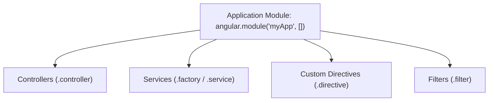
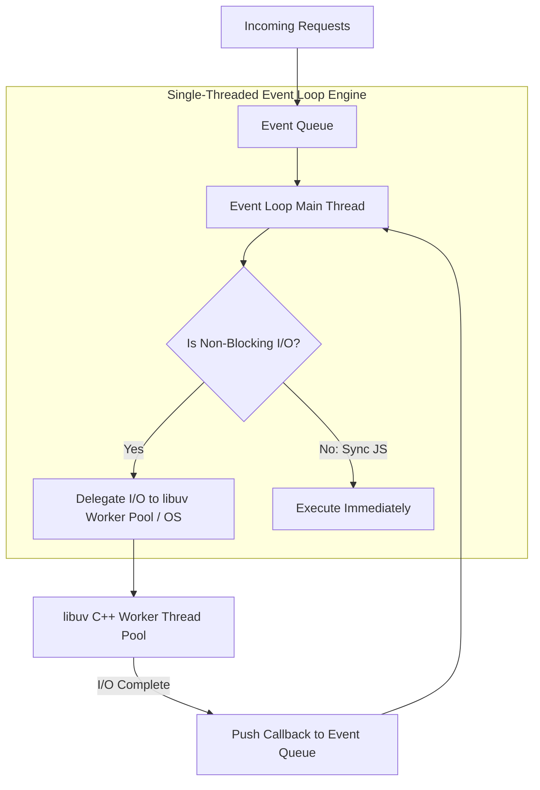
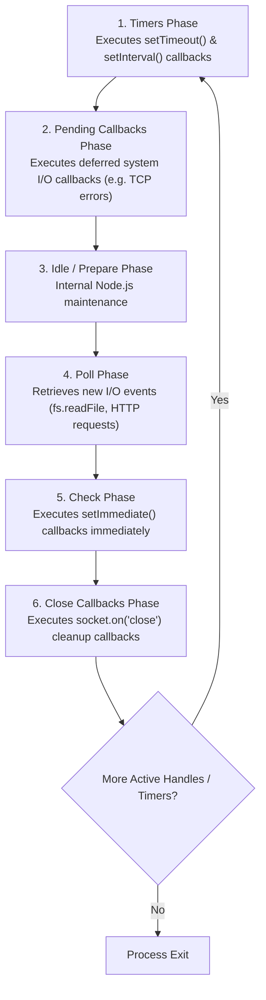

# Web Technologies Exam Solutions: Unit IV & Unit V (Part A & Part B)

---

## PART A Solutions

---

### Q1 (2 Marks) — Unit IV (AngularJS)

#### Question:
> **Which directive is used to bind the value of HTML controls (input, select, textarea) to application data in AngularJS?**

#### Solution:
The **`ng-model`** directive is used in AngularJS to bind the value of HTML form controls (`<input>`, `<select>`, `<textarea>`) to application model data on the `$scope` object.

It establishes **Two-Way Data Binding**, meaning any user input in the form control instantly updates the JavaScript model data, and any change in the model data immediately updates the displayed HTML view.

```html
<!-- Example of ng-model binding -->
<input type="text" ng-model="userName" />
<p>Typed Value: {{ userName }}</p>
```

---

### Q2 (2 Marks) — Unit IV (Node.js)

#### Question:
> **How do you include the HTTP module in a Node.js file?**

#### Solution:
In Node.js, the built-in `http` core module is included using the CommonJS **`require()`** function.

```javascript
// Includes the built-in HTTP module
const http = require('http');

// Example: Creating a basic HTTP web server instance
const server = http.createServer((req, res) => {
  res.writeHead(200, { 'Content-Type': 'text/plain' });
  res.end('Hello from Node.js Server!');
});

server.listen(3000);
```

---

### Q3 (2 Marks) — Unit V (AJAX)

#### Question:
> **What are the disadvantages (Any 2) of Ajax?**

#### Solution:
Two prominent disadvantages of AJAX technology are:

1. **Search Engine Optimization (SEO) & Indexing Challenges**: Search engine web crawlers historically struggle to execute client-side JavaScript or index content that is loaded dynamically via background AJAX calls after initial page load.
2. **Breaks Browser Back Button & Bookmarking History**: Because AJAX updates page content dynamically without triggering full URL page navigations, the browser's Back/Forward history states and bookmark URLs do not automatically update, requiring history API management (`pushState`).
3. **Same-Origin Security Policy (SOP) Restriction**: `XMLHttpRequest` cannot directly fetch data from third-party cross-domain endpoints without server-side proxies or CORS headers enabled.

---

### Q4 (2 Marks) — Unit IV (React.js)

#### Question:
> **What is a React component?**

#### Solution:
A **React Component** is an independent, reusable, self-contained building block of a user interface. It accepts arbitrary inputs (called **Props**) and returns React elements describing what should appear on the screen using JSX syntax.

React components can be declared as **Functional Components** (functions returning JSX using Hooks) or **Class Components** (classes extending `React.Component`).

```jsx
// Example of a Functional React Component
function UserCard(props) {
  return <h2>Hello, {props.name}!</h2>;
}
```

---

### Q5 (2 Marks) — Unit V (Django)

#### Question:
> **What is the purpose of Django's ORM (Object-Relational Mapping)?**

#### Solution:
The primary purpose of Django's **Object-Relational Mapping (ORM)** is to allow developers to interact with relational databases (SQLite, PostgreSQL, MySQL) purely using Python code instead of writing raw SQL queries.

#### Key Benefits:
- Maps Python classes to database tables (`models.Model`).
- Maps class attributes to database columns.
- Provides high-level Python methods (`Student.objects.filter(gpa__gte=3.5)`) to perform database CRUD (Create, Read, Update, Delete) operations cleanly across any supported SQL database engine.

---

---

## PART B Solutions

---

### Q1 (10 Marks) — Unit IV (AngularJS)

#### Question:
> **Write short notes on:**
> 1. **AngularJS Expressions**
> 2. **AngularJS Modules**

---

#### 1. AngularJS Expressions (5 Marks)

##### Definition & Syntax:
**AngularJS Expressions** are JavaScript-like code snippets written inside **double curly braces: `{{ expression }}`**. They are evaluated by the AngularJS compiler, and the resulting output is interpolated directly into the HTML View DOM.

```html
<p>Total Price: ${{ quantity * unitCost }}</p>
```

##### Key Characteristics & Difference from Standard JavaScript Expressions:

| Feature | AngularJS Expressions (`{{ }}`) | Standard JavaScript Expressions |
| :--- | :--- | :--- |
| **Context** | Evaluated against the **`$scope` object**, not global `window`. | Evaluated against the global `window` object. |
| **Null / Error Safety** | **Forgiving**: Undefined variables or `null` values output blank text without throwing JS errors. | Throws `ReferenceError` or `TypeError` on undefined symbols. |
| **Control Flow** | **No Control Flow Statements**: Loops (`for`), conditionals (`if`), or exceptions (`try-catch`) are **prohibited**. | Full control flow statements allowed. |
| **Operators** | Bitwise and assignment operators (`=`, `+=`) are forbidden. | All operators allowed. |
| **Filter Support** | Supports formatting pipe filters (e.g. `{{ price \| currency }}`). | No native pipe filter syntax. |

##### Types of Expressions with Examples:
- **Numeric Expressions**: `{{ 10 * 5 + 2 }}`
- **String Operations**: `{{ firstName + ' ' + lastName }}`
- **Object Access**: `{{ student.gpa }}`
- **Array Indexing**: `{{ marks[0] }}`

##### Mitigating Flash of Unrendered Content (FOUC):
To prevent users from seeing raw uncompiled braces (e.g., `{{ name }}`) during slow network loads, developers use **`ng-bind="name"`** or the **`ng-cloak`** directive.

---

#### 2. AngularJS Modules (5 Marks)

##### Definition & Purpose:
An **AngularJS Module** (`angular.module`) is a global container for the different parts of an application—including Controllers, Services, Directives, and Filters. Modules prevent global namespace pollution and structure applications into modular, maintainable components.



##### Setter vs. Getter Syntax:

1. **Creating a Module (Setter Syntax - 2 Arguments)**:
   Passing an array of dependency module names (even an empty array `[]`) **creates a new module**:
   ```javascript
   // Creates a new module named 'studentApp'
   var app = angular.module("studentApp", []);
   ```
2. **Retrieving an Existing Module (Getter Syntax - 1 Argument)**:
   Omitting the second array parameter **retrieves an existing module instance**:
   ```javascript
   // Retrieves existing module
   var app = angular.module("studentApp");
   ```

##### Bootstrapping via `ng-app`:
To bind a module to an HTML view, assign the module name to the root `ng-app` directive:
```html
<html lang="en" ng-app="studentApp">
```

---

### Q2 (10 Marks) — Unit IV (Node.js)

#### Question:
> **How the Node.js Event Loop works. Illustrate it with an example.**

---

#### Solution:

### 1. Introduction & Process Model Architecture

Node.js operates on a **Single-Threaded Event Loop Model with Non-Blocking I/O** powered by the **libuv** C library. 

Unlike traditional multi-threaded web servers (which allocate one thread per request and block while waiting for disk/database I/O), Node.js executes application JavaScript code on a single primary thread. When asynchronous I/O tasks (file reading, network requests, database queries) are encountered, Node.js delegates them to the OS kernel or the background **libuv C++ Worker Thread Pool**, allowing the main thread to immediately handle incoming client requests without blocking.



---

### 2. The 6 Phases of the Node.js Event Loop

The libuv Event Loop executes sequentially through **6 distinct phases** in a continuous loop:



#### Detailed Phase Descriptions:
1. **Timers Phase**: Executes callbacks scheduled by `setTimeout(fn, delay)` and `setInterval(fn, delay)`.
2. **Pending Callbacks Phase**: Executes I/O callbacks deferred to the next loop iteration (e.g., system-level errors like `ECONNREFUSED`).
3. **Idle / Prepare Phase**: Used internally by Node.js for engine preparation.
4. **Poll Phase**: Calculates blocking time, retrieves new I/O events, and executes I/O-related callbacks (e.g., file system `fs.readFile`, database responses).
5. **Check Phase**: Executes callbacks registered with **`setImmediate()`** immediately after the Poll phase completes.
6. **Close Callbacks Phase**: Executes cleanup callbacks (e.g., `socket.on('close', fn)`).

#### Microtask Queue Priority:
In addition to the 6 phases, Node.js features a **Microtask Queue** containing:
- **`process.nextTick()`**: Executes **immediately** before moving to the next Event Loop phase (Highest Priority).
- **`Promise.then()`**: Executes right after `process.nextTick()` microtasks complete.

---

### 3. 📜 Illustrative Code Example Demonstrating Execution Order

The following Node.js script demonstrates the precise execution priority order across synchronous code, microtask queues, and Event Loop phases (`setImmediate`, `setTimeout`, and Poll I/O).

```javascript
// event_loop_demo.js - Illustrating Node.js Event Loop Order

const fs = require('fs');
const path = require('path');

console.log("=== 1. MAIN THREAD EXECUTION STARTED (Synchronous Stack) ===");

// 1. Timers Phase (setTimeout)
setTimeout(() => {
  console.log("=== 6. TIMERS PHASE: setTimeout(..., 0) Executed ===");
}, 0);

// 2. Check Phase (setImmediate)
setImmediate(() => {
  console.log("=== 5. CHECK PHASE: setImmediate(...) Executed ===");
});

// 3. Microtask Queue 1 (process.nextTick - Highest Priority)
process.nextTick(() => {
  console.log("=== 3. MICROTASK QUEUE: process.nextTick(...) Executed ===");
});

// 4. Microtask Queue 2 (Promise.then)
Promise.resolve().then(() => {
  console.log("=== 4. MICROTASK QUEUE: Promise.then(...) Executed ===");
});

// 5. Poll Phase Asynchronous File I/O
const filePath = path.join(__dirname, 'test.txt');

// Ensure sample file exists
if (!fs.existsSync(filePath)) {
  fs.writeFileSync(filePath, 'Event Loop Sample Data');
}

fs.readFile(filePath, 'utf8', (err, data) => {
  console.log("=== 7. POLL PHASE: Asynchronous File I/O Callback Executed ===");
  
  // Inside I/O phase: setImmediate ALWAYS executes before setTimeout
  setImmediate(() => {
    console.log("   --> Inside I/O: setImmediate Executed First");
  });
  
  setTimeout(() => {
    console.log("   --> Inside I/O: setTimeout Executed Second");
  }, 0);
});

console.log("=== 2. MAIN THREAD EXECUTION FINISHED (Synchronous Stack Empty) ===");
```

---

### 4. Expected Console Execution Log:

```text
=== 1. MAIN THREAD EXECUTION STARTED (Synchronous Stack) ===
=== 2. MAIN THREAD EXECUTION FINISHED (Synchronous Stack Empty) ===
=== 3. MICROTASK QUEUE: process.nextTick(...) Executed ===
=== 4. MICROTASK QUEUE: Promise.then(...) Executed ===
=== 5. CHECK PHASE: setImmediate(...) Executed ===
=== 6. TIMERS PHASE: setTimeout(..., 0) Executed ===
=== 7. POLL PHASE: Asynchronous File I/O Callback Executed ===
   --> Inside I/O: setImmediate Executed First
   --> Inside I/O: setTimeout Executed Second
```
