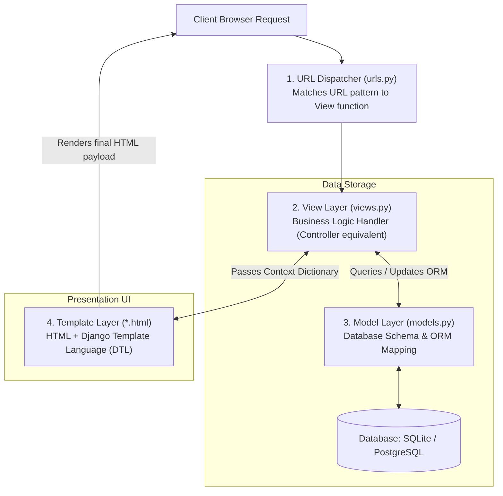
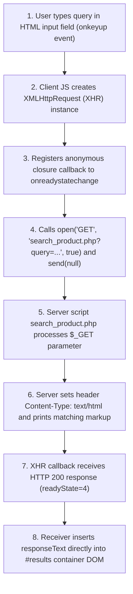

# Web Technologies Exam Solutions: Unit IV & Unit V (Part B - Q3, Q4, and Q5)

---

## Q3 (10 Marks) — Unit IV (React.js)

### Question:
> **With a neat diagram, explain how React.js works.**

---

### Solution:

#### 1. Introduction to React.js Architecture
React.js is a component-based front-end JavaScript library created by Facebook (Meta). Unlike traditional web applications that directly query and update the browser's Document Object Model (DOM), React introduces a high-performance **Virtual DOM Engine** and **Declarative Component Architecture** to manage user interfaces efficiently.

---

#### 2. Architecture Diagram: How React.js Works

```mermaid
flowchart TD
    StateChange["1. User Action / Event<br/>(Triggers State or Props Update)"] --> NewVDB["2. Re-creates New Virtual DOM Tree<br/>(In-Memory Lightweight JS Object)"]
    
    subgraph DiffingEngine["React Reconciliation Engine"]
        NewVDB <-->|3. Diffing Algorithm compares with| PrevVDB["Previous Virtual DOM Snapshot"]
        DiffingEngine --> Batching["4. Computes Minimal DOM Batch Operations"]
    end
    
    Batching --> RealDOM["5. Applies ONLY Changed Nodes to Real Browser DOM"]
    RealDOM --> UI["6. Rendered Visual View Updated"]
```

---

#### 3. Core Architectural Concepts

##### A. Component-Based Architecture
- User interfaces are broken down into small, isolated, reusable building blocks called **Components**.
- Components take inputs (**Props**) and manage local data (**State**), returning JSX elements describing what should appear on screen.

##### B. The Virtual DOM Engine
- Directly updating the real browser DOM is computationally expensive and slow.
- React maintains an in-memory lightweight JavaScript object copy of the real DOM tree called the **Virtual DOM**.

##### C. The Reconciliation Process & Diffing Algorithm
When a component's state or props change:
1. **Virtual DOM Tree Generation**: React creates a new Virtual DOM tree representing the updated state.
2. **Diffing Algorithm**: React compares the new Virtual DOM tree with a snapshot of the previous Virtual DOM tree using an $O(n)$ heuristic **Diffing Algorithm**.
3. **Batching**: React calculates the exact minimum number of DOM mutations required.

##### D. Real DOM Patching & Unidirectional Data Flow
- React batches and applies *only* the specific changed DOM nodes (e.g., updating a single `<span>` text node without re-rendering parent container divs).
- Data flows predictably in one direction (**Unidirectional Data Flow**) from parent components down to child components via `props`.

---

#### 4. Code Example Illustrating React State & Virtual DOM Updates

```jsx
// React Component demonstrating Virtual DOM reconciliation on state change
function CounterApp() {
  const [count, setCount] = React.useState(0);

  return (
    <div className="card">
      <h2>React Virtual DOM Counter</h2>

      {/* Only this count text node gets updated in the Real DOM! */}
      <p>Current Count: <strong>{count}</strong></p>

      <button onClick={() => setCount(count + 1)}>
        Increment Count
      </button>
    </div>
  );
}
```

---

---

## Q4 (10 Marks) — Unit V (Django)

### Question:
> **Explain the MVT (Model-View-Template) architectural pattern in Django.**

---

### Solution:

#### 1. Introduction to MVT Pattern
Django uses the **MVT (Model-View-Template)** architectural pattern, which is a variation of the classic **MVC (Model-View-Controller)** design pattern. MVT decouples data management, business logic, and presentation markup into distinct, loosely coupled layers.

---

#### 2. Architecture Diagram: Django MVT Request-Response Cycle



---

#### 3. Detailed Component Breakdown & Comparison Matrix

| MVT Component | MVC Equivalent | Key Responsibilities | Primary File |
| :--- | :--- | :--- | :--- |
| **Model (M)** | **Model** | Defines database table structures, field types, and relationships using Python ORM classes. | `models.py` |
| **View (V)** | **Controller** | Handles **Business Logic**. Receives HTTP requests, queries Models, passes data to Templates, and returns HTTP responses. | `views.py` |
| **Template (T)**| **View** | The **Presentation Layer**. HTML files containing **Django Template Language (DTL)** tags (``) and variables (`{{ }}`). | `templates/*.html` |
| **URL Router** | **Router** | Regex/Path dispatcher that routes incoming client URLs to corresponding View handler functions. | `urls.py` |

---

#### 4. Step-by-Step Execution Workflow:

1. **Client Request**: User requests a URL (e.g. `http://example.com/books/`).
2. **URL Routing (`urls.py`)**: Django matches `/books/` to `views.book_list`.
3. **View Logic (`views.py`)**: 
   - Queries database via Model ORM: `books = Book.objects.all()`.
   - Packages data into a context dictionary: `context = {'book_list': books}`.
4. **Template Rendering (`book_list.html`)**: The View passes context to the template engine. DTL parses loops (``) and variables (`{{ b.title }}`).
5. **HTTP Response**: View sends the rendered HTML payload back to the browser.

---

#### 5. Code Example Demonstrating MVT Architecture

##### A. Model Layer (`models.py`):
```python
from django.db import models

class Book(models.Model):
    title = models.CharField(max_length=200)
    author = models.CharField(max_length=100)
    price = models.DecimalField(max_digits=6, decimal_places=2)

    def __str__(self):
        return self.title
```

##### B. View Layer (`views.py`):
```python
from django.shortcuts import render
from .models import Book

def book_list(request):
    books = Book.objects.all()
    return render(request, 'books/list.html', {'book_list': books})
```

##### C. Template Layer (`list.html`):
```html
<h2>Available Books Directory</h2>
<ul>
  
    <li><strong>{{ book.title }}</strong> by {{ book.author }} - ${{ book.price }}</li>
  
    <li>No books found.</li>
  
</ul>
```

---

---

## Q5 (10 Marks) — Unit V (AJAX)

### Question:
> **Develop an application that illustrates the concept of Ajax Request and Response.**

---

### Solution:

#### 1. Application Overview
This complete, self-contained case study demonstrates an **AJAX Auto-Complete Search Application**. When a user types a product name or category into an input field, the `onkeyup` JavaScript event handler fires an asynchronous `XMLHttpRequest` GET request to a server-side PHP script without reloading the web page. The PHP script processes the query and returns matching product details as a text response, which is dynamically rendered in the DOM.

---

#### 2. Architecture Flow



---

#### 3. Complete Source Code

##### Component A: Client HTML View Document (`index.html`)

```html
<!DOCTYPE html>
<!-- index.html - AJAX Search Interface -->
<html lang="en">
<head>
  <meta charset="utf-8" />
  <title>AJAX Live Product Search</title>
  <style type="text/css">
    body { font-family: Arial, sans-serif; background-color: #f4f6f9; margin: 30px; }
    .card { width: 550px; margin: auto; background: white; padding: 25px; border-radius: 8px; box-shadow: 0 4px 10px rgba(0,0,0,0.1); }
    h2 { color: #2c3e50; border-bottom: 2px solid #3498db; padding-bottom: 8px; }
    input[type="text"] { width: 95%; padding: 10px; border: 1px solid #ccc; border-radius: 4px; font-size: 15px; }
    #search-results { margin-top: 15px; background: #fafafa; border: 1px solid #ddd; border-radius: 4px; padding: 10px; min-height: 50px; }
    .product-item { padding: 8px; border-bottom: 1px solid #eee; }
    .product-item:last-child { border-bottom: none; }
    .price { float: right; color: #27ae60; font-weight: bold; }
  </style>
  
  <!-- Client JavaScript AJAX Logic -->
  <script type="text/javascript">
    function searchProducts(strQuery) {
      var resultsContainer = document.getElementById("search-results");

      // Clear container if input query is empty
      if (strQuery.trim().length === 0) {
        resultsContainer.innerHTML = "<em>Start typing to search products in real-time...</em>";
        return;
      }

      // 1. Cross-Browser XHR Instantiation
      var xhr;
      if (window.XMLHttpRequest) {
        xhr = new XMLHttpRequest(); // Modern browsers (Chrome, Firefox, Safari, Edge, IE7+)
      } else {
        xhr = new ActiveXObject("Microsoft.XMLHTTP"); // Legacy IE5 & IE6
      }

      // 2. Register Anonymous Closure Callback Receiver
      xhr.onreadystatechange = function() {
        // Process response ONLY when transfer complete (4) and HTTP status successful (200)
        if (xhr.readyState === 4 && xhr.status === 200) {
          // Dynamically update DOM container with server response HTML text
          resultsContainer.innerHTML = xhr.responseText;
        }
      };

      // 3. Configure HTTP GET request with query parameter
      var targetUrl = "search_product.php?query=" + encodeURIComponent(strQuery);
      xhr.open("GET", targetUrl, true);

      // 4. Send asynchronous request to server
      xhr.send(null);
    }
  </script>
</head>
<body>

<div class="card">
  <h2>AJAX Live Product Search</h2>

  <p>Search Inventory (Try typing 'laptop', 'phone', or 'chair'):</p>
  
  <!-- Input box triggers searchProducts() on every key press -->
  <input type="text" 
         id="search-input" 
         onkeyup="searchProducts(this.value)" 
         placeholder="Type product name here..." />

  <!-- Dynamic Container updated asynchronously by AJAX Receiver -->
  <div id="search-results">
    <em>Start typing to search products in real-time...</em>
  </div>
</div>

</body>
</html>
```

---

##### Component B: Server-Side Response PHP Script (`search_product.php`)

```php
<?php
// search_product.php - Server Response Document

// Set HTTP Response Content-Type Header
header("Content-Type: text/html");

// Mock Database Catalog Array
$catalog = array(
    array("name" => "Gaming Laptop 15-inch", "category" => "Electronics", "price" => 1200.00),
    array("name" => "Smartphone Pro Max", "category" => "Electronics", "price" => 999.00),
    array("name" => "Wireless Noise Canceling Headphones", "category" => "Electronics", "price" => 250.00),
    array("name" => "Ergonomic Office Chair", "category" => "Furniture", "price" => 180.00),
    array("name" => "Standing Executive Desk", "category" => "Furniture", "price" => 450.00),
    array("name" => "Stainless Steel Water Bottle", "category" => "Accessories", "price" => 25.00)
);

// Retrieve GET query parameter
$searchQuery = isset($_GET["query"]) ? strtolower(trim($_GET["query"])) : "";

if (empty($searchQuery)) {
    echo "<em>No search query provided.</em>";
    exit();
}

$matches = array();

// Search matching items in catalog
foreach ($catalog as $item) {
    if (strpos(strtolower($item["name"]), $searchQuery) !== false || 
        strpos(strtolower($item["category"]), $searchQuery) !== false) {
        $matches[] = $item;
    }
}

// Generate HTML Response Payload
if (count($matches) > 0) {
    foreach ($matches as $match) {
        echo "<div class='product-item'>";
        echo "<span class='price'>$" . number_format($match["price"], 2) . "</span>";
        echo "<strong>" . htmlspecialchars($match["name"]) . "</strong> ";
        echo "<small>(" . htmlspecialchars($match["category"]) . ")</small>";
        echo "</div>";
    }
} else {
    echo "<div style='color: #c0392b;'>No matching products found for '" . htmlspecialchars($searchQuery) . "'.</div>";
}
?>
```
